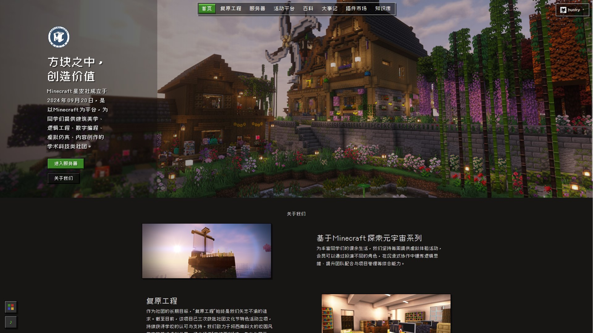
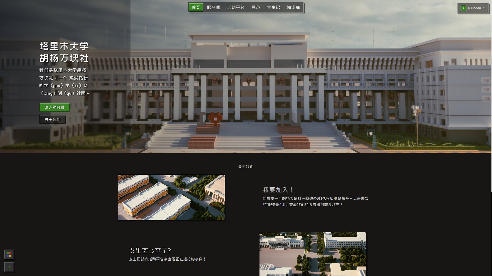

# YuDream Admin

<p align="center">
  <strong>面向可扩展业务场景的现代化管理平台</strong>
</p>

<p align="center">
  <a href="#在线演示">在线演示</a> ·
  <a href="#落地案例">落地案例</a> ·
  <a href="#核心能力">核心能力</a> ·
  <a href="#快速开始">快速开始</a> ·
  <a href="#插件开发">插件开发</a> ·
  <a href="#参与贡献">参与贡献</a>
</p>

<p align="center">
  
  
  
  
  
  
  <a href="https://ydadocs.yudream.online/"></a>
  <a href="https://ydashow.yudream.online/"></a>
</p>

YuDream Admin 是一个后端由 YuDream 原创实现的企业级管理平台。后端基于 Java 21、Spring Boot 3 和 DDD 分层，提供用户与权限、内容管理、知识库、集成编排、可视化数据、AI Agent 等平台能力，并通过插件运行时将业务功能与平台核心解耦。

前端基于 [Fantastic-admin](https://fantastic-admin.hurui.me/)，使用 Vue 3、Arco Design Vue 和 UnoCSS。项目既可以作为一套完整的后台系统使用，也可以作为团队构建独立业务插件的宿主平台；打开 CMS、公开站点与官方插件后，不必二次开发就能上线面向访客的一站式官网。

## 在线演示

公开演示站：[https://ydashow.yudream.online/](https://ydashow.yudream.online/)

| | |
| --- | --- |
| 账号 | `admin` |
| 密码 | `admin123` |

演示环境供浏览后台与公开站能力，数据可能被重置，请勿存放真实业务或密钥。

## 落地案例

下面两所高校 Minecraft 社团官网是 **非二次开发** 的生产部署：共用同一套 YuDream Admin 宿主、SITE 主题和官方业务插件，栏目与文案在后台配置，没有分叉平台源码、也没有为单个社团写定制后端。

同一主题下可以换 Hero、导航和内容区块；服务器列表、活动平台、百科、大事记、插件市场、知识库等模块按社团需要开关，形成「MC 社团一站式官网」。

<table>
  <tr>
    <td width="50%" valign="top">
      <h3><a href="https://www.swustmc.cn/site">西南科技大学 Minecraft 星空社</a></h3>
      <p>公开站覆盖首页、复原工程、服务器、活动平台、百科、大事记、插件市场与知识库。首页由主题接管导航与版式，社团介绍与长期项目在 CMS 区块中维护。</p>
      <a href="https://www.swustmc.cn/site"></a>
    </td>
    <td width="50%" valign="top">
      <h3><a href="https://hall.mc.taru.xj.cn/site">塔里木大学胡杨方块社</a></h3>
      <p>同一套主题与站点能力的另一份部署。导航收敛为服务器、活动平台、百科、大事记与知识库，首页文案与配图按社团自行替换，用于招新与服务器状态公示。</p>
      <a href="https://hall.mc.taru.xj.cn/site"></a>
    </td>
  </tr>
</table>

> 这两处站点证明：把平台当产品用——启用公开站点、装上主题与业务插件、在后台填内容——就能交付完整官网。需要更深的业务差异时，再走独立插件，而不是改宿主。

## 核心能力

| 方向 | 能力 |
| --- | --- |
| 系统管理 | 用户、角色、部门、菜单、权限、在线用户与安全配置 |
| 内容与站点 | CMS、可视化页面编辑、发布流程、公开站点（含移动端折叠导航）、SEO，以及按 `themeCode` 隔离的 SITE 主题（首页 / chrome / 页面集） |
| 知识与智能 | 知识库检索、文档解析、AI Provider 管理、Agent 应用与可视化工作流 |
| 消息与通信 | QQ 消息平台（Milky / 官方 OpenAPI）、SSE、WebSocket、入站邮箱核验 |
| 集成与自动化 | HTTP、Python 运行时、消息队列、S3 兼容对象存储、kkFileView 文件预览 |
| 数据能力 | 数据可视化、图谱检索、Neo4j 与可选的 RAG 扩展 |
| 插件生态 | JAR 热加载、动态菜单和权限、登录注册扩展点、前端 Remote Entry、本机市场源与远程源订阅 |

## 为什么使用它

- **分层清晰**：后端遵循 DDD 分层，领域、应用、基础设施和接口职责明确。
- **按需启用**：平台能力可由项目配置和运行状态共同控制，未启用的能力不会强制依赖外部中间件。
- **插件优先**：业务插件可独立开发、构建和发布；平台核心只维护稳定运行时与契约。
- **完整的前端体验**：Vue 3 管理端支持动态路由、主题、多布局和远程插件页面。
- **开箱即用的公开站**：CMS、SITE 主题、导航与官方插件可以拼出完整对外官网，高校 MC 社团站点即按此方式上线，无需二次开发。
- **面向生产部署**：提供 Docker 镜像、Compose 编排与环境变量模板。

## 架构

```text
                    ┌────────────────────┐     ┌────────────────────┐
                    │   Vue 3 管理端       │     │  公开站 /site        │
                    │ 主应用 + Remote UI  │     │ SITE 主题 + CMS     │
                    └─────────┬──────────┘     └─────────┬──────────┘
                              │ HTTP / SSE / WebSocket    │
┌─────────────────────────────▼───────────────────────────▼─────────────┐
│                         YuDream Admin Core                            │
│  interfaces  ->  application  ->  domain  <-  infrastructure          │
│  API、鉴权        用例编排       业务规则       Mongo、Redis、AI、S3 等 │
├───────────────────────────────────────────────────────────────────────┤
│  18 项平台能力（双闸门）· Plugin Runtime / yudream-plugin-spi          │
│  JAR 生命周期 · 菜单权限 · HTTP 扩展 · Remote 模块 · SITE/ADMIN 主题   │
└───────────────────────────────────────────────────────────────────────┘
                                      │
                  ┌──────────────────┴──────────────────┐
                  │                                     │
        独立业务插件仓库                       外部平台与中间件
  yudream-admin-plugins               MongoDB · Redis · S3 · AI Provider
```

### 仓库结构

```text
yudream-domain/             领域模型、聚合与仓储契约
yudream-application/        应用服务、用例编排与 DTO
yudream-infrastructure/     持久化、外部服务适配与插件运行时
yudream-interfaces/         HTTP 接口、请求响应与接口装配
yudream-bootstrap/          Spring Boot 启动模块
yudream-frontend/           Vue 3 主前端与共享包
yudream-plugins/            插件 SPI 与示例插件
plugins/                    运行时加载的外部插件 JAR 目录
yd-docs/                    在线文档站源码（VitePress）
docs/                       平台、插件与部署文档
```

## 快速开始

### 环境要求

- JDK 21
- Maven 3.9+
- Node.js `22.22+`、`24.15+` 或更高兼容版本
- pnpm 11.9+
- MongoDB 和 Redis
- Docker 与 Docker Compose（容器化部署时需要）

### 1. 配置环境变量

复制模板并按环境修改数据库、缓存、邮件、对象存储和可选平台能力配置：

```bash
cp .env.example .env
```

Windows PowerShell：

```powershell
Copy-Item .env.example .env
```

> `.env` 可能包含密钥，请仅在本地或部署环境中保存，不要提交到仓库。

### 2. 安装前端依赖

```bash
cd yudream-frontend
pnpm install
```

### 3. 启动后端

在仓库根目录执行：

```bash
mvn -pl yudream-bootstrap -am spring-boot:run
```

### 4. 启动前端

另开一个终端：

```bash
cd yudream-frontend
pnpm dev
```

默认开发地址由前端启动日志输出。首次运行前，请确认 `.env` 中的 MongoDB 与 Redis 连接配置可用。

### 构建验证

```bash
mvn -pl yudream-bootstrap -am -DskipTests compile
```

```bash
cd yudream-frontend
pnpm build
```

## Docker 部署

仓库根目录提供生产 Compose 编排。准备好 `.env` 后执行：

```bash
docker compose pull
docker compose up -d
```

默认会启动后端、前端、渲染服务、kkFileView 文件预览与镜像更新监控。MongoDB、Redis、S3 兼容存储等依赖需要按照 `.env` 指向可访问的服务。

可选的 RabbitMQ 与 Neo4j 服务位于 `docker-compose.platform.yml`：

```bash
docker compose -f docker-compose.platform.yml --profile mq up -d
docker compose -f docker-compose.platform.yml --profile graph up -d
```

## 插件开发

插件通过稳定契约与平台交互，而不依赖平台内部模块（版本以源文件为准）：

- 后端插件依赖 `online.yudream.base:yudream-plugin-spi`（当前 `2.27.0`）。
- 前端插件使用 `@yudream/plugin-sdk`（当前 `1.7.0`）与 `@yudream/components`（当前 `1.3.0`）。
- 插件 JAR 使用根目录 `plugin.yml` 描述元数据，并由运行时管理加载、启用与卸载。
- 前端插件通过 `remoteEntry.js` 作为远程模块加载到主前端；样式统一走声明式 `style.css`（`@yudream/plugin-sdk/uno-config`）。
- SITE 主题经 `@PluginTheme` 注册：可声明 `homeComponent` / `chromeComponent`、首页方案与主题配置 schema；公开站按 `themeCode` 隔离页面与布局。
- 本机市场源由能力 `plugin-market-source` 提供；远程 `V2_API` / `STATIC_INDEX` 订阅不依赖该能力，也不回落 Nexus。

新建官方插件时，建议从 [插件仓库模板](templates/plugin-repo/README.md) 开始；完整约定见 [插件系统规范](docs/plugin-system/specification.md) 和 [插件开发教程](docs/plugin-system/tutorial.md)。官方业务插件源码位于独立仓库 [yudream-admin-plugins](https://gitlab.yudream.online/yudream/yudream-admin-plugins)。

第三方作者把插件发到开放站点的本机市场，或自己托管一套市场源（后台「插件发布」/ API Key），不要走主仓 MR 往 Nexus 代发。`{code}@{pluginVersion}` 不可覆盖。步骤见[第三方插件投稿指南](docs/third-party-plugin-submission.md) 与[自托管插件市场源](yd-docs/docs/plugin/market-source.md)。

## 文档

- [在线文档站](https://ydadocs.yudream.online/)
- [在线演示](https://ydashow.yudream.online/)（账号 `admin` / 密码 `admin123`）
- [落地案例（MC 社团一站式官网）](https://ydadocs.yudream.online/guide/showcase)
- [插件系统规范](docs/plugin-system/specification.md)
- [插件开发教程](docs/plugin-system/tutorial.md)
- [文档站源码与维护说明](yd-docs/README.md)
- [第三方插件投稿](docs/third-party-plugin-submission.md)
- [插件市场发布边界](docs/plugin-store-release.md)
- [自托管插件市场源](yd-docs/docs/plugin/market-source.md)
- [平台能力说明](docs/platform/)
- [仓库拆分与边界说明](docs/repository-split/README.md)
- [契约发布校验](docs/plugin-system/contract-validation.md)

## 参与贡献

欢迎提交 Issue 和 Pull Request。提交前请确保：

1. 改动只覆盖当前问题，不混入无关格式化或生成文件。
2. 后端变更遵循 `domain -> application -> infrastructure -> interfaces` 的职责边界。
3. 新增或修改插件能力时，使用 SPI、SDK 和公开契约，不直接依赖平台内部实现。
4. 运行与改动相关的测试、类型检查或构建命令。
5. 在 Pull Request 中说明行为变化、配置影响和验证结果。

## License

本项目采用 [MIT License](LICENSE) 开源。
