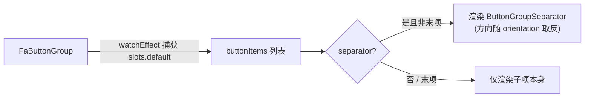

<script setup>
import Demo from '../.vitepress/theme/components/Demo.vue'
import ApiTable from '../.vitepress/theme/components/ApiTable.vue'
import InteractiveRemainingBasicButtonGroup from '../.vitepress/theme/components/demos/InteractiveRemainingBasicButtonGroup.vue'

const srcBasic = `<script setup>
// 组件已由框架自动导入，无需手动 import
<\/script>

<template>
  <FaButtonGroup>
    <FaButton>
      <FaIcon name="i-mdi:eye" class="size-4" />
      查看详情
    </FaButton>
    <FaButton>
      <FaIcon name="i-mdi:pencil" class="size-4" />
      编辑
    </FaButton>
    <FaButton>
      <FaIcon name="i-mdi:delete" class="size-4" />
      删除
    </FaButton>
  </FaButtonGroup>
</template>`

const srcSeparator = `<template>
  <!-- 相邻按钮之间自动插入分割线 -->
  <FaButtonGroup separator>
    <FaButton variant="outline">复制</FaButton>
    <FaButton variant="outline">剪切</FaButton>
    <FaButton variant="outline">粘贴</FaButton>
  </FaButtonGroup>
</template>`

const srcVertical = `<template>
  <!-- 垂直排列，常用于工具栏或侧边迷你菜单 -->
  <FaButtonGroup orientation="vertical">
    <FaButton size="sm" variant="ghost">
      <FaIcon name="i-mdi:format-bold" />
    </FaButton>
    <FaButton size="sm" variant="ghost">
      <FaIcon name="i-mdi:format-italic" />
    </FaButton>
    <FaButton size="sm" variant="ghost">
      <FaIcon name="i-mdi:format-underline" />
    </FaButton>
  </FaButtonGroup>
</template>`

const props = [
  ['<code>orientation</code>', "<code>'horizontal' | 'vertical'</code>", "<code>'horizontal'</code>", '排列方向'],
  ['<code>separator</code>', '<code>boolean</code>', '<code>false</code>', '是否在相邻子项之间自动插入分割线；<code>orientation</code> 为 <code>vertical</code> 时分割线为水平方向，否则为垂直方向'],
  ['<code>class</code>', '<code>string</code>', '—', '透传根元素 class'],
]
</script>

# FaButtonGroup 按钮组

将多个 `FaButton` 组合成一组的容器组件，支持水平/垂直排列与自动分割线。基于 Tailwind 样式封装，根元素带 `role="group"` 与 `data-orientation` 属性。

## 基础用法

默认插槽中依次放置 `FaButton`，组件会捕获全部槽位内容并统一控制间距与圆角合并（首尾按钮保留外侧圆角，相邻按钮的圆角自动衔接）。

<Demo title="基础按钮组" description="default 插槽内放置多个 FaButton" :source="srcBasic">
  <ClientOnly><InteractiveRemainingBasicButtonGroup /></ClientOnly>
</Demo>

## 带分割线

传入 `separator` 后，组件会在每个子项之间渲染一个 `ButtonGroupSeparator`，最后一个子项之后不会追加。

<Demo title="分割线" :source="srcSeparator">
  <ClientOnly><InteractiveRemainingBasicButtonGroup /></ClientOnly>
</Demo>

## 垂直排列

`orientation="vertical"` 时按钮纵向堆叠；此时分割线的方向会自动切换为水平。适合工具栏、侧边迷你菜单等场景。

<Demo title="垂直按钮组" :source="srcVertical">
  <ClientOnly><InteractiveRemainingBasicButtonGroup /></ClientOnly>
</Demo>

## 组合其他组件

除 `FaButton` 外，也可以放入 `ButtonGroupText`（说明文字）或 `ButtonGroupSeparator`（手动分割线）等子组件，它们从 `@yudream/components` 的 button-group 模块导出，常用于「输入框 + 按钮」这类组合控件。

```vue
<template>
  <FaButtonGroup>
    <FaInput placeholder="https://" />
    <ButtonGroupText class="bg-transparent">
      https://
    </ButtonGroupText>
    <FaButton>打开</FaButton>
  </FaButtonGroup>
</template>
```

`ButtonGroupText` 支持 reka-ui 的 `as` / `asChild` 属性，默认渲染为 `div`，自带 `bg-muted` 底色与边框，适合作为组内只读前缀/后缀。

## 与表格操作列的配合

按钮组在表格操作列中可以避免多个按钮挤在一起时圆角断裂的问题；配合 `separator` 使用时建议按钮统一 `variant="ghost"` 或 `"link"`，视觉更轻。

## 实现要点



- `separator` 分割线是在 `index.vue` 中按子项索引动态插入的，不是 CSS 实现，因此对任意子组件都生效。
- `orientation` 同时写入根元素的 `data-orientation` 与样式变体，样式层据此调整 flex 方向与圆角合并规则。
- 组件不处理禁用、加载等状态，这些仍由内部的每个 `FaButton` 自行控制。

## API

### Props

<ApiTable title="FaButtonGroup Props" :data="props" />

### Slots

| 插槽 | 说明 |
| --- | --- |
| `default` | 按钮组成员，通常放置多个 `FaButton` |

### Emits

无自定义 emits。

::: warning 注意事项
- 槽位内容在 `onMounted` 后通过 `watchEffect` 捕获，异步条件渲染的子项变化会被追踪，但请避免依赖服务端渲染时序。
- 建议组内按钮使用统一的 `variant` 与 `size`，混合尺寸会导致视觉不对齐。
:::

::: info 源码位置
- 封装组件：`yudream-frontend/packages/components/src/basic/button-group/index.vue`
- 子组件：`yudream-frontend/packages/components/src/basic/button-group/button-group/`（`ButtonGroup.vue` / `ButtonGroupSeparator.vue` / `ButtonGroupText.vue`）
- 示例：`yudream-frontend/packages/components/src/basic/button-group/_examples/`
:::
