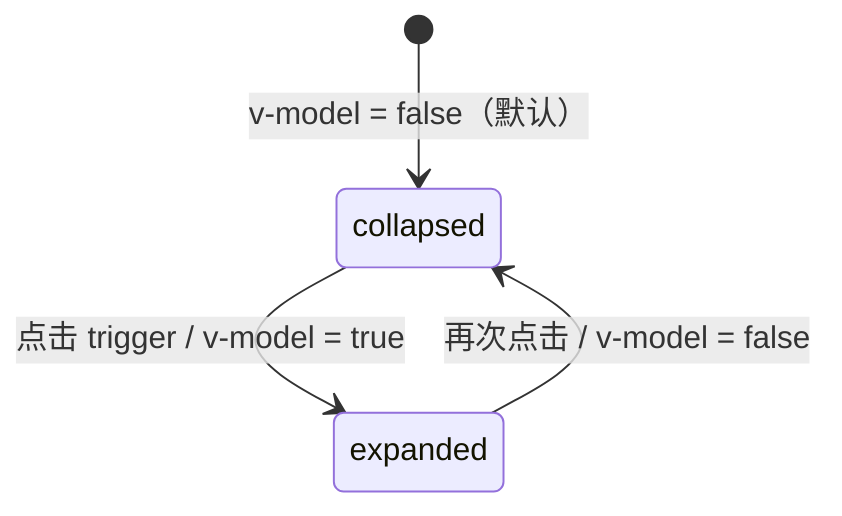

<script setup>
import Demo from '../.vitepress/theme/components/Demo.vue'
import ApiTable from '../.vitepress/theme/components/ApiTable.vue'
import InteractiveUtilityDemo from '../.vitepress/theme/components/demos/InteractiveUtilityDemo.vue'

const srcBasic = `<script setup>
// 组件已由框架自动导入，无需手动 import
<\/script>

<template>
  <FaCollapsible>
    <template #trigger="{ open }">
      <FaButton variant="ghost">
        {{ open ? '收起' : '展开' }}
      </FaButton>
    </template>
    <div class="space-y-2">
      <div v-for="item in 3" :key="item" class="px-4 py-2 border rounded-md">
        内容 {{ item }}
      </div>
    </div>
  </FaCollapsible>
</template>`

const srcControlled = `<script setup>
import { shallowRef } from 'vue'

const open = shallowRef(false)
<\/script>

<template>
  <FaButton @click="open = !open">
    {{ open ? '收起' : '展开' }}
  </FaButton>
  <FaCollapsible v-model="open">
    <div class="mt-4 space-y-2">
      <div v-for="item in 5" :key="item" class="px-4 py-2 border rounded-md">
        内容 {{ item }}
      </div>
    </div>
  </FaCollapsible>
</template>`

const props = [
  ['<code>v-model</code>', '<code>boolean</code>', '<code>false</code>', '展开/收起状态；不传则为非受控模式，由内部点击触发器自行切换'],
]

const emits = [
  ['<code>update:modelValue</code>', '<code>(value: boolean) => void</code>', '展开状态变化时触发，与 <code>v-model</code> 同步'],
]
</script>

# FaCollapsible 折叠面板

可折叠的内容面板，支持展开/收起动画。基于 reka-ui 的 `CollapsibleRoot` / `CollapsibleTrigger` / `CollapsibleContent` 封装，对外收敛为单个组件 + `v-model` 的用法。

## 使用场景

- FAQ 问答列表、手风琴菜单
- 可展开的详情区域、目录折叠
- 高级筛选条件的展开/收起

## 基础用法

通过 `#trigger` 插槽提供触发元素，slot props 暴露当前 `open` 状态，方便切换文案或图标；折叠内容放在默认插槽中。

<Demo title="基础折叠面板" description="#trigger 插槽接收 { open }，default 插槽为折叠内容" :source="srcBasic">
  <ClientOnly><InteractiveUtilityDemo type="collapsible" /></ClientOnly>
</Demo>

## FAQ / 手风琴

利用 `#trigger` 插槽的 `{ open }` 状态切换箭头方向，即可实现简单的手风琴效果；多项互斥时在业务层维护「当前展开项」状态并绑定到各实例的 `v-model`。

```vue
<script setup>
import { computed, ref } from 'vue'

// 手风琴：同一时间只展开一项
const activeIndex = ref(0)
const faqs = [/* { question, answer } */]

const openFlags = computed(() => faqs.map((_, index) => index === activeIndex.value))

function toggle(index: number, open: boolean) {
  if (open) {
    activeIndex.value = index
  }
}
</script>

<template>
  <FaCollapsible
    v-for="(faq, index) in faqs"
    :key="index"
    :model-value="openFlags[index]"
    @update:model-value="value => toggle(index, value)"
  >
    <template #trigger="{ open }">
      <button>
        {{ faq.question }}
        {{ open ? '▲' : '▼' }}
      </button>
    </template>
    <p>{{ faq.answer }}</p>
  </FaCollapsible>
</template>
```

## 受控用法

用 `v-model` 绑定外部状态，触发器可以放在组件外部（例如工具栏按钮），由业务代码直接切换。

<Demo title="受控模式" :source="srcControlled">
  <div class="demo-row" style="flex-direction:column;align-items:stretch;max-width:320px;">
    <button class="demo-btn demo-btn--primary">收起</button>
    <div style="border:1px solid var(--vp-c-divider);border-radius:6px;padding:8px 12px;font-size:14px;">内容 1</div>
    <div style="border:1px solid var(--vp-c-divider);border-radius:6px;padding:8px 12px;font-size:14px;">内容 2</div>
    <div style="border:1px solid var(--vp-c-divider);border-radius:6px;padding:8px 12px;font-size:14px;">内容 3</div>
  </div>
</Demo>

## 状态流转



- 不提供 `#trigger` 插槽时，组件只渲染 `CollapsibleContent`，展开完全由外部 `v-model` 控制。
- 展开/收起由 reka-ui 提供平滑的高度动画，无需额外配置。
- 内部实现是 `defineModel<boolean>('modelValue', { default: false })`，因此既支持 `v-model` 也支持 `:model-value` + `@update:model-value`。

## API

### Props

<ApiTable title="FaCollapsible Props" :data="props" />

### Emits

<ApiTable title="FaCollapsible Emits" :data="emits" :columns="['事件', '签名', '说明']" />

### Slots

| 插槽 | 说明 |
| --- | --- |
| `default` | 折叠内容 |
| `trigger` | 触发元素，slot props：`{ open: boolean }`；不传则不渲染触发器 |

::: warning 注意事项
- 折叠内容应有明确的高度边界，避免嵌套复杂布局导致动画抖动。
- 需要多项互斥的手风琴效果时，请在业务层维护一个「当前展开项」状态，把同一状态绑定到多个 `FaCollapsible` 上。
:::

::: info 源码位置
- 封装组件：`yudream-frontend/packages/components/src/basic/collapsible/index.vue`
- 子组件：`yudream-frontend/packages/components/src/basic/collapsible/collapsible/`（`Collapsible.vue` / `CollapsibleTrigger.vue` / `CollapsibleContent.vue`）
- 示例：`yudream-frontend/packages/components/src/basic/collapsible/_examples/`
:::
