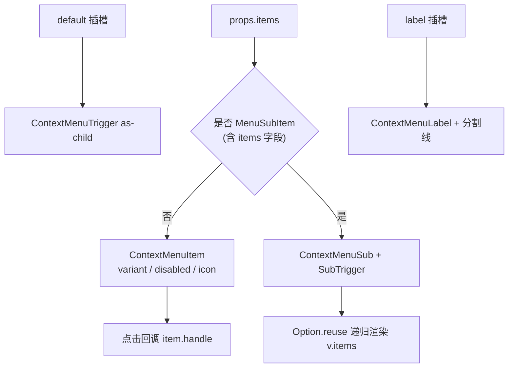

<script setup>
import Demo from '../.vitepress/theme/components/Demo.vue'
import ApiTable from '../.vitepress/theme/components/ApiTable.vue'
import InteractiveUtilityDemo from '../.vitepress/theme/components/demos/InteractiveUtilityDemo.vue'

const srcBasic = `<script setup>
const items = [
  [
    { label: '打开', handle: () => console.log('打开') },
    { label: '编辑', handle: () => console.log('编辑') },
    { label: '复制', handle: () => console.log('复制') },
  ],
]
<\/script>

<template>
  <FaContextMenu :items="items">
    <!-- default 插槽即右键触发区域 -->
    <div class="flex h-[150px] w-[300px] items-center justify-center border rounded-md border-dashed">
      在此区域点击右键
    </div>
  </FaContextMenu>
</template>`

const srcIcon = `<script setup>
import { useFaToast } from '@yudream/components'

const toast = useFaToast()

const items = [
  [
    { label: '打开', icon: 'i-mdi:folder-open', handle: () => toast('打开') },
    { label: '编辑', icon: 'i-mdi:pencil', handle: () => toast('编辑') },
  ],
  [
    { label: '删除', icon: 'i-mdi:delete', variant: 'destructive', handle: () => toast('删除') },
  ],
]
<\/script>

<template>
  <FaContextMenu :items="items">
    
  </FaContextMenu>
</template>`

const srcSub = `<script setup>
const items = [
  [
    {
      label: '导出为',
      items: [
        [
          { label: 'Excel (.xlsx)', handle: () => {} },
          { label: 'PDF', handle: () => {} },
        ],
      ],
    },
  ],
]
<\/script>

<template>
  <FaContextMenu :items="items">
    <div>带子菜单的右键菜单</div>
  </FaContextMenu>
</template>`

const props = [
  ['<code>items</code>', '<code>(MenuItem \\| MenuSubItem)[][]</code>', '<strong>必需</strong>', '菜单项二维数组；每个子数组为一组，组间自动插入分割线'],
]
</script>

# FaContextMenu 右键菜单

在触发区域上点击鼠标右键时弹出的上下文菜单，支持分组、图标、子菜单、禁用与危险操作标记。基于 reka-ui 的 ContextMenu 系列封装为数据驱动（`items` 数组）的单组件用法。

## 使用场景

- 表格行、文件/文件夹的右键操作
- 画布/编辑器上下文菜单
- 图片等媒体文件的操作入口

## MenuItem 数据结构

```ts
// 普通菜单项
interface MenuItem {
  label: string
  icon?: string                          // 图标名，传给 FaIcon
  variant?: 'default' | 'destructive'    // destructive 显示为红色危险操作
  disabled?: boolean
  handle?: () => void                    // 点击回调
}

// 子菜单项（递归结构，可无限嵌套）
interface MenuSubItem {
  label: string
  items: (MenuItem | MenuSubItem)[][]
}
```

## 基础用法

`default` 插槽的内容即为右键触发区域。

<Demo title="基础右键菜单" description="items 二维数组，每个子数组为一组" :source="srcBasic">
  <ClientOnly><InteractiveUtilityDemo type="context-menu" /></ClientOnly>
</Demo>

## 图标与危险操作

组内任一菜单项声明了 `icon` 时，整组都会预留图标占位，保证文本对齐；`variant: 'destructive'` 的项目以红色呈现。

<Demo title="图标与 destructive" :source="srcIcon">
  <div class="demo-row">
    <span style="display:inline-flex;flex-direction:column;border:1px solid var(--vp-c-divider);border-radius:6px;padding:4px 0;min-width:140px;">
      <span style="padding:6px 12px;font-size:13px;">📁 打开</span>
      <span style="padding:6px 12px;font-size:13px;">✏️ 编辑</span>
      <span style="height:1px;background:var(--vp-c-divider);margin:2px 0;"></span>
      <span style="padding:6px 12px;font-size:13px;color:#d5304f;">🗑️ 删除</span>
    </span>
  </div>
</Demo>

## 子菜单

`MenuSubItem` 通过 `items` 属性嵌套，内部用 `createReusableTemplate` 递归渲染，理论上支持任意层级。

<Demo title="子菜单" :source="srcSub">
  <div class="demo-row">
    <span style="display:inline-flex;flex-direction:column;border:1px solid var(--vp-c-divider);border-radius:6px;padding:4px 0;min-width:150px;">
      <span style="padding:6px 12px;font-size:13px;">导出为 ›</span>
      <span style="margin-left:12px;display:inline-flex;flex-direction:column;border-left:1px solid var(--vp-c-divider);border-right:1px solid var(--vp-c-divider);border-bottom:1px solid var(--vp-c-divider);border-radius:0 6px 6px;padding:4px 0;">
        <span style="padding:6px 12px;font-size:13px;">Excel (.xlsx)</span>
        <span style="padding:6px 12px;font-size:13px;">PDF</span>
      </span>
    </span>
  </div>
</Demo>

## 渲染流程



- 组件固定 `:modal="false"`，弹出菜单不会锁住页面滚动。
- 文字方向跟随 `useTextDirection()` 自动设置 `ltr/rtl`。
- 菜单内容层级为 `z-2050`。
- `label` 插槽渲染在菜单顶部，作为整组的说明标题，其后自动跟一条分割线。

## API

### Props

<ApiTable title="FaContextMenu Props" :data="props" />

### Slots

| 插槽 | 说明 |
| --- | --- |
| `default` | 右键触发区域（必填） |
| `label` | 菜单头部标签，渲染于所有菜单项之前 |

### Emits

无自定义 emits；交互通过每项的 `handle` 回调完成。

::: warning 注意事项
- `items` 是二维数组：外层维度是「组」，组间自动加分割线；内层维度是组内的项。
- 图标对齐以「组」为单位预留占位，不同组之间可以不一致。
- 与 [FaDropdown](./dropdown.md) 共享同一套 `MenuItem / MenuSubItem` 结构，二者可复用同一份数据定义。
:::

::: info 源码位置
- 封装组件：`yudream-frontend/packages/components/src/basic/context-menu/index.vue`
- 子组件：`yudream-frontend/packages/components/src/basic/context-menu/context-menu/`
- 示例：`yudream-frontend/packages/components/src/basic/context-menu/_examples/`
:::
