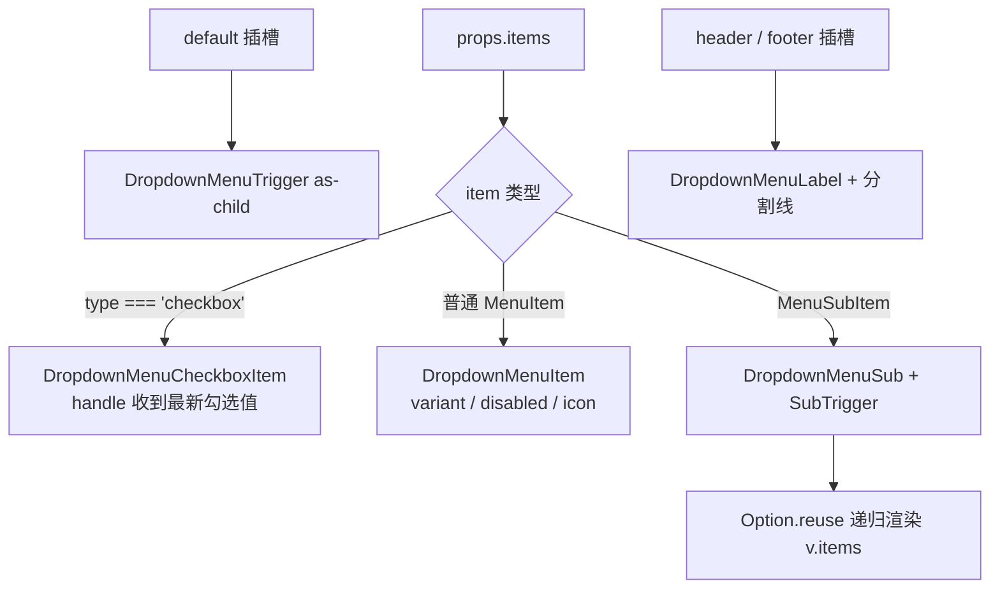

<script setup>
import Demo from '../.vitepress/theme/components/Demo.vue'
import ApiTable from '../.vitepress/theme/components/ApiTable.vue'
import InteractiveBasicDropdown from '../.vitepress/theme/components/demos/InteractiveBasicDropdown.vue'

const srcBasic = `<script setup>
// 组件已由框架自动导入，无需手动 import
const items = [
  [
    { label: '查看详情', handle: () => {} },
    { label: '编辑', handle: () => {} },
    { label: '复制', handle: () => {} },
  ],
  [
    { label: '删除', variant: 'destructive', handle: () => {} },
  ],
]
<\/script>

<template>
  <FaDropdown :items="items">
    <FaButton>
      操作
      <FaIcon name="i-ep:caret-bottom" />
    </FaButton>
  </FaDropdown>
</template>`

const srcCheckbox = `<script setup>
const columns = [
  { label: '名称', checked: true, type: 'checkbox', handle: (checked) => console.log(checked) },
  { label: '状态', checked: false, type: 'checkbox', handle: (checked) => console.log(checked) },
]

const items = [columns]
<\/script>

<template>
  <FaDropdown :items="items">
    <FaButton variant="outline">显示列</FaButton>
  </FaDropdown>
</template>`

const srcHeader = `<template>
  <FaDropdown :items="items">
    <FaAvatar ... />
    <template #header>
      user@example.com
    </template>
    <template #footer>
      退出登录
    </template>
  </FaDropdown>
</template>`

const props = [
  ['<code>items</code>', '<code>(MenuItem \\| MenuSubItem)[][]</code>', '<strong>必需</strong>', '菜单项二维数组；每个子数组为一组，组间自动插入分割线'],
  ['<code>align</code>', "<code>'start' | 'center' | 'end'</code>", '—', '弹出层与触发器的水平对齐方式'],
  ['<code>alignOffset</code>', '<code>number</code>', '<code>0</code>', '对齐方向上的额外偏移（px）'],
  ['<code>side</code>', "<code>'top' | 'right' | 'bottom' | 'left'</code>", "<code>'bottom'</code>", '弹出方向'],
  ['<code>sideOffset</code>', '<code>number</code>', '<code>4</code>', '与触发元素的间距（px）'],
  ['<code>collisionPadding</code>', '<code>number</code>', '<code>0</code>', '与视口边缘的碰撞内边距（px），避免菜单贴边或溢出'],
]
</script>

# FaDropdown 下拉菜单

数据驱动的下拉菜单：传入 `items` 二维数组即可渲染分组、图标、子菜单、复选项与危险操作。基于 reka-ui 的 DropdownMenu 系列封装，触发元素通过 `default` 插槽以 `as-child` 方式挂接。

## MenuItem 数据结构

```ts
// 普通菜单项
interface MenuItem {
  label: string
  type?: 'checkbox'                      // checkbox 渲染为可勾选项
  icon?: string                          // 图标名，传给 FaIcon
  variant?: 'default' | 'destructive'    // destructive 显示为红色危险操作
  disabled?: boolean
  checked?: boolean                      // type === 'checkbox' 时的选中态
  handle?: (checked?: boolean) => void   // 点击回调；checkbox 项会收到最新勾选值
}

// 子菜单项（递归结构）
interface MenuSubItem {
  label: string
  items: (MenuItem | MenuSubItem)[][]
}
```

## 基础用法

点击触发元素弹出菜单；`items` 外层数组为「组」，组间自动插入分割线。

<Demo title="基础下拉菜单" :source="srcBasic">
  <ClientOnly><InteractiveBasicDropdown /></ClientOnly>
</Demo>

## 复选项（type: checkbox）

`type: 'checkbox'` 的项渲染为带勾选框的菜单项，切换时 `handle` 收到最新的布尔值；配合表格「显示列」等开关场景。

<Demo title="checkbox 菜单项" :source="srcCheckbox">
  <div class="demo-row">
    <span style="display:inline-flex;flex-direction:column;border:1px solid var(--vp-c-divider);border-radius:6px;padding:4px 0;min-width:130px;">
      <span style="padding:6px 12px;font-size:13px;">☑ 名称</span>
      <span style="padding:6px 12px;font-size:13px;">☐ 状态</span>
    </span>
  </div>
</Demo>

## header / footer 插槽

`header` 与 `footer` 分别渲染在菜单项之前/之后，并各自跟随一条分割线，适合用户头像菜单展示账号信息。

<Demo title="header / footer" :source="srcHeader">
  <div class="demo-row">
    <span style="display:inline-flex;flex-direction:column;border:1px solid var(--vp-c-divider);border-radius:6px;padding:4px 0;min-width:170px;">
      <span style="padding:6px 12px;font-size:12px;color:var(--vp-c-text-2);">user@example.com</span>
      <span style="height:1px;background:var(--vp-c-divider);margin:2px 0;"></span>
      <span style="padding:6px 12px;font-size:13px;">个人中心</span>
      <span style="padding:6px 12px;font-size:13px;">设置</span>
      <span style="height:1px;background:var(--vp-c-divider);margin:2px 0;"></span>
      <span style="padding:6px 12px;font-size:12px;color:var(--vp-c-text-2);">退出登录</span>
    </span>
  </div>
</Demo>

## 渲染流程



- 组件固定 `:modal="false"`，弹出时不锁页面滚动。
- 文字方向跟随 `useTextDirection()` 自动设置 `ltr/rtl`。
- 菜单内容层级为 `z-2000`。
- 组内任一项声明了 `icon` 时整组预留图标占位，保证文本对齐。

## API

### Props

<ApiTable title="FaDropdown Props" :data="props" />

### Slots

| 插槽 | 说明 |
| --- | --- |
| `default` | 触发元素（必填） |
| `header` | 菜单头部内容，渲染于所有菜单项之前 |
| `footer` | 菜单底部内容，渲染于所有菜单项之后 |

### Emits

无自定义 emits；交互通过每项的 `handle` 回调完成。

::: warning 注意事项
- 触发元素必须是单个可接收事件绑定的元素/组件（内部为 `as-child`），不要放多个根节点。
- 与 [FaContextMenu](./context-menu.md) 共享同一套 `MenuItem / MenuSubItem` 结构；区别在于 FaDropdown 由点击触发且支持 checkbox 项与 header/footer 插槽。
- 子组件 `DropdownMenu*` 系列也从包内导出，需要完全自定义渲染时可直接使用。
:::

::: info 源码位置
- 封装组件：`yudream-frontend/packages/components/src/basic/dropdown/index.vue`
- 子组件：`yudream-frontend/packages/components/src/basic/dropdown/dropdown-menu/`
- 示例：`yudream-frontend/packages/components/src/basic/dropdown/_examples/`
:::
