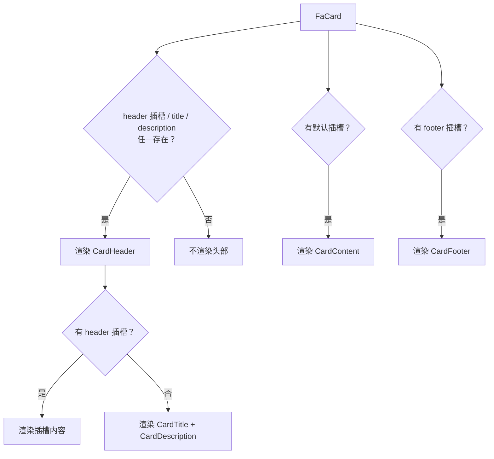

# FaCard 卡片

通用内容容器，将内容分组在带边框和阴影的卡片中。内部由 `Card` / `CardHeader` / `CardTitle` / `CardDescription` / `CardContent` / `CardFooter` 组合而成（基于 reka-ui 风格封装 + UnoCSS 样式）。

## 基础用法

<Demo title="基础卡片" description="通过 title 属性设置标题，默认插槽放置内容" :source="srcBasic">
  <ClientOnly><InteractiveRemainingMisc type="card" /></ClientOnly>
</Demo>

## 带描述

<Demo title="标题 + 描述" description="description 渲染在标题下方，使用弱化文字样式" :source="srcDesc">
  

    
卡片标题

    
这是一段辅助描述，用于补充说明卡片内容。

    
卡片内容

  

</Demo>

## 插槽

`header` 插槽会完全覆盖 `title` 和 `description` 的默认渲染，适合在头部放图标、操作按钮等自定义布局；`footer` 插槽渲染底部区域，常放操作按钮。

<Demo title="自定义头部与页脚" description="header 插槽覆盖 title/description，footer 插槽放置操作按钮" :source="srcSlot">
  

    

      

        
自定义头部

        
header slot 会覆盖 title 和 description

      

    

    
卡片内容区域

    

      取消
      确定
    

  

</Demo>

## 自定义样式

通过 `class`、`headerClass`、`contentClass`、`footerClass` 分别调整四个区域的样式（UnoCSS 原子类直接透传并合并）。

<Demo title="分区定制样式" description="每个区域独立透传 class，可覆盖间距、背景、文字等" :source="srcCustom">
  

    

      
自定义样式

      
headerClass 控制头部背景与间距

    

    
contentClass 控制内容区样式。

    
footerClass 控制页脚样式

  

</Demo>

## 渲染规则

各区域默认样式（可被对应 `*Class` 覆盖）：

| 区域 | 默认样式要点 |
| --- | --- |
| 根（Card） | `bg-card text-card-foreground flex flex-col gap-6 overflow-hidden rounded-xl border py-6 shadow-sm` |
| 头部（CardHeader） | `grid auto-rows-min items-start gap-1.5 px-6`，含 CardAction 时自动切换为两列布局 |
| 内容（CardContent） | `min-w-0 break-words px-6` |
| 页脚（CardFooter） | `flex items-center px-6` |

## API

### Props

<ApiTable title="FaCard Props" :data="props" />

### Slots

| 插槽 | 说明 |
| --- | --- |
| `header` | 自定义头部，存在时覆盖 `title` / `description` |
| `default` | 卡片内容，渲染在 CardContent 中 |
| `footer` | 页脚区域，渲染在 CardFooter 中 |

### Emits

无自定义 emits。

## 注意事项

- 三个区域都是条件渲染：没有 `title`/`description`/`header` 插槽就不渲染头部，没有默认插槽就不渲染内容区，没有 `footer` 插槽就不渲染页脚。
- 组件宽度默认撑满父容器，示例中的 `w-80` / `w-96` 仅用于演示。
- 背景、文字颜色使用 `bg-card` / `text-card-foreground` 等中性语义变量，深浅模式由主题自动切换，业务侧不要写死颜色。

## 源码引用

- `yudream-frontend/packages/components/src/basic/card/index.vue`
- `yudream-frontend/packages/components/src/basic/card/card/`（Card、CardHeader、CardTitle、CardDescription、CardContent、CardFooter、CardAction）
