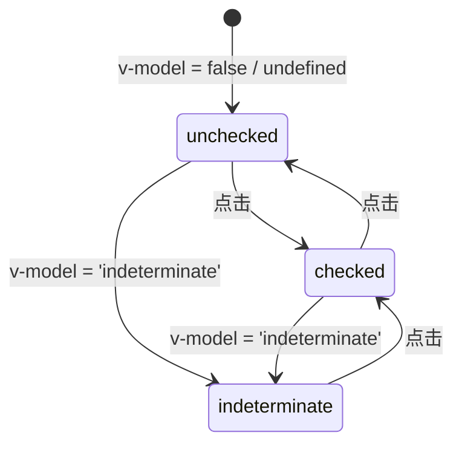

# FaCheckbox 复选框

单个复选框 + 文字标签的组合。基于 reka-ui 的 `CheckboxRoot` 封装 + Tailwind 样式，点击 label 同样触发切换。

## 基础用法

<Demo title="基础复选框" description="v-model 绑定布尔值，默认插槽为 label 文本" :source="srcBasic">
  <ClientOnly><InteractiveBasicCheckbox /></ClientOnly>
</Demo>

## 半选状态

`v-model` 传入 `'indeterminate'` 显示半选，常用于「全选」场景下有部分子项被选中的情况。

<Demo title="半选" :source="srcIndeterminate">
  

    
      −
      部分选中
    
  

</Demo>

## 禁用

<Demo title="禁用" :source="srcDisabled">
  

    
      
      禁用未选中
    
    
      ✓
      禁用已选中
    
  

</Demo>

## 自定义样式

通过 `class` / `itemClass` / `labelClass` 分别覆盖容器、复选框本体、label 的样式。

<Demo title="自定义样式" :source="srcCustomStyle">
  

    
      ✓
      开启精细化配置
    
  

</Demo>

## 状态机

半选状态只能由外部赋值进入，用户点击半选框会切换为选中。

## API

### Props

<ApiTable title="FaCheckbox Props" :data="props" />

### Emits

<ApiTable title="FaCheckbox Emits" :data="emits" :columns="['事件', '签名', '说明']" />

### Slots

| 插槽 | 说明 |
| --- | --- |
| `default` | label 内容；内容为空时 label 自动隐藏（`empty:hidden`） |

::: warning 注意事项
- `v-model` 类型是 `boolean | 'indeterminate' | undefined`，不是严格的布尔，业务侧如需存库请先归一化。
- 需要多选场景请使用 `FaCheckboxGroup`，它负责数组模型、min/max 限制与自定义选项渲染。
:::

::: info 源码位置
- 封装组件：`yudream-frontend/packages/components/src/basic/checkbox/index.vue`
- 底层复选框：`yudream-frontend/packages/components/src/basic/checkbox/checkbox/Checkbox.vue`
- 示例：`yudream-frontend/packages/components/src/basic/checkbox/_examples/`
:::
