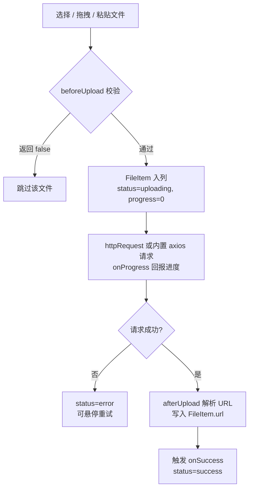

<script setup>
import Demo from '../.vitepress/theme/components/Demo.vue'
import ApiTable from '../.vitepress/theme/components/ApiTable.vue'
import InteractiveRemainingMisc from '../.vitepress/theme/components/demos/InteractiveRemainingMisc.vue'

const srcBasic = `<script setup>
import { ref } from 'vue'

const files = ref([])
<\/script>

<template>
  <FaFileUpload
    v-model="files"
    action="/api/upload"
    :after-upload="response => response.data.url"
    multiple
    @on-success="handleSuccess"
  />
</template>`

const srcValidation = `<script setup>
import { ref } from 'vue'

const files = ref([])

function beforeUpload(file) {
  const isPng = file.type === 'image/png'
  const isLt200K = file.size <= 200 * 1024
  if (!isPng) return false
  if (!isLt200K) return false
  return true
}
<\/script>

<template>
  <FaFileUpload
    v-model="files"
    action="/api/upload"
    :after-upload="response => response.data.url"
    :before-upload="beforeUpload"
    multiple
    :max="5"
    @on-success="handleSuccess"
    @on-click="handleClick"
  />
</template>`

const srcCustomRequest = `<script setup>
import { ref } from 'vue'

const files = ref([])

async function httpRequest({ action, headers, data, name, file, onProgress }) {
  const formData = new FormData()
  Object.entries(data).forEach(([key, value]) => formData.append(key, value))
  formData.append(name, file)
  // 自行发起请求，过程中调用 onProgress(percent) 回报进度
  const response = await myHttp.post(action, formData, { headers })
  onProgress(100)
  return response
}
<\/script>

<template>
  <FaFileUpload
    v-model="files"
    :http-request="httpRequest"
    :after-upload="response => response.url"
    :max="3"
    @on-success="handleSuccess"
  />
</template>`

const srcDirectory = `<script setup>
import { ref } from 'vue'

const files = ref([])
<\/script>

<template>
  <FaFileUpload
    v-model="files"
    directory
    :max="0"
    action="/api/upload"
    :after-upload="response => response.data.url"
  />
</template>`

const props = [
  ['<code>v-model</code>', '<code>FileItem[]</code>', '必填', '文件列表，上传中/成功/失败状态实时写回'],
  ['<code>action</code>', '<code>string</code>', "<code>''</code>", '上传接口地址，默认请求与 httpRequest 都会收到'],
  ['<code>method</code>', '<code>string</code>', "<code>'post'</code>", '默认请求使用的 HTTP 方法'],
  ['<code>headers</code>', '<code>Headers \\| Record&lt;string, any&gt;</code>', '<code>{}</code>', '请求头；Headers 实例会被展开为普通对象'],
  ['<code>data</code>', '<code>Record&lt;string, any&gt;</code>', '<code>{}</code>', '随文件一起提交的额外表单字段（FormData 附加在文件字段之前）'],
  ['<code>name</code>', "<code>string</code>", "<code>'file'</code>", 'FormData 中文件字段的字段名'],
  ['<code>afterUpload</code>', '<code>(response: any) => string \\| Promise&lt;string&gt;</code>', '—', '上传成功后从响应中解析文件 URL，返回值写入 FileItem.url'],
  ['<code>beforeUpload</code>', '<code>(file: File) => boolean \\| Promise&lt;boolean&gt;</code>', '—', '上传前校验，返回 false 则跳过该文件'],
  ['<code>httpRequest</code>', '<code>(options: FileUploadRequestOptions) => any \\| Promise&lt;any&gt;</code>', '—', '自定义上传请求，传入后完全替代内置 axios 请求'],
  ['<code>multiple</code>', '<code>boolean</code>', '<code>false</code>', '点击选择时允许一次多选（directory 为 true 时隐含多选）'],
  ['<code>max</code>', '<code>number</code>', '<code>0</code>', '文件数量上限；0 表示不限制，达到上限后禁用选择/拖拽/粘贴'],
  ['<code>directory</code>', '<code>boolean</code>', '<code>false</code>', '目录上传模式（webkitdirectory），此模式下不响应粘贴'],
  ['<code>disabled</code>', '<code>boolean</code>', '<code>false</code>', '禁用上传与删除'],
  ['<code>description</code>', "<code>string</code>", "<code>'拖放或点击上传'</code>", '拖拽区提示文案（未使用默认插槽时生效）'],
]

const emits = [
  ['<code>onSuccess</code>', '<code>(response: any, file: File) => void</code>', '单个文件上传成功后触发，response 为 httpRequest 的返回值'],
  ['<code>onClick</code>', '<code>(fileItem: FileItem, index: number) => void</code>', '点击文件列表项时触发，可用于预览或下载'],
]
</script>

# FaFileUpload 文件上传

通用文件上传组件，支持点击选择、拖拽、粘贴与目录上传，内置上传进度、失败重试与文件列表管理。`v-model` 绑定 `FileItem[]`，组件会把每个文件的状态实时写回列表。

## 基础用法

<Demo title="基础上传" description="action + afterUpload 即可完成上传；multiple 允许多选" :source="srcBasic">
  <ClientOnly><InteractiveRemainingMisc type="file-upload" /></ClientOnly>
</Demo>

上传交互：

- **点击**：点击虚线区域打开文件选择框，`multiple` 控制是否多选。
- **拖拽**：把文件拖入虚线区域即可上传；拖拽悬停时区域高亮。
- **粘贴**：鼠标悬停在组件上或组件获得焦点时，直接 `Ctrl+V` 粘贴剪贴板中的文件（`directory` 模式下不响应粘贴）。
- **失败重试**：状态为 `error` 的条目悬停后会出现重新上传按钮；非上传中的条目可删除。

## 上传流程



## 校验与数量限制

`beforeUpload` 返回 `false`（或 resolve `false`）即可拦截文件；`max` 达到上限后选择/拖拽/粘贴全部禁用。

<Demo title="上传校验 + onClick" description="beforeUpload 拦截非法文件，点击列表项触发 onClick" :source="srcValidation">
  <div style="border: 2px dashed var(--vp-c-divider); border-radius: 8px; padding: 32px; text-align: center; color: var(--vp-c-text-2); font-size: 14px;">
    仅 PNG，不超过 200KB，最多 5 个
  </div>
</Demo>

## 自定义上传请求

传入 `httpRequest` 后组件不再使用内置 axios 实现，请求方式完全由你控制（断点续传、签名直传 OSS 等场景）。过程中调用 `options.onProgress(percent)` 回报进度，返回值作为 `response` 传给 `afterUpload` 与 `onSuccess`。

<Demo title="httpRequest 自定义请求" description="完全接管上传过程" :source="srcCustomRequest">
  <div style="border: 2px dashed var(--vp-c-divider); border-radius: 8px; padding: 32px; text-align: center; color: var(--vp-c-text-2); font-size: 14px;">
    自定义请求上传
  </div>
</Demo>

## 目录上传

设置 `directory` 后点击选择会打开目录选择器（`webkitdirectory`），目录内所有文件逐个上传；此模式隐含多选且不响应粘贴。

<Demo title="目录上传" description="max=0 表示不限数量" :source="srcDirectory">
  <div style="border: 2px dashed var(--vp-c-divider); border-radius: 8px; padding: 32px; text-align: center; color: var(--vp-c-text-2); font-size: 14px;">
    点击选择目录上传
  </div>
</Demo>

## API

### Props

<ApiTable title="FaFileUpload Props" :data="props" />

### Emits

<ApiTable title="FaFileUpload Emits" :data="emits" :columns="['事件', '回调签名', '说明']" />

### Slots

| 插槽 | 说明 |
| --- | --- |
| `default` | 自定义拖拽区内容，替换默认的图标 + `description` 文案 |

### FileItem

`v-model` 数组元素的类型（导出自组件 `index.vue`）：

```ts
interface FileItem {
  name: string                                  // 文件名
  size: number                                  // 字节数，列表中格式化为可读大小
  url?: string                                  // afterUpload 解析出的地址
  status?: 'uploading' | 'success' | 'error'    // 上传状态
  progress?: number                             // 0-100 上传进度
  file?: File                                   // 原始 File 对象，失败重试时使用
}
```

### FileUploadRequestOptions

`httpRequest` 收到的参数对象：

```ts
interface FileUploadRequestOptions {
  action: string                            // props.action
  method: string                            // props.method
  headers: Headers | Record<string, any>    // props.headers
  data: Record<string, any>                 // props.data
  name: string                              // props.name，文件字段名
  file: File                                // 当前待上传文件
  onProgress: (percent: number) => void     // 进度回调，0-100
}
```

## 注意事项

- `max` 默认为 `0`，表示**不限制**数量；设置为正数后达到上限会禁用一切新增入口。
- 内置默认请求使用 axios 以 `FormData` 提交，先追加 `data` 中的字段，再以 `name` 为字段名追加文件；仅当 `progressEvent.total` 存在时才回报进度。
- 上传失败不会弹出提示，仅把条目标记为 `error`（红框 + 失败图标），需要提示请在 `httpRequest` 中自行处理。
- `onSuccess` 在 `afterUpload` 之后触发；即使 `afterUpload` 未返回 URL，只要请求成功也会触发。
- 粘贴上传只在组件悬停或聚焦时生效，避免与页面其他粘贴行为冲突。

源码：`yudream-frontend/packages/components/src/basic/file-upload/index.vue`，示例：`yudream-frontend/packages/components/src/basic/file-upload/_examples/`
