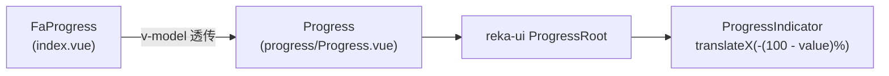

# FaProgress 进度条

展示任务当前进度的条形组件。基于 reka-ui `ProgressRoot` 封装 + UnoCSS 样式，进度条颜色跟随主题主色（`bg-primary`），由后台主题配置统一控制。

## 基础用法

<Demo title="基础进度条" description="通过 v-model 或 :model-value 传入 0 ~ 100 的数值" :source="srcBasic">
  <ClientOnly><InteractiveUtilityDemo type="progress" /></ClientOnly>
</Demo>

## 实现说明

- `FaProgress`（`basic/progress/index.vue`）只做 `v-model` 转发，把 `modelValue` 传给底层 `Progress`。
- 底层 `Progress`（`basic/progress/progress/Progress.vue`）用 `ProgressIndicator` 的 `transform: translateX(-${100 - value}%)` 实现填充动画，带 `transition-all` 过渡。
- 根元素默认样式：`bg-primary/20 relative h-2 w-full overflow-hidden rounded-full`；指示器为 `bg-primary`。
- 除上表外，reka-ui `ProgressRootProps` 的其余属性（如 `getValueLabel`）也会透传。

## API

### Props

<ApiTable title="FaProgress Props" :data="props" />

### Slots

无插槽。

### Emits

无自定义 emits；`modelValue` 通过 `defineModel` 支持 `v-model` 双向绑定。

## 注意事项

- 组件只负责展示，不会自增进度；上传/下载等场景需自行更新绑定的数值。
- 需要更粗的进度条时用 `class` 覆盖高度，例如 `class="h-3"`。
- 颜色不由组件 props 控制，遵循主题主色；不要在业务页面手写固定色板覆盖。

## 源码引用

- `yudream-frontend/packages/components/src/basic/progress/index.vue`
- `yudream-frontend/packages/components/src/basic/progress/progress/Progress.vue`
