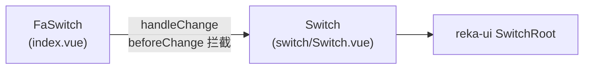

# FaSwitch 开关

布尔状态切换。基于 reka-ui `SwitchRoot` 封装，滑块颜色随主题主色变化（选中态为 `bg-primary`），不由业务页面控制。

## 基础用法

用 `v-model` 绑定一个布尔值。

<Demo title="基础开关" description="v-model 双向绑定布尔值" :source="srcBasic">
  <ClientOnly><InteractiveBasicSwitch /></ClientOnly>
</Demo>

## 禁用状态

<Demo title="禁用" :source="srcDisabled">
  

    <button class="demo-btn demo-btn--disabled" style="width: 44px; padding: 0;">禁</button>
  

</Demo>

## 带图标

通过 `on-icon` / `off-icon` 在滑块内部显示状态图标，适合「日间 / 夜间」等语义明确的场景。

<Demo title="图标开关" description="on-icon 与 off-icon 分别对应开、关状态" :source="srcIcon">
  

    <button class="demo-btn demo-btn--primary" style="width: 44px; padding: 0;">☀</button>
    <button class="demo-btn" style="width: 44px; padding: 0;">🌙</button>
  

</Demo>

## 前置拦截（beforeChange）

传入 `beforeChange` 后，每次切换都会先执行该函数：返回 `true`（或 resolve `true`）才更新 `v-model`，返回 `false` 或抛出异常则保持原状态。常用于二次确认或权限校验。

<Demo title="beforeChange 拦截" description="确认通过后才会真正切换" :source="srcBeforeChange">
  

    <button class="demo-btn demo-btn--primary" style="width: 44px; padding: 0;">?</button>
    点击后先弹确认框
  

</Demo>

## 实现说明

- `FaSwitch`（`basic/switch/index.vue`）持有布尔模型，先经过 `beforeChange` 判定再写入模型值。
- 底层 `Switch` 将 `SwitchRootProps` / `SwitchRootEmits` 透传给 reka-ui `SwitchRoot`，并提供 `thumb` 插槽渲染滑块内容；`FaSwitch` 用该插槽放状态图标，未向使用者暴露插槽。

## API

### Props

<ApiTable title="FaSwitch Props" :data="props" />

### Events

无自定义 emits。状态变化完全通过 `v-model`（`update:modelValue`）同步；如需监听变化，直接 `watch` 绑定的值即可。

### Slots

无对外插槽。滑块内部的 `thumb` 插槽由组件自身用于渲染 `onIcon` / `offIcon` 图标。

## 注意事项

- `beforeChange` 返回 `Promise<boolean>` 时组件会等待其完成；期间不会提前更新状态。
- 需要更大点击区域时用 `class` 调整尺寸（根元素默认 `h-[1.15rem] w-8` 圆角胶囊）。

## 源码引用

- `yudream-frontend/packages/components/src/basic/switch/index.vue`
- `yudream-frontend/packages/components/src/basic/switch/switch/Switch.vue`
