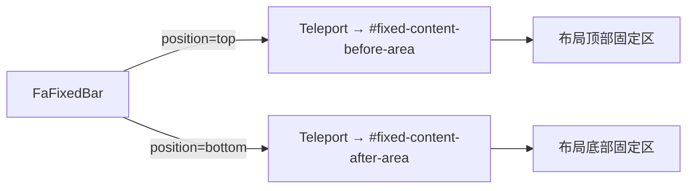

<script setup>
import Demo from '../.vitepress/theme/components/Demo.vue'
import ApiTable from '../.vitepress/theme/components/ApiTable.vue'
import InteractiveUtilityDemo from '../.vitepress/theme/components/demos/InteractiveUtilityDemo.vue'

const srcBasic = `<script setup>
import { FaFixedBar, FaButton } from '@yudream/components'
<\/script>

<template>
  <!-- 固定在布局顶部区域 -->
  <FaFixedBar position="top">
    <FaButton>顶部操作</FaButton>
  </FaFixedBar>

  <!-- 固定在布局底部区域（保存栏等） -->
  <FaFixedBar position="bottom" class="flex justify-end gap-2">
    <FaButton variant="outline">取消</FaButton>
    <FaButton>保存</FaButton>
  </FaFixedBar>
</template>`
const props = [
  ['<code>position</code>', '<code>top | bottom</code>', '—', '必填；固定到顶部或底部固定区'],
  ['<code>class</code>', '<code>string</code>', '—', '透传内部容器 class，可用于排版按钮组'],
]
</script>

# FaFixedBar 固定栏

将内容固定渲染到应用布局预留的顶部 / 底部固定区域，典型用途是页面顶部的操作条和底部的「取消 / 保存」栏。组件内部基于 `Teleport` 实现：内容被传送至布局中 `#fixed-content-before-area`（top）或 `#fixed-content-after-area`（bottom）容器。

依据源码：`yudream-frontend/packages/components/src/basic/fixed-bar/index.vue`

## 工作原理



`Teleport` 使用 `defer` 且 `disabled` 与组件的 keep-alive 激活状态绑定：

- `onMounted` / `onActivated` 时启用传送（`isActive = true`），内容出现在固定区。
- `onDeactivated` 时禁用传送（内容回到原地），避免 keep-alive 缓存页面残留固定栏。

::: tip
目标容器由宿主布局提供；若布局未渲染对应容器，内容不会显示。请确保在标准后台布局内使用。
:::

## 基础用法

<Demo title="固定栏" description="position 决定传送到顶部还是底部固定区" :source="srcBasic">
  <ClientOnly><InteractiveUtilityDemo type="fixed-bar" /></ClientOnly>
</Demo>

## 示例讲解

以底部保存栏为例：

```vue
<FaFixedBar position="bottom" class="flex justify-end gap-2">
  <FaButton variant="outline">取消</FaButton>
  <FaButton>保存</FaButton>
</FaFixedBar>
```

- `position` 是必填 prop，直接决定 Teleport 目标：`top` → `#fixed-content-before-area`，`bottom` → `#fixed-content-after-area`，模板中通过 `#` + 容器 id 动态拼接。
- 内部容器默认样式为 `mx-auto bg-background pointer-events-auto p-4`：水平居中、背景不透明白（遮住滚动内容）、自带 16px 内边距；传入的 `class` 与默认样式合并而非整体替换。
- 容器加 `pointer-events-auto` 意味着外层固定区可能是 `pointer-events-none` 的悬浮层，组件保证自身可交互。

## API

### Props

<ApiTable title="FaFixedBar Props" :data="props" />

### Slots

| 插槽 | 说明 |
| --- | --- |
| `default` | 固定栏内容 |

### Emits

无自定义 emits。
