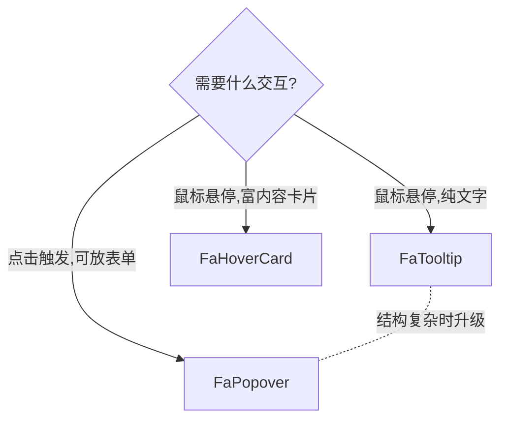

<script setup>
import Demo from '../.vitepress/theme/components/Demo.vue'
import ApiTable from '../.vitepress/theme/components/ApiTable.vue'
import InteractiveRemainingBasicHoverCard from '../.vitepress/theme/components/demos/InteractiveRemainingBasicHoverCard.vue'

const srcBasic = `<script setup>
// 组件已由框架自动导入，无需手动 import
<\/script>

<template>
  <FaHoverCard>
    <a href="#" class="text-primary underline">
      @husky
    </a>
    <template #card>
      <div class="w-80 space-y-2 text-sm">
        <p class="font-medium">SiberianHusky</p>
        <p class="text-muted-foreground">
          前端工程师，专注于 Vue 3 与组件库建设。
        </p>
      </div>
    </template>
  </FaHoverCard>
</template>`

const props = [
  ['<code>align</code>', "<code>'start' | 'center' | 'end'</code>", "<code>'center'</code>", '卡片与触发器的水平对齐方式'],
  ['<code>alignOffset</code>', '<code>number</code>', '<code>0</code>', '对齐方向上的额外偏移（px）'],
  ['<code>side</code>', "<code>'top' | 'right' | 'bottom' | 'left'</code>", "<code>'bottom'</code>", '弹出方向'],
  ['<code>sideOffset</code>', '<code>number</code>', '<code>4</code>', '与触发元素的间距（px）'],
  ['<code>collisionPadding</code>', '<code>number</code>', '<code>0</code>', '与视口边缘的碰撞内边距（px）'],
  ['<code>class</code>', '<code>string</code>', '—', '透传卡片 class；建议为内容设定合适的宽度（如 <code>w-80</code>）'],
]
</script>

# FaHoverCard 悬浮卡片

鼠标悬停在触发元素上时展示的富内容卡片，用于在不打断操作的前提下预览额外信息。基于 reka-ui 的 `HoverCard` / `HoverCardTrigger` / `HoverCardContent` 封装。

## 使用场景

- 用户/组织信息预览
- 链接、引用的摘要预览
- 术语解释、日期时间详情、标签详情

## 基础用法

`default` 插槽是悬停触发元素；**卡片内容放在 `#card` 插槽中**。与 Tooltip 不同，HoverCard 的内容可以是任意结构化富文本。

<Demo title="基础悬浮卡片" :source="srcBasic">
  <ClientOnly><InteractiveRemainingBasicHoverCard /></ClientOnly>
</Demo>

## 用户信息卡片

HoverCard 最典型的场景：在列表、评论、@提及中悬停用户名预览资料，无需跳转页面。

<Demo title="用户信息预览" :source="srcBasic">
  <ClientOnly><InteractiveRemainingBasicHoverCard /></ClientOnly>
</Demo>

## 弹出位置与偏移

与 [FaPopover](./popover.md) 一致：`side` 指定四个方向，`sideOffset` / `alignOffset` 控制像素级微调，空间不足时自动碰撞翻转。

<Demo title="side 方向" :source="srcBasic">
  <ClientOnly><InteractiveRemainingBasicHoverCard /></ClientOnly>
</Demo>

## 链接预览

文档、引用链接的悬停摘要也是常见用法；卡片内可以放标题、摘要与操作按钮，宽度建议固定（`w-80`）以保持阅读节奏。

```vue
<template>
  <FaHoverCard side="top">
    <a href="#" class="text-primary underline">
      yudream/components 设计规范
    </a>
    <template #card>
      <div class="w-80 space-y-2 text-sm">
        <p class="font-medium">设计规范</p>
        <p class="text-muted-foreground">
          组件命名、间距与主题变量的约定说明。
        </p>
      </div>
    </template>
  </FaHoverCard>
</template>
```

## 与相近组件的关系



- HoverCard 由 reka-ui 内置的悬停延迟驱动，避免鼠标划过时误触发；没有暴露自定义 delay 参数。
- 卡片样式层级为 `z-2000`，定位行为由 reka-ui 自动处理。
- 组件不管理展开状态（无 `v-model`），完全由悬停交互驱动。

## API

### Props

<ApiTable title="FaHoverCard Props" :data="props" />

### Slots

| 插槽 | 说明 |
| --- | --- |
| `default` | 悬停触发元素（必填） |
| `card` | 悬浮卡片内容 |

### Emits

无自定义 emits。

::: warning 注意事项
- 触发元素必须是单个可接收事件绑定的元素/组件（内部为 `as-child`）。
- 移动端没有 hover 语义，重要操作入口不要只依赖 HoverCard 展示。
:::

::: info 源码位置
- 封装组件：`yudream-frontend/packages/components/src/basic/hover-card/index.vue`
- 子组件：`yudream-frontend/packages/components/src/basic/hover-card/hover-card/`
- 示例：`yudream-frontend/packages/components/src/basic/hover-card/_examples/`
:::
