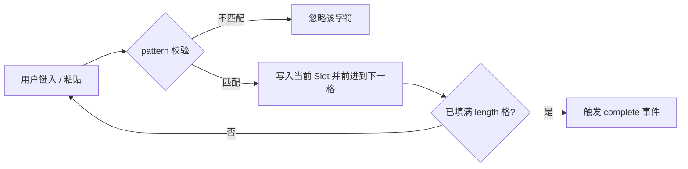

# FaInputOTP 验证码输入

一次性密码（OTP）输入组件，用于短信验证码、邮箱验证码、双因素认证（2FA）等场景。基于 [vue-input-otp](https://input-otp.1stg.me/) 封装，支持自动聚焦跳格、粘贴分发、退格回退与自定义位数/分组/字符模式。框架会自动全局注册，页面中无需手动导入。

## 基础用法

<Demo title="基础用法" description="默认 6 位，输入后自动跳到下一格，支持整段粘贴" :source="srcBasic">
  <ClientOnly><InteractiveRemainingBasicInputOtp /></ClientOnly>
</Demo>

## 自定义位数

<Demo title="length" description="通过 length 调整位数，如常见的 4 位短信验证码" :source="srcLength">
  <ClientOnly><InteractiveRemainingBasicInputOtp /></ClientOnly>
</Demo>

## 输入模式

<Demo title="pattern" description="三种预设模式，或直接传正则字符串限制可输入字符" :source="srcPattern">
  <ClientOnly><InteractiveRemainingBasicInputOtp /></ClientOnly>
</Demo>

## 分组分隔符

<Demo title="separator" description="separator 传入每组长度，组间自动插入分隔符；不足部分并入最后一段" :source="srcSeparator">
  <ClientOnly><InteractiveRemainingBasicInputOtp /></ClientOnly>
</Demo>

## 输入与完成事件

<Demo title="input / complete" description="input 随输入实时回调，complete 在填满时触发一次" :source="srcCallback">
  <ClientOnly><InteractiveRemainingBasicInputOtp /></ClientOnly>
</Demo>

## API

### Props

<ApiTable title="FaInputOTP Props" :data="props" />

### Emits

<ApiTable title="FaInputOTP Emits" :data="emits" :columns="['事件', '回调签名', '说明']" />

## 行为机制

要点：

- 组件内部由 `InputOTP` 容器 + `InputOTPGroup` 分组 + `InputOTPSlot` 单格组成，`separator` 会把 `length` 切成若干连续区间，区间之间渲染 `InputOTPSeparator`；
- `pattern` 的三个预设值分别映射 vue-input-otp 导出的 `REGEXP_ONLY_CHARS`、`REGEXP_ONLY_DIGITS`、`REGEXP_ONLY_DIGITS_AND_CHARS`；其他字符串按自定义正则处理；
- 支持粘贴整段验证码（自动分配到各格）、退格删除并回退上一格、方向键在格间移动。

## 注意事项

- `v-model` 是**一个完整字符串**而不是数组；校验时直接对整个值做请求即可，无需自行拼接。
- `complete` 每次填满都会触发（包括重新修改后再次填满）；若做一次性提交，请在回调中加防抖或状态锁。
- 验证码本身是短数字/字母串，不涉及 Snowflake ID；但若后续要把用户 ID 等 Java `Long`/Snowflake ID 一并传给前端，JSON、TS 模型与 URL 参数中一律使用 `string`，禁止 `Number(id)`。
- `separator` 中非正数会被跳过，超出 `length` 的部分会截断；未覆盖到的剩余位数并入最后一个分组。

## 源码

- 组件：`yudream-frontend/packages/components/src/basic/input-otp/index.vue`
- 内部实现：`yudream-frontend/packages/components/src/basic/input-otp/input-otp/`（`InputOTP.vue`、`InputOTPSlot.vue`、`InputOTPGroup.vue`、`InputOTPSeparator.vue`）
- 示例：`yudream-frontend/packages/components/src/basic/input-otp/_examples/`
