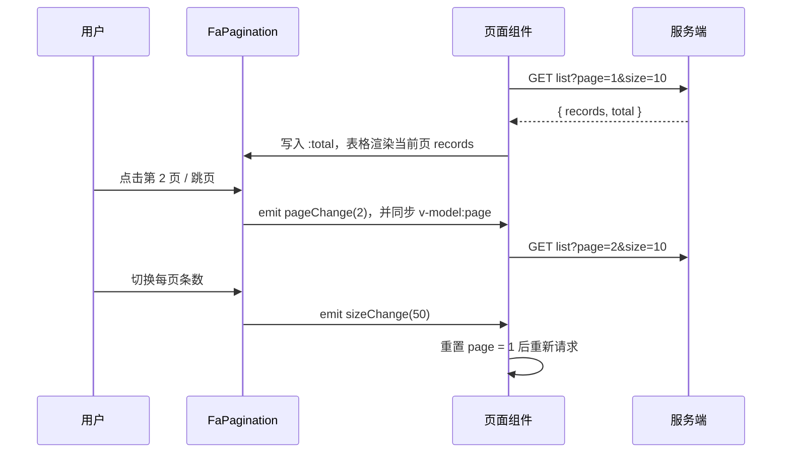

# FaPagination 分页

基于 reka-ui Pagination 子组件二次封装的完整分页栏：页码器 + 总数 + 每页条数选择器 + 跳页输入框，通过 `layout` 字符串自由编排。内部由 `Pagination` / `PaginationContent` / `PaginationItem` / `PaginationEllipsis` / `PaginationFirst` 等子组件组成。

依据源码：`yudream-frontend/packages/components/src/basic/pagination/index.vue` 及同目录 `pagination/` 子目录

## 基础用法

组件是**受控**的：`page` 与 `size` 均为必填的 `v-model`，`total` 由服务端返回后写入。翻页与改每页条数只更新模型并发出事件，请求由业务侧发起（见下文「与服务端分页配合」）。

<Demo title="基础分页" description="v-model:page / v-model:size 受控，layout 控制子项" :source="srcBasic">
  <ClientOnly><InteractiveRemainingBasicPagination /></ClientOnly>
</Demo>

## layout 布局

`layout` 是逗号分隔的字符串，决定显示哪些子项及其排列顺序：

| 片段 | 含义 |
| --- | --- |
| `total` | 总条数文案（默认「共 N 条」） |
| `sizes` | 每页条数 Select |
| `pager` | 页码器（首/上一页/页码/省略号/下一页/末页） |
| `jumper` | 「前往 N 页」跳页输入框 |
| `->` | 弹性占位符（把后面的项推到右侧，移动端隐藏） |

未出现在 `layout` 中的子项不渲染。跳页输入框会过滤非数字字符，回车提交；越界时自动纠正到边界页码。

<Demo title="自定义布局" description="layout='total, sizes, ->, pager, jumper'" :source="srcLayout">
  <ClientOnly><InteractiveRemainingBasicPagination /></ClientOnly>
</Demo>

## API

### Props

<ApiTable title="FaPagination Props" :data="props" />

### Emits

<ApiTable title="FaPagination Emits" :data="events" />

### Slots

无插槽。

## 与服务端分页配合

FaPagination 不做本地切片——`data` 是否分页完全由调用方决定。标准管理页（参考 `apps/core-arco-design-vue/src/views/system/user/index.vue`）的组合方式：

要点：

- 请求参数约定为 `page`（从 1 开始）与 `size`，响应为项目统一的 `PageResult<T>` 结构（含 `records` 与 `total`，见 `apps/core-arco-design-vue/src/api/modules/system-client.ts`），将 `total` 回填给 `:total`。
- 监听 `size-change` 时应先把 `page` 重置为 1，避免落在超出范围 的页码上。
- 表格侧使用 `FaTable` / `FaResponsiveTable` 时直接把当前页 `records` 作为 `data` 传入即可，无需开启任何客户端分页 prop。

::: warning 长 ID 必须使用 string
后端 Java `Long` / Snowflake ID 超出 JS `Number` 安全整数范围，在 JSON 响应、TS 模型、表格行 key 与 URL 参数中**一律使用 `string`**，禁止 `Number(id)` 之类的转换；分页接口返回的主键、以及跳转详情页携带的 `id` 查询参数都应保持字符串形态。
:::
