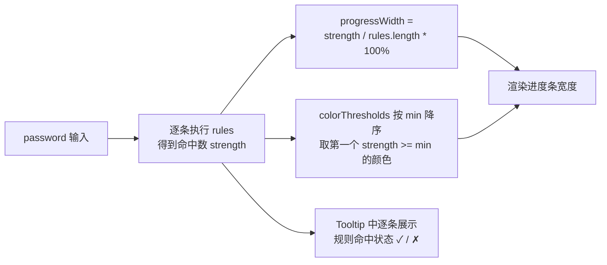

# FaPasswordStrength 密码强度

实时密码强度指示条。根据传入的 `password` 值逐条计算规则命中数，驱动进度条宽度与颜色变化；悬停问号图标可查看每条规则的达标情况。配合 `FaInput` 的 `type="password"` 使用即可覆盖注册、改密等场景。框架会自动全局注册，页面中无需手动导入。

## 基础用法

<Demo title="基础用法" description="默认 5 条规则 + 4 档色阶，随输入实时更新" :source="srcBasic">
  <ClientOnly><InteractiveRemainingFormPasswordStrength variant="basic" /></ClientOnly>
</Demo>

## 自定义规则与色阶

<Demo title="rules / colorThresholds" description="自定义校验规则数量与颜色档位，满分等于 rules.length" :source="srcCustom">
  <ClientOnly><InteractiveRemainingFormPasswordStrength variant="custom" /></ClientOnly>
</Demo>

## API

### Props

<ApiTable title="FaPasswordStrength Props" :data="props" />

## 默认值明细

### 默认规则 defaultRules

| 提示文案 | 判定函数 |
| --- | --- |
| 长度至少为8个字符 | `value.length >= 8` |
| 包含大写字母 | `/[A-Z]/.test(value)` |
| 包含小写字母 | `/[a-z]/.test(value)` |
| 包含数字 | `/\d/.test(value)` |
| 包含特殊字符 | `/[^A-Z0-9]/i.test(value)` |

### 默认色阶 defaultColorThresholds

<ApiTable title="defaultColorThresholds" :data="colorThresholds" :columns="['阈值', '颜色类', '效果']" />

## 强度计算机制

要点：

- 强度满分等于 `rules.length`，进度条宽度按命中数占比计算，而非百分比算法；
- `colorThresholds` 匹配的是**命中规则数**而不是百分比：默认色阶下命中 4 条规则时会使用 `min: 3` 对应的黄色；
- 规则列表在 Tooltip 中逐条展示，命中的条目显示绿色勾选。

## 注意事项

- 组件是**纯受控展示组件**，自身不校验、不提交；密码值由外部通过 `password` prop 传入。
- `rule` 函数接收当前 `password` 字符串并返回布尔值，可写任意同步逻辑（正则、字符集判断等）。
- 自定义 `colorThresholds` 时建议始终保留一条 `min: 0` 兜底项，否则强度为 0 时进度条没有颜色类。
- 密码字段属于敏感信息，不要把明文密码写入 URL 或日志；若同一表单需要携带用户 ID 等 Java `Long`/Snowflake ID，JSON、TS 模型与 URL 参数中一律使用 `string`，禁止 `Number(id)`。

## 源码

- 组件：`yudream-frontend/packages/components/src/basic/password-strength/index.vue`
- 示例：`yudream-frontend/packages/components/src/basic/password-strength/_examples/`
