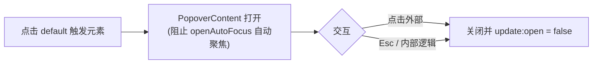

<script setup>
import Demo from '../.vitepress/theme/components/Demo.vue'
import ApiTable from '../.vitepress/theme/components/ApiTable.vue'
import InteractiveBasicPopover from '../.vitepress/theme/components/demos/InteractiveBasicPopover.vue'

const srcBasic = `<script setup>
// 组件已由框架自动导入，无需手动 import
<\/script>

<template>
  <FaPopover>
    <FaButton variant="outline">点击弹出</FaButton>
    <template #panel>
      <div class="text-sm space-y-2">
        <p>这里是弹出面板内容</p>
        <p>可以放表单、筛选器等复杂结构</p>
      </div>
    </template>
  </FaPopover>
</template>`

const srcControlled = `<script setup>
import { ref } from 'vue'

const open = ref(false)
<\/script>

<template>
  <FaPopover v-model:open="open">
    <FaButton @click="open = !open">
      {{ open ? '关闭' : '打开' }}筛选
    </FaButton>
    <template #panel>
      <!-- 高级筛选面板 -->
    </template>
  </FaPopover>
</template>`

const props = [
  ['<code>v-model:open</code>', '<code>boolean</code>', '<code>false</code>', '弹出层展开状态；不传则由内部点击触发器自行切换'],
  ['<code>align</code>', "<code>'start' | 'center' | 'end'</code>", "<code>'center'</code>", '弹出层与触发器的水平对齐方式'],
  ['<code>alignOffset</code>', '<code>number</code>', '<code>0</code>', '对齐方向上的额外偏移（px）'],
  ['<code>side</code>', "<code>'top' | 'right' | 'bottom' | 'left'</code>", "<code>'bottom'</code>", '弹出方向'],
  ['<code>sideOffset</code>', '<code>number</code>', '<code>4</code>', '与触发元素的间距（px）'],
  ['<code>collisionPadding</code>', '<code>number</code>', '<code>0</code>', '与视口边缘的碰撞内边距（px）'],
  ['<code>class</code>', '<code>string</code>', '—', '透传弹出面板 class；面板默认 <code>min-w-72</code>（18rem），可通过它调整宽度'],
]

const emits = [
  ['<code>update:open</code>', '<code>(value: boolean) => void</code>', '展开状态变化时触发，与 <code>v-model:open</code> 同步'],
]
</script>

# FaPopover 弹出框

灵活的弹出容器：点击触发元素后在周围弹出自定义面板。基于 reka-ui 的 `Popover` / `PopoverTrigger` / `PopoverContent` 封装，自动定位避免超出视口。

## 使用场景

- 高级筛选面板、快速操作面板
- 信息详情卡片、颜色/日期选择器
- 轻量级「点开即用、点击外部关闭」的表单

## 基础用法

`default` 插槽是触发元素；**面板内容必须放在 `#panel` 插槽中**。

<Demo title="基础弹出框" :source="srcBasic">
  <ClientOnly><InteractiveBasicPopover /></ClientOnly>
</Demo>

## 高级筛选面板

Popover 的典型场景：触发按钮 + 面板内放表单控件，确认后写回业务状态。面板宽度用 `class` 覆盖（如 `w-80`）。

```vue
<script setup>
import { reactive, ref } from 'vue'

const open = ref(false)
const filter = reactive({ keyword: '', status: 'all' })

function apply() {
  // 将 filter 应用到列表查询
  open.value = false
}
</script>

<template>
  <FaPopover v-model:open="open" align="end">
    <FaButton variant="outline">高级筛选</FaButton>
    <template #panel>
      <div class="w-80 space-y-3">
        <FaInput v-model="filter.keyword" placeholder="关键字" />
        <FaSelect v-model="filter.status" :options="statusOptions" />
        <FaButton class="w-full" @click="apply">
          应用
        </FaButton>
      </div>
    </template>
  </FaPopover>
</template>
```

## 受控用法

通过 `v-model:open` 双向绑定展开状态，可从组件外部（如工具栏按钮）控制开关。

<Demo title="受控模式" :source="srcControlled">
  <div class="demo-row">
    <button class="demo-btn demo-btn--primary">关闭筛选</button>
  </div>
</Demo>

## 弹出位置

`side` 控制四个方向，`align` 控制水平对齐；空间不足时 reka-ui 会自动碰撞翻转。

<Demo title="side 方向" :source="srcBasic">
  <div class="demo-row">
    <button class="demo-btn" style="opacity:.6;">Top ▴</button>
    <button class="demo-btn" style="opacity:.6;">Right ▸</button>
    <button class="demo-btn" style="opacity:.6;">Bottom ▾</button>
    <button class="demo-btn" style="opacity:.6;">Left ◂</button>
  </div>
</Demo>

## 行为细节



- 面板样式为 `z-2000 w-unset min-w-72`：宽度不跟随触发元素，最小 18rem，用 `class` 可覆盖。
- 组件在 `@open-auto-focus` 中调用 `preventDefault()`，打开时不会抢走当前焦点。
- 点击面板外部自动关闭。

## API

### Props

<ApiTable title="FaPopover Props" :data="props" />

### Emits

<ApiTable title="FaPopover Emits" :data="emits" :columns="['事件', '签名', '说明']" />

### Slots

| 插槽 | 说明 |
| --- | --- |
| `default` | 触发元素 |
| `panel` | 弹出面板内容（必填，否则面板为空） |

::: warning 注意事项
- 忘记写 `#panel` 是最常见的错误——内容写在 `default` 插槽里会变成触发器的一部分。
- 简短的纯文字提示请改用 [FaTooltip](./tooltip.md)；鼠标悬停展示的卡片用 [FaHoverCard](./hover-card.md)。
:::

::: info 源码位置
- 封装组件：`yudream-frontend/packages/components/src/basic/popover/index.vue`
- 子组件：`yudream-frontend/packages/components/src/basic/popover/popover/`（含未在封装中使用的 `PopoverAnchor.vue`）
- 示例：`yudream-frontend/packages/components/src/basic/popover/_examples/`
:::
