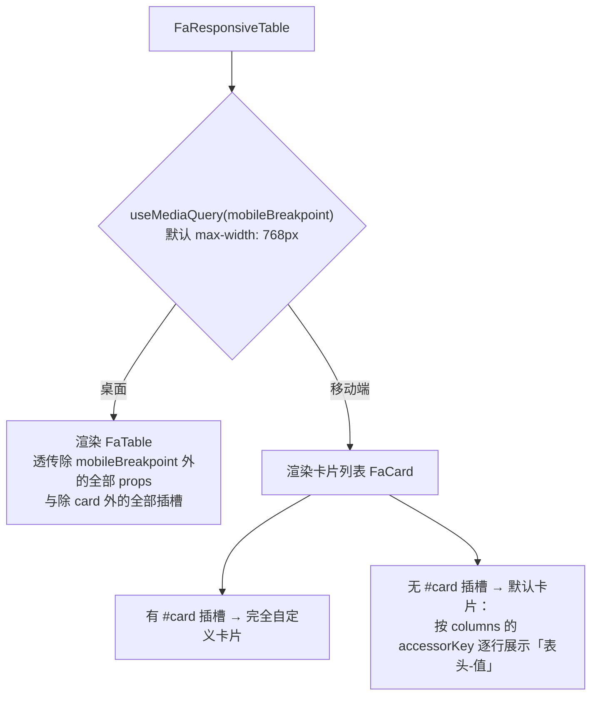

# FaResponsiveTable 响应式表格（YuDream 原创包装组件）

`FaResponsiveTable` 是 YuDream 原创的响应式包装组件，不是 Fantastic-admin 框架自带的 `Fa*` 组件。它在桌面端复用 `FaTable`，在移动端切换为卡片列表；props、插槽与 `FaTable` 保持兼容并整体透传，已有表格页把 `FaTable` 换成 `FaResponsiveTable` 即可获得移动端适配。组件只负责响应式渲染传入的数据，不负责请求、服务端分页或分页状态管理。

依据源码：`yudream-frontend/packages/components/src/basic/responsive-table/index.vue`

## 工作原理

移动端补充行为：

- 树形数据（`tree`）在移动端被展开为带层级的扁平列表（`flattenTree`），子级按深度缩进并用连接线标识。
- 数据为空时渲染「暂无数据」空态卡片；`toolbar` 插槽在移动端同样会渲染。

## 基础用法

<Demo title="桌面端表格" description="演示固定为桌面分支，便于检查 FaTable 样式；生产使用默认断点自动切换" :source="srcBasic">
  <ClientOnly><InteractiveRemainingFormResponsiveTable variant="basic" /></ClientOnly>
</Demo>

::: tip
后端 Java `Long` / Snowflake ID 在 JSON 响应、TS 模型与 URL 参数中一律使用 `string`（如示例中的 `id: '1932574829104'`），禁止 `Number(id)` 转换。
:::

## 自定义移动端卡片

通过 `#card` 插槽（作用域 `{ row, index, depth }`）完全接管卡片内容；未提供时回退到按列生成的默认卡片。

<Demo title="#card 插槽" description="{ row, index, depth } 作用域自定义卡片" :source="srcCard">
  <ClientOnly><InteractiveRemainingFormResponsiveTable variant="card" /></ClientOnly>
</Demo>

## API

### Props

完整 Props 继承自 [`FaTable`](./fa-table.md) 的 `TableProps<TData>`（含 `columns` / `data` / `selectable` / `tree` / `stripe` 等），仅新增一项：

<ApiTable title="FaResponsiveTable Props" :data="[
  ['<code>mobileBreakpoint</code>', '<code>string</code>', `<code>'(max-width: 768px)'</code>`, '移动端媒体查询断点，命中即渲染卡片列表'],
]" />

::: details 关于布尔 props 的透传
类型包含 Boolean 的 props（如 `selectable` / `tree` / `expanded` 等）在此处显式声明 `undefined` 默认值，保证未传值时经 `v-bind` 透传给 `FaTable` 后仍走 `FaTable` 自身的默认值——尤其 `expanded: false` 会让树形表格误判为受控展开而无法展开。业务侧无需关心此细节。
:::

### Slots

| 插槽 | 说明 |
| --- | --- |
| `card` | 仅移动端；作用域 <code>{ row, index, depth }</code>，自定义卡片 |
| `toolbar` | 桌面由 `FaTable` 渲染，移动端也会渲染 |
| 其余插槽 | 原样透传给 `FaTable`（单元格、空态等，见 fa-table.md） |

### Emits

无自定义 emits，`FaTable` 的事件透传。

## 与服务端分页配合

FaResponsiveTable 本身不做分页——它只负责渲染传入的 `data`。标准组合是 `FaSearchBar` + `FaResponsiveTable` + [`FaPagination`](./pagination.md)：分页请求由页面发起（参数 `page` 从 1 开始、`size` 为每页条数，服务端返回 `PageResult<T>`），把当前页的 `records` 数组交给 `:data`，`total` 交给 `FaPagination` 的 `:total`。翻页 / 改每页条数后重新请求即可，组件无需任何额外配置。

::: warning 长 ID 必须使用 string
分页接口返回的主键（Java `Long` / Snowflake ID）超出 JS 安全整数范围，在 JSON、TS 模型、表格行 key 与 URL 参数中一律使用 `string`，禁止 `Number(id)`。
:::
