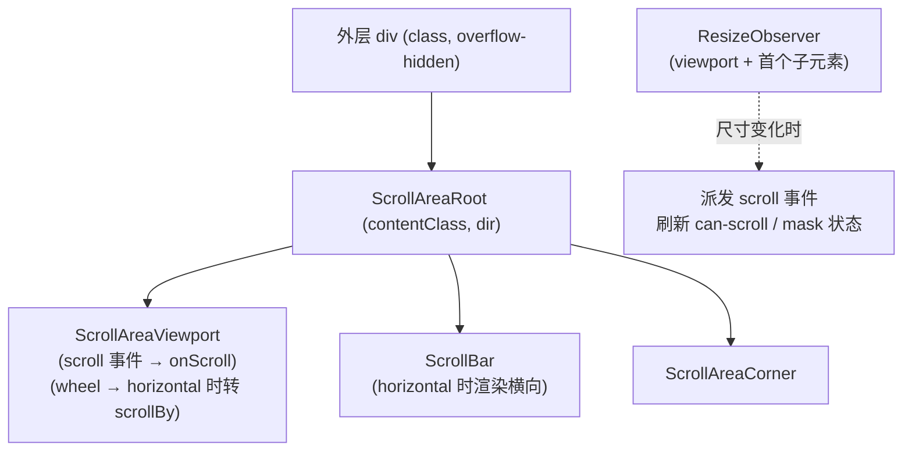

# FaScrollArea 滚动区域

自定义滚动条的滚动容器，支持水平/垂直滚动、渐变遮罩与滚动事件监听。基于 reka-ui 的 `ScrollAreaRoot` / `ScrollAreaViewport` / `ScrollBar` 封装，并额外提供了 `scrollTo` 方法与 `mask` 遮罩能力。

## 使用场景

- 长列表、侧边栏、聊天消息的滚动容器
- 水平滚动的卡片列表
- 需要隐藏滚动条但保留滚动能力的区域

## 基础用法

**必须通过 `class` 设置 `height` / `max-height` 等尺寸约束**，内容超出后才会出现滚动。

<Demo title="垂直滚动" :source="srcBasic">
  <ClientOnly><InteractiveRemainingBasicScrollArea /></ClientOnly>
</Demo>

## 水平滚动

`horizontal` 启用后渲染横向 `ScrollBar`，并且滚轮的 `deltaY` 会被转换为 `scrollBy({ left })`，方便用鼠标滚轮横向浏览。内容需要超出容器宽度（子项 `shrink-0`）。

<Demo title="水平滚动" :source="srcHorizontal">
  <ClientOnly><InteractiveRemainingBasicScrollArea /></ClientOnly>
</Demo>

## 渐变遮罩

`mask` 开启后，在可滚动的边缘显示渐变遮罩，提示「下方/右侧还有内容」。内部实现基于 CSS `@property` + Scroll Timeline（`scroll-timeline-name: --scroll-area-mask-timeline`），遮罩随滚动位置自动淡出；`can-scroll` class 由 ResizeObserver 监测「内容是否超出视口」后写入。

<Demo title="渐变遮罩" :source="srcMask">
  <ClientOnly><InteractiveRemainingBasicScrollArea /></ClientOnly>
</Demo>

## 编程式滚动

组件通过 `defineExpose` 暴露 `scrollTo(scrollNumber, behavior)`；水平模式下滚动 `left`，垂直模式下滚动 `top`。同时也暴露了内部 `ref` 供高级场景取用 viewport 元素。

<Demo title="scrollTo" :source="srcScrollTo">
  <ClientOnly><InteractiveRemainingBasicScrollArea /></ClientOnly>
</Demo>

## 内部结构

- 组件会监听容器与内容尺寸变化，变化时主动向 viewport 派发 `scroll` 事件，保证遮罩与滚动条状态即时刷新。
- 文字方向跟随 `useTextDirection()` 自动设置 `ltr/rtl`。

## API

### Props

<ApiTable title="FaScrollArea Props" :data="props" />

### Emits

<ApiTable title="FaScrollArea Emits" :data="emits" :columns="['事件', '签名', '说明']" />

### Slots

| 插槽 | 说明 |
| --- | --- |
| `default` | 滚动内容 |

### Exposed

| 名称 | 类型 | 说明 |
| --- | --- | --- |
| `scrollTo` | `<code>(scrollNumber: number, behavior?: ScrollBehavior) => void</code>` | 滚动到指定位置；`behavior` 默认 `'auto'`，可传 `'smooth'` |
| `ref` | `<code>ShallowRef<ScrollAreaRootExpose \| null></code>` | 内部 `ScrollArea` 组件引用，可通过 `.el.viewportElement` 取到 viewport 元素 |

::: warning 注意事项
- 不设置高度约束就不会滚动——这是使用该组件最常见的踩坑点。
- `horizontal` 模式会接管 `wheel` 事件做纵向转横向滚动，页面级纵向滚动经过该区域时会被拦截。
- `mask` 依赖 CSS Scroll Timeline 特性，旧浏览器上遮罩可能不生效，但不影响滚动功能。
:::

::: info 源码位置
- 封装组件：`yudream-frontend/packages/components/src/basic/scroll-area/index.vue`
- 子组件：`yudream-frontend/packages/components/src/basic/scroll-area/scroll-area/`（`ScrollArea.vue` / `ScrollBar.vue`）
- 示例：`yudream-frontend/packages/components/src/basic/scroll-area/_examples/`
:::
