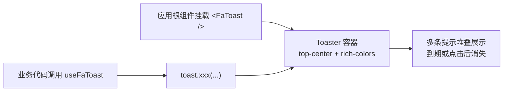

# FaToast 轻提示

全局轻提示（Toast），用于表单提交反馈、操作成败等瞬时消息。组件本体 `<FaToast />` 是 [vue-sonner](https://sonner.emilkowal.ski/) 的 `Toaster` 封装（固定 `top-center` 位置、`rich-colors` 富色模式与主题化样式类）；业务代码不操作组件，而是通过 `useFaToast()` 返回的函数式 API 弹出消息。

## 基础用法

<Demo title="五种类型 + 描述" description="默认 / success / error / info / warning，均可携带 description 副标题" :source="srcBasic">
  <ClientOnly><InteractiveRemainingBasicToast /></ClientOnly>
</Demo>

## 操作按钮

<Demo title="action 按钮" description="options.action 在提示内渲染一个可点击的操作按钮，如「撤销」" :source="srcAction">
  <ClientOnly><InteractiveRemainingBasicToast /></ClientOnly>
</Demo>

## 加载与 Promise

<Demo title="loading / promise" description="loading 手动 dismiss；promise 随状态自动切换成功/失败文案" :source="srcAsync">
  <ClientOnly><InteractiveRemainingBasicToast /></ClientOnly>
</Demo>

## API

### useFaToast()

`useFaToast()` 内部直接返回 vue-sonner 的 `toast` 对象，方法如下：

<ApiTable title="useFaToast 方法" :data="methods" :columns="['方法', '说明']" />

### 常用 options

| 属性 | 类型 | 说明 |
| --- | --- | --- |
| `description` | `string \| () => string` | 副标题描述文案 |
| `duration` | `number` | 自动关闭毫秒数；传 `Infinity` 表示不自动关闭 |
| `action` | `{ label: string, onClick: () => void }` | 提示内的操作按钮 |
| `cancel` | `{ label: string, onClick: () => void }` | 提示内的取消按钮 |

## 挂载机制

要点：

- `<FaToast />` 只需在应用根组件中挂载一次（框架默认布局已内置），之后任何页面/组合式函数里调用 `useFaToast()` 都会渲染到同一个容器；
- 组件内部统一了样式类：正文、描述、操作/取消按钮与各类型图标颜色均已适配主题的明暗模式，业务侧无需再传样式。

## 注意事项

- `useFaToast()` 无参数、无组件上下文依赖，在事件回调、请求拦截器等任意位置均可直接调用。
- 多条提示会**堆叠展示**，每条可点击关闭；高频场景（如批量导入）注意控制弹出数量。
- `toast.loading` 默认不会自动消失，示例中使用 `duration: Infinity` 并在完成后显式 `toast.dismiss(id)`。
- 若要在提示里展示资源 ID 等 Java `Long`/Snowflake ID，JSON、TS 模型与 URL 参数中一律使用 `string`，禁止 `Number(id)`，避免精度丢失导致文案里的 ID 错误。

## 源码

- 函数式 API：`yudream-frontend/packages/components/src/basic/toast/index.ts`（`useToast` 直接返回 vue-sonner 的 `toast`）
- 组件封装：`yudream-frontend/packages/components/src/basic/toast/index.vue`（`Toaster` + 样式类）、`yudream-frontend/packages/components/src/basic/toast/sonner/`
- 导出名：`yudream-frontend/packages/components/src/index.ts:56-57`（重导出为 `FaToast` / `useFaToast`）
- 示例：`yudream-frontend/packages/components/src/basic/toast/_examples/`
