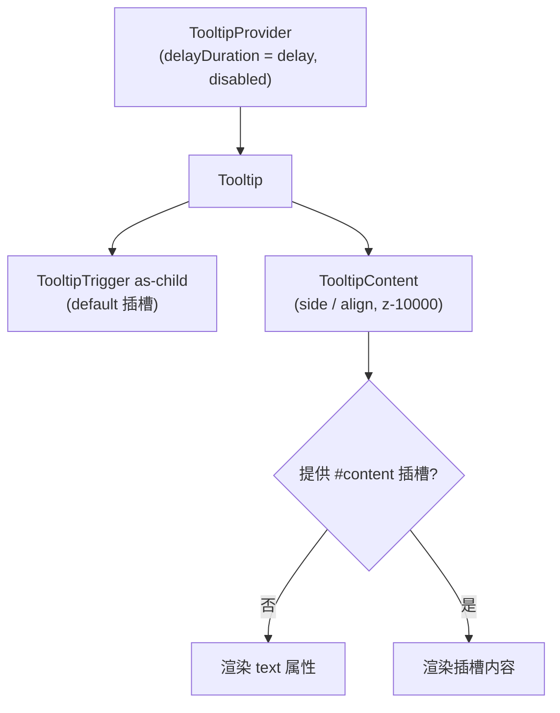

<script setup>
import Demo from '../.vitepress/theme/components/Demo.vue'
import ApiTable from '../.vitepress/theme/components/ApiTable.vue'
import InteractiveRemainingBasicTooltip from '../.vitepress/theme/components/demos/InteractiveRemainingBasicTooltip.vue'

const srcBasic = `<script setup>
// 组件已由框架自动导入，无需手动 import
<\/script>

<template>
  <FaTooltip text="注意噢！">
    <FaIcon name="i-ri:question-line" class="text-lg cursor-help" />
  </FaTooltip>
</template>`

const srcSide = `<template>
  <FaTooltip text="上方提示" side="top">
    <FaButton variant="outline">Top</FaButton>
  </FaTooltip>
  <FaTooltip text="下方提示" side="bottom">
    <FaButton variant="outline">Bottom</FaButton>
  </FaTooltip>
</template>`

const srcContent = `<template>
  <FaTooltip>
    <FaButton variant="outline">自定义内容</FaButton>
    <template #content>
      <p>支持 <strong>富文本</strong> 的自定义内容</p>
    </template>
  </FaTooltip>
</template>`

const props = [
  ['<code>text</code>', '<code>string</code>', "<code>''</code>", '提示文字；默认插槽 <code>content</code> 未提供时渲染'],
  ['<code>delay</code>', '<code>number</code>', '<code>300</code>', '延迟显示时间（毫秒），透传给内部 <code>TooltipProvider</code> 的 <code>delayDuration</code>'],
  ['<code>side</code>', "<code>'top' | 'right' | 'bottom' | 'left'</code>", '—', '弹出方向'],
  ['<code>align</code>', "<code>'start' | 'center' | 'end'</code>", '—', '对齐方式'],
  ['<code>disabled</code>', '<code>boolean</code>', '<code>false</code>', '禁用提示；透传给 <code>TooltipProvider</code>'],
]
</script>

# FaTooltip 文字提示

鼠标悬停（或键盘聚焦）时显示的简短文字提示。基于 reka-ui 的 `TooltipProvider` / `Tooltip` / `TooltipTrigger` / `TooltipContent` 封装，把常用场景收敛为 `text` 属性一行搞定。

## 使用场景

- 按钮、图标的功能说明
- 表单字段提示、被截断文字的完整内容展示

## 基础用法

`default` 插槽是触发元素；`text` 即提示文字。

<Demo title="基础文字提示" :source="srcBasic">
  <ClientOnly><InteractiveRemainingBasicTooltip /></ClientOnly>
</Demo>

## 弹出方向

`side` / `align` 控制位置，空间不足时自动碰撞翻转。

<Demo title="side 方向" :source="srcSide">
  <ClientOnly><InteractiveRemainingBasicTooltip /></ClientOnly>
</Demo>

## 延迟与禁用

`delay` 控制显示延迟毫秒数；`disabled` 直接禁用提示（透传给 `TooltipProvider`），适合表格列在窄屏下按需关闭提示的场景。

```vue
<template>
  <FaTooltip text="立即保存" :delay="500" :disabled="isTouchDevice">
    <FaButton :loading="saving">保存</FaButton>
  </FaTooltip>
</template>
```

## 表单字段提示

图标 + Tooltip 是表单里解释字段含义的标准做法；触发元素记得加 `cursor-help`，提示用户可悬停。

```vue
<template>
  <div class="flex items-center gap-1">
    <span>并发数</span>
    <FaTooltip text="同时处理任务的最大数量，超出将排队">
      <FaIcon name="i-ri:question-line" class="text-muted-foreground cursor-help" />
    </FaTooltip>
  </div>
</template>
```

## 自定义内容

需要富文本时使用 `#content` 插槽，它会覆盖 `text` 属性。

<Demo title="自定义内容" :source="srcContent">
  <ClientOnly><InteractiveRemainingBasicTooltip /></ClientOnly>
</Demo>

## 结构与行为



- 每个组件实例内部都包了一个 `TooltipProvider`，因此 `delay` 是实例级配置，互不影响。
- 内容层级为 `z-10000`，高于 Popover/Dropdown（`z-2000`）。
- 提示由悬停与键盘聚焦共同触发，对无障碍访问友好。

## API

### Props

<ApiTable title="FaTooltip Props" :data="props" />

### Emits

无自定义 emits；悬停/聚焦行为由 reka-ui 驱动。

### Slots

| 插槽 | 说明 |
| --- | --- |
| `default` | 触发元素（必填） |
| `content` | 自定义提示内容，覆盖 `text` 属性 |

::: warning 注意事项
- 提示内容应简短明了；内容复杂或需要交互时改用 [FaPopover](./popover.md)。
- 触发元素必须是单个可接收事件绑定的元素/组件（内部为 `as-child`）。
- 默认 300ms 延迟是为了避免鼠标快速划过时误触发，一般无需调整。
:::

::: info 源码位置
- 封装组件：`yudream-frontend/packages/components/src/basic/tooltip/index.vue`
- 子组件：`yudream-frontend/packages/components/src/basic/tooltip/tooltip/`
- 示例：`yudream-frontend/packages/components/src/basic/tooltip/_examples/`
:::
