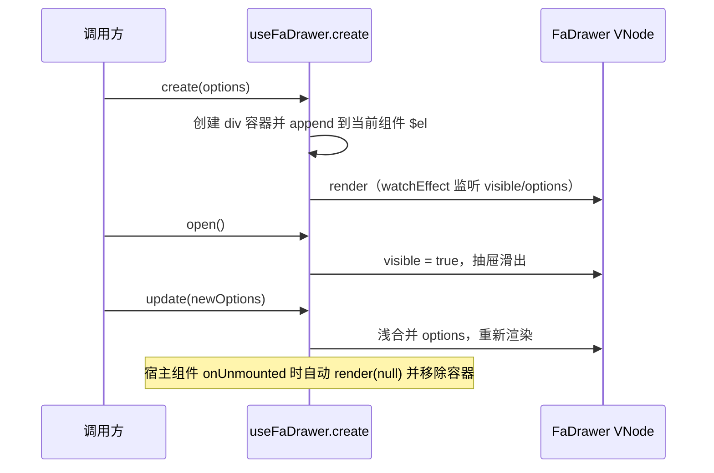

# useFaDrawer 命令式抽屉

`useFaDrawer()` 提供命令式（函数式）创建抽屉的能力，无需在模板中声明 `<FaDrawer>`，适合在事件回调、列表行操作里临时弹出一个抽屉。

- 导出名：`useFaDrawer`（包内原名 `useDrawer`，由 `@yudream/components` 重导出为 `useFaDrawer`）
- 与 `useFaModal()` 的区别：**只提供 `create` 一个方法**，没有 `info/success/warning/error/confirm` 快捷方法（那些是 Modal 专属）。

## API 总览

```ts
import { useFaDrawer } from '@yudream/components'

const drawer = useFaDrawer()
const { open, close, update } = drawer.create(options)
```

### useFaDrawer()

| 方法 | 签名 | 返回值 | 说明 |
| --- | --- | --- | --- |
| `create` | `(options: BaseOptions) => { open, close, update }` | Drawer 控制器 | 创建并挂载抽屉容器，返回控制器；**此时尚未打开**，需调用 `open()` |

### create 返回值

| 方法 | 签名 | 说明 |
| --- | --- | --- |
| `open` | `() => void` | 打开抽屉（内部 `visible = true`，触发重新渲染） |
| `close` | `() => void` | 关闭抽屉 |
| `update` | `(newOptions: BaseOptions) => void` | 浅合并 options 并触发重新渲染，可动态改标题/内容/按钮状态 |

### BaseOptions

`BaseOptions = Omit<DrawerProps, 'modelValue'> & { content?, onOpen?, onOpened?, onClose?, onClosed?, onConfirm?, onCancel? }`

- 除 `modelValue` 外的全部 [FaDrawer Props](./fa-drawer.md#props)（`side`、`title`、`beforeClose` 等）都可传入；
- `content`：`Component | VNode | string`，作为 `default` 插槽内容渲染（string 原样输出文本，VNode 直接渲染，Component 经 `h()` 渲染）；
- `onOpen / onOpened / onClose / onClosed / onConfirm / onCancel`：对应组件同名事件的回调形式。

## 行为机制



要点：

- 容器节点挂载到**当前组件实例的 `$el`** 下，并继承当前应用的 `appContext`（插件内调用同样能拿到宿主注入的全局配置）；
- `watchEffect` 同时监听 `visible` 和 `options`，因此 `update()` 后无需手动刷新；
- 宿主组件卸载时自动清理渲染并移除容器，不会泄漏 DOM。

## 代码示例

以下示例提取自组件库 `_examples/_functional.vue`：

```vue
<script setup lang="ts">
import { h } from 'vue'

const toast = useFaToast()

const { open } = useFaDrawer().create({
  title: '函数式调用',
  description: '通过 useDrawer().create() 创建抽屉。',
  content: h('div', { class: 'text-sm text-muted-foreground leading-6' }, '这里是函数式调用渲染的内容。'),
  showCancelButton: true,
  onConfirm: () => toast('确认操作'),
  onCancel: () => toast('取消操作'),
})
</script>

<template>
  <FaButton @click="open">
    打开抽屉
  </FaButton>
</template>
```

配合 `beforeClose` 做异步提交：

```ts
const { open, update } = useFaDrawer().create({
  title: '编辑资源',
  content: EditForm,
  showCancelButton: true,
  async beforeClose(action, done) {
    if (action === 'confirm') {
      update({ confirmButtonLoading: true })
      try {
        await api.save(form)
        done()
      }
      finally {
        update({ confirmButtonLoading: false })
      }
    }
    else {
      done()
    }
  },
})
open()
```

## 注意事项

- `create()` 只完成挂载，**必须再调 `open()`** 抽屉才会出现（与 `useFaModal().info()` 等快捷方法内部自动 open 不同）。
- `create` 必须在 `setup` 或组件生命周期内调用（依赖 `getCurrentInstance()`）；脱离组件上下文调用时容器无法挂载，也不会自动清理。
- `update` 是浅合并：`update({ title: '新标题' })` 不会清空其他已传选项。
- `content` 传字符串时按纯文本渲染，不会解析 HTML。

::: info 源码
`yudream-frontend/packages/components/src/basic/drawer/index.ts`（`useDrawer` 实现与 `BaseOptions` 类型）、`yudream-frontend/packages/components/src/index.ts:16`（重导出为 `useFaDrawer`）、示例 `yudream-frontend/packages/components/src/basic/drawer/_examples/_functional.vue`
:::
