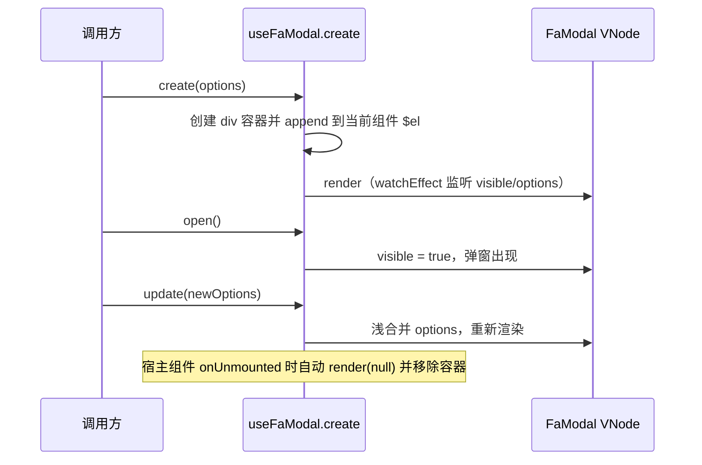

# useFaModal 命令式弹窗

`useFaModal()` 提供命令式（函数式）创建弹窗的能力，无需在模板中声明 `<FaModal>`；除 `create` 外还内置 `info/success/warning/error/confirm` 五个快捷方法，自动套用居中、无关闭按钮等默认样式并立即打开。

- 导出名：`useFaModal`（包内原名 `useModal`，由 `@yudream/components` 重导出为 `useFaModal`）
- 与 `useFaDrawer()` 的区别：Drawer 只有 `create` 一个方法，而 Modal 额外提供五个快捷方法（内部同样走 `create` + 立即 `open()`）。

## API 总览

```ts
import { useFaModal } from '@yudream/components'

const modal = useFaModal()
const { open, close, update } = modal.create(options)

modal.info(options)     // 图标 info 的提示弹窗
modal.success(options)  // 图标 success
modal.warning(options)  // 图标 warning
modal.error(options)    // 图标 error
const confirmRef = modal.confirm(options) // 双按钮确认框，返回 { update }
```

### useFaModal()

| 方法 | 签名 | 返回值 | 说明 |
| --- | --- | --- | --- |
| `create` | `(options: BaseOptions) => { open, close, update }` | Modal 控制器 | 创建并挂载弹窗容器；**此时尚未打开**，需调用 `open()` |
| `info` / `success` / `warning` / `error` | `(options: alertOptions) => void` | 无 | 套用 alert 默认项（图标、居中、仅确认按钮等）并**立即打开** |
| `confirm` | `(options: confirmOptions) => { update }` | `{ update }` | 套用确认框默认项（显示取消按钮等）并立即打开 |

### create 返回值

| 方法 | 签名 | 说明 |
| --- | --- | --- |
| `open` | `() => void` | 打开弹窗（内部 `visible = true`，触发重新渲染） |
| `close` | `() => void` | 关闭弹窗 |
| `update` | `(newOptions: BaseOptions) => void` | 浅合并 options 并触发重新渲染，可动态改标题/内容/按钮状态 |

## Options 类型

### BaseOptions

`BaseOptions = Omit<ModalProps, 'modelValue'> & { content?, onOpen?, onOpened?, onClose?, onClosed?, onConfirm?, onCancel? }`

- 除 `modelValue` 外的全部 [FaModal Props](./fa-modal.md#props)（`title`、`icon`、`beforeClose`、`draggable` 等）都可传入；
- `content`：`Component | VNode | string`，作为 `default` 插槽内容渲染（string 原样输出文本，VNode 直接渲染，Component 经 `h()` 渲染）；
- `onOpen / onOpened / onClose / onClosed / onConfirm / onCancel`：对应组件同名事件的回调形式。

### alertOptions（info/success/warning/error）

从 `BaseOptions` 中挑选：`title`、`description`、`icon`、`alignCenter`、`overlay`、`overlayBlur`、`confirmButtonText`、`confirmButtonDisabled`、`confirmButtonLoading`、`closeOnClickOverlay`、`closeOnPressEscape`、`class`、`headerClass`、`contentClass`、`footerClass`、`content`、`onConfirm`。

四个方法共用同一组默认项，仅 `icon` 不同：`closable: false`、`border: false`、`alignCenter: true`、`closeOnClickOverlay: false`、`destroyOnClose: true`、`openAutoFocus: true`。

### confirmOptions

在上述基础上额外允许 `cancelButtonText`、`confirmButtonDisabled`、`confirmButtonLoading`、`beforeClose`、`onCancel`，并默认追加 `showCancelButton: true`。同名属性传入时覆盖默认值。

## 行为机制



要点：

- 容器节点挂载到**当前组件实例的 `$el`** 下，并继承当前应用的 `appContext`（插件内调用同样能拿到宿主注入的全局配置）；容器 id 形如 `FaModal-{组件 uid}`；
- `watchEffect` 同时监听 `visible` 和 `options`，因此 `update()` 后无需手动刷新；
- 宿主组件卸载时自动清理渲染并移除容器，不会泄漏 DOM；
- 快捷方法与 `create` 共享同一实现：先 `Object.assign(defaults, options)` 再 `create(...)` 并立刻 `open()`。

## 代码示例

命令式创建（示例提取自 `modal/_examples/_functional.vue`）：

```ts
import { h } from 'vue'

const toast = useFaToast()

const { open } = useFaModal().create({
  title: '函数式调用',
  description: '通过 useModal().create() 创建弹窗。',
  content: h('div', { class: 'text-sm text-muted-foreground leading-6' }, '这里是函数式调用渲染的内容。'),
  showCancelButton: true,
  onConfirm: () => toast('确认操作'),
  onCancel: () => toast('取消操作'),
})
```

异步删除确认（配合 `beforeClose` 拦截关闭）：

```ts
function remove() {
  useFaModal().confirm({
    title: '删除确认',
    content: '删除后不可恢复，确定删除吗？',
    async beforeClose(action, done) {
      if (action === 'confirm') {
        await api.remove(id)
      }
      done()
    },
  })
}
```

快捷类型弹窗：

```ts
const modal = useFaModal()
modal.success({ title: '保存成功', description: '内容已同步到服务器' })
modal.error({ title: '保存失败', description: '请稍后重试' })
```

## 注意事项

- 快捷方法（`info/success/warning/error/confirm`）**内部已自动 `open()`**，返回值没有 `open/close`；需要手动控制开关时机时改用 `create()`。
- `create` 必须在 `setup` 或组件生命周期内调用（依赖 `getCurrentInstance()`）；脱离组件上下文调用时容器无法挂载，也不会自动清理。
- `update` 是浅合并：`update({ title: '新标题' })` 不会清空其他已传选项。
- `content` 传字符串时按纯文本渲染，不会解析 HTML。
- 弹窗内若展示资源 ID 等 Java `Long`/Snowflake ID，JSON、TS 模型与 URL 参数中一律使用 `string`，禁止 `Number(id)`。

::: info 源码
`yudream-frontend/packages/components/src/basic/modal/index.ts`（`useModal` 实现、`ModalProps`/`BaseOptions`/`alertOptions`/`confirmOptions` 类型）、`yudream-frontend/packages/components/src/index.ts:34`（重导出为 `useFaModal`）、示例 `yudream-frontend/packages/components/src/basic/modal/_examples/_functional.vue`
:::
