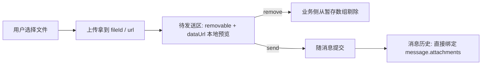

<script setup>
import Demo from '../.vitepress/theme/components/Demo.vue'
import ApiTable from '../.vitepress/theme/components/ApiTable.vue'
import InteractiveRemainingAiDemos from '../.vitepress/theme/components/demos/InteractiveRemainingAiDemos.vue'

const srcBasic = `<script setup>
import { YdAttachmentList } from '@yudream/components'
import type { YdChatAttachment } from '@yudream/components/ai'
import { ref } from 'vue'

// 待发送：上传后暂存 dataUrl 预览；已发送：直接用消息里的 attachments
const attachments = ref<YdChatAttachment[]>([
  {
    fileId: '1827364512001',
    fileName: '架构图.png',
    contentType: 'image/png',
    kind: 'IMAGE',
    dataUrl: 'data:image/png;base64,…',
  },
  {
    fileId: '1827364512002',
    fileName: '需求文档-v2.pdf',
    contentType: 'application/pdf',
    kind: 'DOCUMENT',
    url: '/api/files/1827364512002',
  },
])

function onRemove(attachment: YdChatAttachment) {
  attachments.value = attachments.value.filter(item => item !== attachment)
}
<\/script>

<template>
  <YdAttachmentList :attachments="attachments" removable @remove="onRemove" />
</template>`

const props = [
  ['<code>attachments</code>', '<code>YdChatAttachment[]</code>', '—（必填）', '附件列表；为空时整个组件不渲染（根节点带 <code>v-if="attachments.length"</code>）'],
  ['<code>removable</code>', '<code>boolean</code>', '<code>false</code>', '是否显示每项右侧的移除按钮（✕），用于发送前的待发送区'],
]

const attachment = [
  ['<code>fileId</code>', '<code>string?</code>', '文件 id。<strong>后端雪花 Long 在 JSON 中一律序列化为 string</strong>，禁止 <code>Number(id)</code>；同时作为渲染 key（缺省回退 <code>fileName</code>）'],
  ['<code>fileName</code>', '<code>string</code>', '文件名（必填），超长单行省略'],
  ['<code>contentType</code>', '<code>string?</code>', 'MIME 类型；以 <code>image/</code> 开头时按图片渲染缩略图'],
  ['<code>size</code>', '<code>number?</code>', '字节数，仅作数据携带，当前模板未渲染'],
  ['<code>kind</code>', '<code>\'IMAGE\' | \'DOCUMENT\' | \'FILE\' | string?</code>', '业务分类，决定非图片项的图标（见下方图标映射）'],
  ['<code>url</code>', '<code>string?</code>', '服务端文件地址；存在时整项渲染为 <code>&lt;a target="_blank"&gt;</code> 可点击下载 / 预览'],
  ['<code>extractedText</code>', '<code>string?</code>', '解析出的文本内容，仅作数据携带，模板未渲染'],
  ['<code>dataUrl</code>', '<code>string?</code>', '本地 base64 预览地址，图片项优先于 <code>url</code> 使用（上传前即可预览）'],
]

const emits = [
  ['<code>remove</code>', '<code>(attachment: YdChatAttachment)</code>', '点击移除按钮（<code>@click.prevent.stop</code>，不会触发外链跳转）；从列表删除由业务侧完成'],
]

const iconMap = [
  ['<code>kind === \'IMAGE\'</code> 或 <code>contentType</code> 以 <code>image/</code> 开头', '图片缩略图（<code>34×34</code> 圆角裁剪，取 <code>dataUrl || url</code>）'],
  ['<code>kind === \'DOCUMENT\'</code>', '<code>i-ri:file-text-line</code> 文档图标'],
  ['其他', '<code>i-ri:attachment-2</code> 通用附件图标'],
]
</script>

# YdAttachmentList 附件列表

聊天消息 / 输入框上方的附件条：横向 flex 换行排列的胶囊卡片。图片类附件渲染 `34×34` 缩略图，其余按 `kind` 显示图标；带 `url` 的附件整体是 `<a target="_blank" rel="noopener">` 外链，可直接打开预览或下载。

组件纯展示 + 发事件：`removable` 只控制移除按钮显隐，真正的列表增删由业务侧维护。既用于发送前的待发送附件区，也直接接收 `useYdChatStream` 消息上的 `attachments` 做历史展示。

源码：`yudream-frontend/packages/components/src/ai/YdAttachmentList.vue`

## 基础用法

<Demo title="附件列表" description="真实组件；点击移除按钮只更新本地 mock 列表" :source="srcBasic">
  <ClientOnly><InteractiveRemainingAiDemos demo="attachment" /></ClientOnly>
</Demo>

## API

### Props

<ApiTable title="YdAttachmentList Props" :data="props" />

### YdChatAttachment

类型定义在 `yudream-frontend/packages/components/src/ai/useYdChatStream.ts`，并已从 AI 子入口 `src/ai/index.ts` 导出：

```ts
import type { YdChatAttachment } from '@yudream/components/ai'
```

<ApiTable title="YdChatAttachment 字段" :data="attachment" :columns="['字段', '类型', '说明']" />

### Emits

<ApiTable title="YdAttachmentList Emits" :data="emits" :columns="['事件', '签名', '说明']" />

### 图标判定

非图片项的图标按以下优先级判定：

<ApiTable title="图标映射" :data="iconMap" :columns="['条件', '展示']" />

## 两种使用场景



- **待发送区**：上传完成后把 `{ fileName, contentType, kind, dataUrl, ... }` push 进本地数组，开 `removable` 让用户撤回。
- **消息历史**：流式组合式函数解析出的消息附件直接透传，不带 `removable`，有 `url` 的项可点击新窗口打开。

## 注意事项

- **`fileId` 一律使用 string**（雪花 Long 序列化），拼接口地址、做 key、比较时都保持字符串，禁止 `Number(id)`。
- 渲染 key 是 `fileId ?? fileName`，因此同一批内文件名也建议不重复，否则可能触发 Vue key 警告。
- 图片判定同时看 `kind === 'IMAGE'` 与 `contentType` 前缀——只给 `contentType` 不给 `kind` 也能正确显示缩略图。
- 组件自身不做大小限制、类型白名单与上传逻辑，这些属于输入框 / 上传服务的职责。

> 真实使用参考：`yudream-frontend/apps/component-showcase/src/sections/AiSection.vue`
