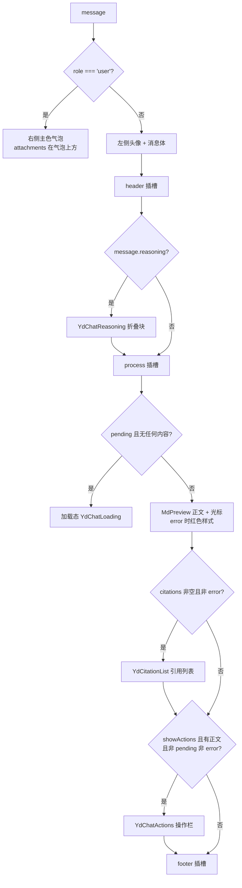

# YdBubble 消息气泡

AI 对话的单条消息气泡：`role === 'user'` 渲染为右侧主色实底气泡，其余渲染为左侧带头像、支持深度思考 / 处理过程 / 引用 / 操作栏的完整助手消息。正文使用 `md-editor-v3` 的 `MdPreview` 渲染 Markdown，天然适配流式追加。组件是纯展示组件，不含任何网络逻辑，配合 `useYdChatStream` 使用。

源码：`yudream-frontend/packages/components/src/ai/YdBubble.vue`

## 基础用法

<Demo title="用户 / 助手气泡" description="真实气泡、操作栏和本地流式状态；不访问任何 API" :source="srcBasic">
  <ClientOnly><InteractiveMediaBubble /></ClientOnly>
</Demo>

## 流式输出状态

<Demo title="等待首字节 → 流式正文" description="点击按钮以本地定时器驱动真实气泡的 pending、正文和光标状态" :source="srcStreaming">
  <ClientOnly><InteractiveMediaBubble /></ClientOnly>
</Demo>

## API

### Props

<ApiTable title="YdBubble Props" :data="props" />

### Emits

<ApiTable title="YdBubble Emits" :data="emits" :columns="['事件', '签名', '说明']" />

### Slots

<ApiTable title="YdBubble Slots" :data="slots" :columns="['插槽', '作用域参数', '说明']" />

## 渲染分支

组件模板只有两个顶层分支，全部行为由此推导：

## 注意事项

- **`message.id` 一律使用 string**。后端消息 id 是雪花 Long，JSON 中序列化为字符串；禁止 `Number(id)` 转换，否则超出 `Number.MAX_SAFE_INTEGER` 会精度丢失。本组件本身不消费 `id`，但列表 `key`、重新生成定位都依赖它。
- 加载态的触发条件是「五项全空」：`pending && !content && !reasoning && !tools?.length && !activities?.length`。只要模型吐出了推理或工具活动，就不再显示加载占位。
- 操作栏出现条件是 `showActions && !error && content && !pending`——错误消息和生成中的消息不会出现复制 / 重新生成。
- 全局配置通过 `provideYdChatConfig` 提供（`yudream-frontend/packages/components/src/ai/chat-context.ts`），组件内逐级回退：props → 全局配置 → 内置默认值。
- 用户气泡用 `white-space: pre-wrap` 直接输出纯文本（不走 Markdown）；助手正文才走 `MdPreview`。

> 相关组件：`YdChatMessageList`（内置了同构的消息布局）、`YdChatReasoning`、`YdChatProcess`、`YdChatActions`。真实使用参考 `yudream-frontend/apps/component-showcase/src/sections/AiSection.vue`。
