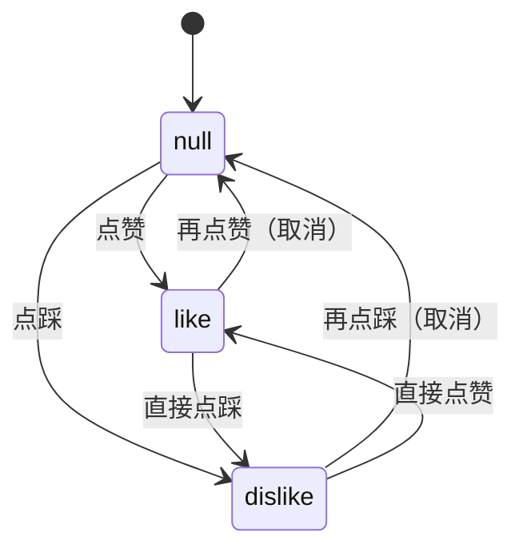

# YdChatActions 消息操作栏

AI 回答下方的轻量操作条：复制、重新生成、点赞 / 点踩反馈与自定义操作项。按钮是「图标 + 文字」的幽灵样式，支持 `iconOnly` 纯图标紧凑模式。组件自带剪贴板写入与「已复制」瞬时反馈，业务只需监听事件做持久化。

源码：`yudream-frontend/packages/components/src/ai/YdChatActions.vue`

## 基础用法

<Demo title="完整操作栏" description="真实组件；复制、重新生成、反馈和自定义操作均为本地交互" :source="srcBasic">
  <ClientOnly><InteractiveRemainingAiDemos demo="actions" /></ClientOnly>
</Demo>

## 自定义操作项

<Demo title="items + iconOnly" description="真实操作栏中的本地自定义操作" :source="srcItems">
  <ClientOnly><InteractiveRemainingAiDemos demo="actions" /></ClientOnly>
</Demo>

## API

### Props

<ApiTable title="YdChatActions Props" :data="props" />

### Emits

<ApiTable title="YdChatActions Emits" :data="emits" :columns="['事件', '签名', '说明']" />

### Slots

<ApiTable title="YdChatActions Slots" :data="slots" :columns="['插槽', '说明']" />

### YdChatActionItem

`items` 数组元素的类型，在组件 `<script setup>` 中以 `export interface YdChatActionItem` 声明：

<ApiTable title="YdChatActionItem 字段" :data="actionItem" :columns="['字段', '类型', '说明']" />

## 反馈状态机

- 组件内部持有 `feedbackState`，初始值来自 `feedbackValue` prop；之后切换完全在组件内完成，每次变化通过 `feedback` 事件抛出**最终值**。
- 复制成功后按钮文字变为「已复制」（图标变对勾），1600ms 后自动还原。

## 注意事项

- 复制使用 `navigator.clipboard?.writeText`；非 HTTPS 等场景下可能不可用——组件捕获异常后仍抛 `copy` 事件并显示「已复制」，需要严格兜底时请在事件里自行再写一次。
- 反馈按钮没有文字，只有图标与 `title`（「有帮助」/「没帮助」），不受 `iconOnly` 影响。
- 该组件通常不直接出现在页面里，而是被 `YdBubble` 在 `show-actions` 时内部调用（`copy-text` 取消息正文）；`YdChatMessageList` 则使用自己内联的操作行而非本组件。
- 注意与消息级建议动作区分：`message.actions`（`YdChatAction`）渲染的是气泡下方的胶囊按钮组，语义是「下一步做什么」；本组件是工具栏语义。

> 相关组件：`YdBubble`。真实使用参考 `yudream-frontend/apps/component-showcase/src/sections/AiSection.vue`。
