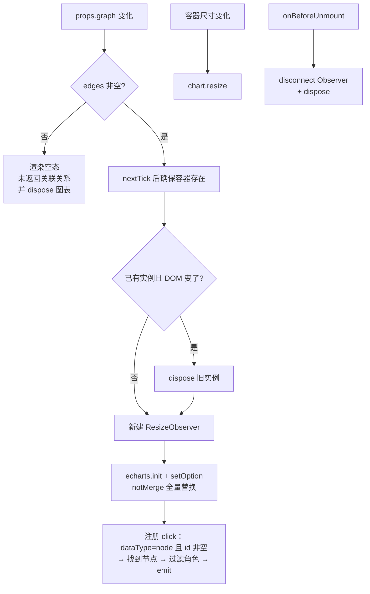

# YdChatGraph 关联图谱

基于 ECharts `graph` 力导向布局的知识库关联关系可视化：节点大小按相关度分数缩放、颜色区分 query/focus 角色与普通节点，边宽按权重缩放，支持缩放拖拽（roam + draggable）、hover 邻接高亮与边 tooltip。组件内部自行管理 echarts 实例生命周期与容器尺寸自适应。

源码：`yudream-frontend/packages/components/src/ai/YdChatGraph.vue`

## 基础用法

<Demo title="力导向图" description="真实 ECharts 图谱；可拖拽缩放并点击普通节点" :source="srcBasic">
  <ClientOnly><InteractiveRemainingAiDemos demo="graph" /></ClientOnly>
</Demo>

## 紧凑模式

<Demo title="compact" description="真实紧凑图谱；节点标签隐藏" :source="srcCompact">
  <ClientOnly><InteractiveRemainingAiDemos demo="graph-compact" /></ClientOnly>
</Demo>

## API

### Props

<ApiTable title="YdChatGraph Props" :data="props" />

### Emits

<ApiTable title="YdChatGraph Emits" :data="emits" :columns="['事件', '签名', '说明']" />

### YdChatGraphNode

声明在 `yudream-frontend/packages/components/src/ai/useYdChatStream.ts`：

<ApiTable title="YdChatGraphNode 字段" :data="graphNode" :columns="['字段', '类型', '说明']" />

### YdChatGraphEdge

<ApiTable title="YdChatGraphEdge 字段" :data="graphEdge" :columns="['字段', '类型', '说明']" />

## 渲染与生命周期

- 主题色不是硬编码的：通过往容器里塞临时探针元素再读 `getComputedStyle`，把 CSS 变量（`--primary-6`、`--color-bg-1`、`--color-text-*`）解析成真实色值后传给 ECharts，深浅模式切换随 props 重渲生效。
- tooltip 使用 `renderMode: 'richText'` 并开启 `confine`，避免在气泡内溢出。
- 边 tooltip 显示「起点 - 终点」，有 `signal` 时追加第二行。

## 注意事项

- **节点 / 边的 `id`、`source`、`target` 一律使用 string**。后端知识库节点若是雪花 Long 主键，JSON 中已序列化为字符串；禁止 `Number(id)` 转换——ECharts 点击回调里也是用 `String(params.data.id)` 回来比对 `nodes` 列表。
- **没有边就没有图**：`edges` 为空时不初始化 echarts，只渲染空态文案「未返回关联关系」；`nodes` 单独存在不会画图。
- 组件依赖 `echarts`（宿主包已内置），业务侧无需单独引入或按需注册模块——组件内部 `import * as echarts from 'echarts'` 全量引入。
- 通常不直接在页面使用，而是经 `YdChatProcess` 在 `wiki-graph` 活动中渲染；直接使用时注意给外层一个确定宽度的容器（画布默认高 300px，宽度撑满父容器）。

> 相关组件：`YdChatProcess`。真实使用参考 `yudream-frontend/apps/core-arco-design-vue/src/views/platform/chat/index.vue`。
