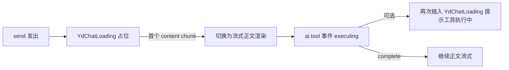

<script setup>
import Demo from '../.vitepress/theme/components/Demo.vue'
import ApiTable from '../.vitepress/theme/components/ApiTable.vue'
import InteractiveMediaChatLoading from '../.vitepress/theme/components/demos/InteractiveMediaChatLoading.vue'

const srcBasic = `<script setup>
import { YdChatLoading } from '@yudream/components'
<\/script>

<template>
  <!-- 首个 token 到达前的占位 -->
  <YdChatLoading />
</template>`

const srcCustom = `<template>
  <!-- 自定义文案：执行工具调用时 -->
  <YdChatLoading text="正在检索知识库…" />

  <!-- 纯三点动画：不显示任何文字 -->
  <YdChatLoading text="" />
</template>`
</script>

# YdChatLoading 对话加载中

对话流式回复的等待占位：三个主题色小圆点做交错闪烁动画，后跟可选的提示文案。用于「用户已发送、模型首个 token 尚未到达」的空窗期，或工具调用执行中的行内提示。

组件只有一个 prop、零事件零插槽，是最简单的 AI 组件；动画纯 CSS（`animation-delay` 0 / 0.2s / 0.4s 交错），无 JS 定时器。

源码：`yudream-frontend/packages/components/src/ai/YdChatLoading.vue`

## 基础用法

<Demo title="默认加载态" description="真实组件的三个闪烁圆点；可直接修改 text 或留空">
  <ClientOnly><InteractiveMediaChatLoading /></ClientOnly>
</Demo>

## 自定义文案

<Demo title="自定义与纯动画" description="输入提示文案；清空输入框即可仅保留真实组件的圆点动画" :source="srcCustom">
  <ClientOnly><InteractiveMediaChatLoading /></ClientOnly>
</Demo>

## API

### Props

<ApiTable title="YdChatLoading Props" :data="[
  ['<code>text</code>', '<code>string</code>', `<code>'正在思考…'</code>`, '提示文案；<code>v-if</code> 判定，传空字符串 <code>\'\'</code> 只渲染三点动画'],
]" />

没有 Emits 与插槽。

## 在对话流中的位置



典型接线（伪代码）：

```vue
<template v-if="message.pending && !message.content">
  <YdChatLoading :text="toolHint ?? '正在思考…'" />
</template>
```

其中 `toolHint` 由 `useYdChatStream` 的工具事件驱动：收到 `ai.tool`（`status: 'executing'`）时置为「正在执行 {toolName}…」，完成或失败后清空。

## 注意事项

- 组件是 `inline-flex` 行内元素，可直接嵌在气泡文本流里，不需要块级容器。
- 圆点颜色取 `rgb(var(--primary-6))`、文字取 `--color-text-3`，跟随后台主题配置，不要在业务侧覆盖颜色。
- 判断「该显示加载态」的逻辑在业务侧：通常是消息存在但 `content` 为空且未出错；错误场景应展示错误气泡而非无限 loading。

> 真实使用参考：`yudream-frontend/apps/component-showcase/src/sections/AiSection.vue`
