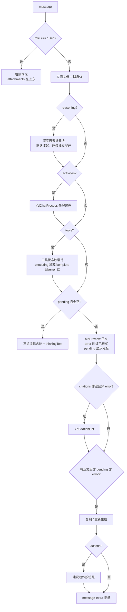

# YdChatMessageList 消息列表

AI 对话页的消息流主体：按顺序渲染用户 / 助手消息，内置深度思考折叠块、处理过程时间线、工具调用状态、Markdown 正文与流式光标、引用列表、复制 / 重新生成操作、建议动作按钮，以及「回到底部」悬浮钮和智能跟随滚动。数据通常直接绑定 `useYdChatStream` 返回的 `messages`。

源码：`yudream-frontend/packages/components/src/ai/YdChatMessageList.vue`

## 基础用法

<Demo title="消息列表" description="真实消息列表；展开推理、点击引用和操作均只处理本地 mock 数据" :source="srcBasic">
  <ClientOnly><InteractiveRemainingAiDemos demo="message-list" /></ClientOnly>
</Demo>

## 空态与滚动控制

<Demo title="ref 方法" description="真实列表的本地消息与滚动容器" :source="srcScroll">
  <ClientOnly><InteractiveRemainingAiDemos demo="message-list" /></ClientOnly>
</Demo>

## API

### Props

<ApiTable title="YdChatMessageList Props" :data="props" />

### Emits

<ApiTable title="YdChatMessageList Emits" :data="emits" :columns="['事件', '签名', '说明']" />

### Slots

<ApiTable title="YdChatMessageList Slots" :data="slots" :columns="['插槽', '作用域参数', '说明']" />

### Expose

| 方法 | 签名 | 说明 |
| --- | --- | --- |
| `scrollToBottom` | `(force?: boolean) => void` | 滚动到底部；`force = true` 强制滚动，否则仅当接近底部（80px 内）时才滚 |

## 单条消息的渲染结构

## 滚动行为

组件维护「用户是否上翻离开底部」的状态：

- `messages.length` 变化（新消息）→ **强制**滚到底。
- 最后一条消息的内容量变化（流式增量，统计正文 / 推理 / 工具 / 活动 / 命中 / 图谱节点边数量之和）→ 仅当用户本就在底部（距底 < 80px）时跟随滚动。
- 用户上翻后显示 sticky 吸附在容器底部的「回到底部」悬浮钮，点击强制回底。

## 注意事项

- **`message.id` 一律使用 string**。后端消息 id 是雪花 Long，JSON 中序列化为字符串；禁止 `Number(id)` 转换。列表渲染 `key` 取 `message.id ?? index`，缺 id 时退化为索引 key，建议始终传 id。
- 列表内的深度思考是**组件内联实现**（非 `YdChatReasoning`），展开状态按消息索引记录在组件内部，默认全部收起。
- 工具名映射：`wiki.search` / `web.fetch` / `web_fetch` 统一显示为「检索知识库」，其余显示原始 `toolName`。
- 正文中的 `wiki://` 链接有专属虚线下划线样式，点击不会自动导航——需要业务在 `@content-click` 中自行拦截并路由。

> 相关组件：`YdBubble`（单条消息版本）、`YdChatProcess`、`YdCitationList`、`YdAttachmentList`。真实使用参考 `yudream-frontend/apps/core-arco-design-vue/src/views/platform/chat/index.vue`、`yudream-frontend/apps/component-showcase/src/sections/AiSection.vue`。
