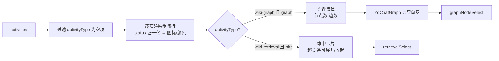

# YdChatProcess 处理过程

回答上方的过程时间线：把一次 AI 回复背后的活动（进度、知识库检索命中、关联图谱分析）渲染为带状态图标的步骤流。检索命中默认最多显示 3 条、可展开；`wiki-graph` 活动首次出现即自动展开为 ECharts 力导向图。

源码：`yudream-frontend/packages/components/src/ai/YdChatProcess.vue`

## 基础用法

<Demo title="过程时间线" description="真实组件；可点击本地检索命中" :source="srcBasic">
  <ClientOnly><InteractiveRemainingAiDemos demo="process" /></ClientOnly>
</Demo>

## 图谱活动

<Demo title="wiki-graph 自动展开" description="真实过程组件与自动展开的本地图谱" :source="srcGraph">
  <ClientOnly><InteractiveRemainingAiDemos demo="process-graph" /></ClientOnly>
</Demo>

## API

### Props

<ApiTable title="YdChatProcess Props" :data="props" />

### Emits

<ApiTable title="YdChatProcess Emits" :data="emits" :columns="['事件', '签名', '说明']" />

### YdChatActivity

`activities` 数组元素的类型，声明在 `yudream-frontend/packages/components/src/ai/useYdChatStream.ts` 的 `export interface YdChatActivity`：

<ApiTable title="YdChatActivity 字段" :data="activity" :columns="['字段', '类型', '说明']" />

## 状态归一化与图标

后端返回的状态字符串先 trim、转小写并把下划线替换为中划线，再归一化为四种展示态：

| 归一化状态 | 命中值示例 | 图标 | 颜色 |
| --- | --- | --- | --- |
| `complete` | complete / success / finished / done | `i-ri:checkbox-circle-line` | 成功色 |
| `error` | error / failed / failure | `i-ri:error-warning-line` | 危险色 |
| `cancelled` | cancelled / canceled / stopped | `i-ri:stop-circle-line` | 中性灰 |
| `running`（其余一切） | running 等 | `i-ri:loader-4-line`（旋转动画） | 主色 |

类型专属图标会覆盖通用状态图标：`wiki-retrieval` 用 `i-ri:search-line`，`wiki-graph` 用 `i-ri:mind-map`。

## 注意事项

- **`messageId` 一律使用 string**。后端消息 id 是雪花 Long，JSON 中序列化为字符串；禁止 `Number(id)` 转换。
- 展开状态按「活动索引」记录在组件内部：检索命中超过 3 条才出现展开按钮；图谱活动通过深度 watch 在节点首次到达时自动置为展开。
- 命中卡片的 `key` 由 `nodeId || path || title` 加 `excerpt` 组合而成；`hit.nodeId` 若来自后端雪花 ID，同样保持 string。
- 分数显示规则：`score < 1` 时保留 2 位小数（如 `0.92`），否则取整——组件假定分数是 0~1 的相似度。
- 组件自身不带外边距容器约束，通常直接放在 `YdBubble` 的 `process` 插槽或 `YdChatMessageList` 内部使用。

> 相关组件：`YdChatGraph`、`YdChatMessageList`。真实使用参考 `yudream-frontend/apps/core-arco-design-vue/src/views/platform/chat/index.vue`。
