# YdChatSender 输入框

AI 对话页底部的输入区：Kimi 风格大圆角输入框，内置建议问题 chips、附件选择（按钮 / 拖拽 / 粘贴三种入口）、`@` 上下文提及、免责声明与「发送 / 停止生成」切换。组件只负责采集输入并发事件——文件上传、请求发送与流式接收全部由业务侧配合 `useYdChatStream` 完成。

源码：`yudream-frontend/packages/components/src/ai/YdChatSender.vue`

## 基础用法

<Demo title="输入框" description="真实组件；输入、建议问题和发送只使用本地 mock" :source="srcBasic">
  <ClientOnly><InteractiveRemainingAiDemos demo="sender" /></ClientOnly>
</Demo>

## @ 上下文提及

<Demo title="mentionItems" description="真实组件；输入 @ 打开并选择本地上下文候选" :source="srcMention">
  <ClientOnly><InteractiveRemainingAiDemos demo="sender-mention" /></ClientOnly>
</Demo>

## API

### Props

<ApiTable title="YdChatSender Props" :data="props" />

### Emits

<ApiTable title="YdChatSender Emits" :data="emits" :columns="['事件', '签名', '说明']" />

### Slots

<ApiTable title="YdChatSender Slots" :data="slots" :columns="['插槽', '说明']" />

### YdChatAttachment

`attachments` 数组元素的类型，声明在 `yudream-frontend/packages/components/src/ai/useYdChatStream.ts` 的 `export interface YdChatAttachment`：

<ApiTable title="YdChatAttachment 字段" :data="attachment" :columns="['字段', '类型', '说明']" />

## 交互细节

```mermaid
flowchart TD
  A[用户输入] --> B{按 Enter 且未按 Shift?}
  B -- 是 --> C{canSend?<br/>非 disabled 且非 loading<br/>且文本非空}
  C -- 是 --> D[emit send<br/>清空输入框]
  C -- 否 --> E[忽略]
  B -- 否 --> F[换行继续输入]
  G[拖拽 / 粘贴 / 点击＋] --> H[emit attach files]
  H --> I[业务上传后写入 attachments]
  I --> J[输入框上方展示可删除附件]
  D --> K[loading = true<br/>发送按钮切换为停止]
  K --> L[emit stop 中断流]
```

- **Enter 发送、Shift+Enter 换行**；`canSend` 为 `false` 时 Enter 不生效。
- 附件有三个入口：工具条 `＋` 按钮（受 `accept` / `multiple` 约束）、composer 区域拖拽（`drop`）、textarea 粘贴文件，三者统一走 `attach` 事件。
- `@` 提及由内置 `YdSuggestion` 实现：输入 `@` 后按候选过滤，键盘上下选择、Enter 确认；选中后组件把 `@{value} ` 写回输入框并抛出 `mentionSelect`，业务语义（如切换知识库作用域）完全由页面解析。
- `loading` 时建议 chips 与附件按钮禁用，发送按钮替换为「停止生成」。

## 注意事项

- 组件**不上传文件**：`attach` 只回传原始 `File[]`，上传到后端拿到 `fileId` 后由业务侧 push 进 `attachments`。
- **`fileId` 一律使用 string**。后端文件 id 是雪花 Long，JSON 中序列化为字符串；禁止 `Number(fileId)` 转换，否则超出 `Number.MAX_SAFE_INTEGER` 会精度丢失。
- `send` 事件不携带历史消息；历史裁剪与请求体组装由 `useYdChatStream` 的 `send(text, attachments)` 负责，页面只需在事件里转发。
- 免责声明在移动端（`max-width: 640px`）会被隐藏，工具条允许换行。

> 相关组件：`YdAttachmentList`、`YdSuggestion`。真实使用参考 `yudream-frontend/apps/core-arco-design-vue/src/views/platform/chat/index.vue`、`yudream-frontend/apps/component-showcase/src/sections/AiSection.vue`。
