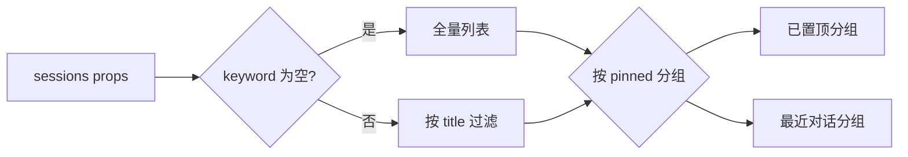

# YdChatSessionList 会话列表

AI 对话页的左侧会话管理栏：内置「新建会话」按钮与会话搜索框，列表按 `pinned` 自动分为「已置顶 / 最近对话」两组，行悬停浮出重命名、置顶、删除操作。组件本身**纯展示 + 发事件**，不做任何持久化与排序，数据维护完全由业务侧负责。

源码：`yudream-frontend/packages/components/src/ai/YdChatSessionList.vue`

## 基础用法

<Demo title="会话列表" description="真实组件；搜索、选择、新建、置顶和删除均操作本地 mock 会话" :source="srcBasic">
  <ClientOnly><InteractiveRemainingAiDemos demo="session-list" /></ClientOnly>
</Demo>

## API

### Props

<ApiTable title="YdChatSessionList Props" :data="props" />

### YdSessionItem

`sessions` 数组元素的类型，在组件 `<script setup>` 中以 `export interface YdSessionItem` 声明：

<ApiTable title="YdSessionItem 字段" :data="sessionItem" :columns="['字段', '类型', '说明']" />

### Emits

<ApiTable title="YdChatSessionList Emits" :data="emits" :columns="['事件', '签名', '说明']" />

所有行内操作按钮都带 `@click.stop`，不会误触发 `select`。

### 作用域图标映射

`scopeType` 只影响行首图标，不影响分组与搜索：

| `scopeType` | 图标 | 含义 |
| --- | --- | --- |
| `WIKI` | `i-ri:book-2-line` | 知识库问答会话 |
| `AGENT` | `i-ri:robot-2-line` | Agent 应用会话 |
| 其他 / 缺省 | `i-ri:chat-3-line` | 通用会话 |

## 内置搜索与分组

搜索框是组件内置的本地过滤（不发事件）：按 `title` 不区分大小写 `includes` 匹配，过滤结果再按 `pinned` 分组。空态文案分两种：列表本身为空时提示「暂无会话，点击上方开始新对话」；搜索无命中时提示「没有匹配的会话」。

## 业务侧事件处理

组件不维护数据，五个事件的典型处理（真实代码摘自宿主聊天页）：

<Demo title="事件处理示例" description="真实会话列表；所有事件均更新本地 mock 状态" :source="srcHandlers">
  <ClientOnly><InteractiveRemainingAiDemos demo="session-list" /></ClientOnly>
</Demo>

## 注意事项

- **`id` 一律使用 string**。后端会话 id 是雪花 Long，JSON 中序列化为字符串；禁止 `Number(id)` 转换，否则超出 `Number.MAX_SAFE_INTEGER` 会精度丢失，导致 `activeId` 匹配失败。
- `YdSessionItem` 虽然从组件文件中导出，但**没有从包入口 `@yudream/components` / `@yudream/components/ai` 再导出**；业务侧一般直接传后端 DTO（如 `ChatSession`），只要结构兼容即可。
- 组件宽 248px（`min-width: 220px`），需放在 flex 布局或抽屉中；移动端用法可参考聊天页：同一个组件同时挂在桌面侧栏和 `FaDrawer` 里。
- 重命名 / 删除的二次确认（`window.prompt` / `window.confirm` 或 `FaModal`）由业务实现，组件不内置。

> 真实使用参考：`yudream-frontend/apps/core-arco-design-vue/src/views/platform/chat/index.vue`、`yudream-frontend/apps/component-showcase/src/sections/AiSection.vue`
