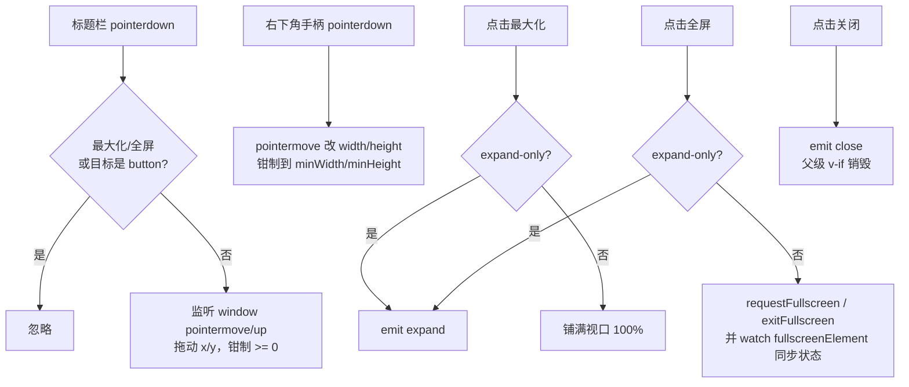

# YdChatWindow 聊天窗口

可拖拽、可缩放、可最大化的浮动 AI 对话窗壳：`position: fixed` 悬浮在页面上方，标题栏支持按住拖动、最大化与浏览器全屏，右下角提供缩放手柄。组件只负责「窗口」本身——内部放什么（消息列表、输入框、会话列表）完全由默认插槽决定。

源码：`yudream-frontend/packages/components/src/ai/YdChatWindow.vue`

## 基础用法

<Demo title="浮动窗口" description="点击后打开真实窗口，可拖动、缩放、最大化 / 全屏和关闭；内容完全本地">
  <ClientOnly><InteractiveMediaChatWindow /></ClientOnly>
</Demo>

## expand-only 模式

<Demo title="窗口事件" description="真实窗口关闭、最大化和全屏均可直接交互；demo 仅显示 expand 事件，不跳转路由" :source="srcExpand">
  <ClientOnly><InteractiveMediaChatWindow /></ClientOnly>
</Demo>

## API

### Props

<ApiTable title="YdChatWindow Props" :data="props" />

### Emits

<ApiTable title="YdChatWindow Emits" :data="emits" :columns="['事件', '签名', '说明']" />

### Slots

<ApiTable title="YdChatWindow Slots" :data="slots" :columns="['插槽', '说明']" />

## 交互模型

- 拖动与缩放都在 `window` 上挂 `pointermove` / `pointerup` 监听，`onBeforeUnmount` 时兜底移除；标题栏内点击按钮不会触发拖动（`closest('button')` 判断）。
- 最大化与全屏互斥：已全屏时最大化按钮不响应；两者任一生效时样式统一切换为 `left/top 0 + 100%/100%`。
- 全屏使用浏览器 Fullscreen API（需 `document.fullscreenEnabled`），并通过 watch `document.fullscreenElement` 双向同步——用户按 Esc 退出时组件状态也能复位。

## 注意事项

- 窗口是 `position: fixed` 且 `z-index: 1000`，会悬浮在页面所有内容之上；不需要时务必用 `v-if` 卸载。
- 组件**没有内置遮罩与 teleport**，位置状态（x/y/宽高）也不受控——外部无法通过 prop 复位窗口位置；如需持久化位置请在业务侧自行处理。
- 默认插槽容器是纵向 flex 且 `min-height: 0`，直接把 `YdChatMessageList` 与 `YdChatSender` 依次放进去即可获得正确的滚动布局。
- `expand-only` 场景下最大化与全屏按钮都发同一个 `expand` 事件，按钮图标仍按各自状态渲染。

> 相关组件：`YdChatMessageList`、`YdChatSender`、`YdChatSessionList`。真实使用参考 `yudream-frontend/apps/core-arco-design-vue/src/views/platform/chat/index.vue`。
