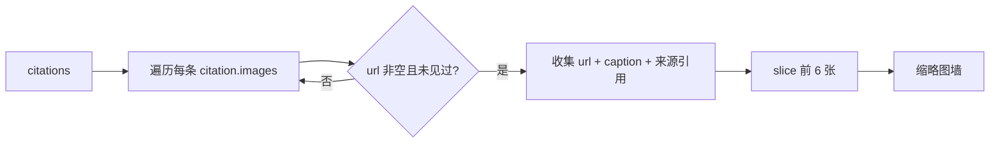

<script setup>
import Demo from '../.vitepress/theme/components/Demo.vue'
import ApiTable from '../.vitepress/theme/components/ApiTable.vue'
import InteractiveRemainingAiDemos from '../.vitepress/theme/components/demos/InteractiveRemainingAiDemos.vue'

const srcBasic = `<script setup>
import { YdCitationList } from '@yudream/components'
import type { YdChatCitation } from '@yudream/components/ai'

const citations: YdChatCitation[] = [
  {
    title: '插件系统概述',
    path: '/docs/plugin-system/overview',
    spaceSlug: 'wiki',
    spaceName: '平台 Wiki',
    excerpt: '插件是宿主应用的可热插拔扩展单元，通过 plugin.yml 声明入口与依赖…',
    images: [{ url: '/files/plugin-arch.png', caption: '插件加载流程' }],
  },
  {
    title: 'SPI 端口设计',
    nodeId: '1827364512001',
    excerpt: '插件调用宿主能力只能走 SPI 端口…',
  },
]

function onSelect(citation: YdChatCitation) {
  // 优先 sourceUrl，其次按 path / nodeId 跳转站内页面
}
<\/script>

<template>
  <YdCitationList :citations="citations" @select="onSelect" />
</template>`

const props = [
  ['<code>citations</code>', '<code>YdChatCitation[]</code>', '<code>[]</code>', '引用列表；为空时整个组件不渲染'],
  ['<code>label</code>', '<code>string</code>', "<code>'引用来源'</code>", '折叠头部文案，自动拼接数量：<code>{label}（N）</code>'],
  ['<code>defaultOpen</code>', '<code>boolean</code>', '<code>true</code>', '初始是否展开；展开状态由组件内部 <code>ref</code> 维护，之后点击头部切换'],
  ['<code>imageUrlResolver</code>', '<code>(url: string) => string</code>', '<code>undefined</code>', '图片地址解析函数（如开发环境补代理前缀），缺省原样使用；同时作用于缩略图 <code>src</code> 与新窗口打开地址'],
]

const citation = [
  ['<code>title</code>', '<code>string</code>', '来源标题（必填）'],
  ['<code>path</code>', '<code>string?</code>', '站内路径；<code>nodeId</code> / <code>path</code> / <code>title</code> 共同作为渲染 key'],
  ['<code>nodeId</code>', '<code>string?</code>', 'CMS / Wiki 节点 id。<strong>后端雪花 Long 在 JSON 中一律序列化为 string</strong>，禁止 <code>Number(id)</code>'],
  ['<code>spaceSlug</code>', '<code>string?</code>', '知识库空间 slug，仅作数据携带，模板未直接渲染'],
  ['<code>spaceName</code>', '<code>string?</code>', '空间名称，仅作数据携带'],
  ['<code>sourceUrl</code>', '<code>string?</code>', '外部来源地址；跳转优先级高于 <code>path</code>，由业务侧在 <code>select</code> 中决定'],
  ['<code>excerpt</code>', '<code>string?</code>', '检索命中的原文片段，显示在标题下方并作为整行的 <code>title</code> 悬浮提示'],
  ['<code>images</code>', '<code>{ url?: string, caption?: string }[]?</code>', '引用页中的相关图片，汇总后去重渲染为缩略图区'],
]

const emits = [
  ['<code>select</code>', '<code>(citation: YdChatCitation)</code>', '点击某条引用行；打开目标页面由业务侧实现'],
]
</script>

# YdCitationList 引用来源

AI 回答下方的「引用溯源」区块：可折叠的来源编号列表（序号圆点 + 标题 + 命中片段），并把全部引用携带的相关图片汇总为缩略图墙。数据来自 `useYdChatStream` 流式事件解析出的 `YdChatCitation[]`，通常直接挂在 `YdBubble` 助手消息正文下方。

源码：`yudream-frontend/packages/components/src/ai/YdCitationList.vue`

## 基础用法

<Demo title="引用来源" description="真实组件；展开和选择引用仅处理本地 mock 数据" :source="srcBasic">
  <ClientOnly><InteractiveRemainingAiDemos demo="citation" /></ClientOnly>
</Demo>

## 图片汇总规则

缩略图区不是逐条引用展示，而是把所有 `citation.images` **按 `url` 去重后合并**，最多取前 6 张：



点击缩略图用 `window.open(resolveUrl(url), '_blank')` 新窗口打开原图（`@click.stop`，不会触发引用行的 `select`）；有 `caption` 时叠加在缩略图底部半透明黑条上。

## API

### Props

<ApiTable title="YdCitationList Props" :data="props" />

### YdChatCitation

类型定义在 `yudream-frontend/packages/components/src/ai/useYdChatStream.ts`，已从 AI 子入口 `src/ai/index.ts` 导出，可直接 `import type { YdChatCitation } from '@yudream/components/ai'`：

<ApiTable title="YdChatCitation 字段" :data="citation" :columns="['字段', '类型', '说明']" />

### Emits

<ApiTable title="YdCitationList Emits" :data="emits" :columns="['事件', '签名', '说明']" />

## 典型位置：挂载在助手消息内

`YdChatMessage.message.citations` 由流式组合式函数填充，直接透传即可：

```vue
<YdBubble v-for="message in messages" :key="message.id">
  <template #content>{{ message.content }}</template>
  <YdCitationList
    v-if="message.citations?.length"
    :citations="message.citations"
    :image-url-resolver="resolveFileUrl"
    @select="openCitation"
  />
</YdBubble>
```

跳转策略参考：`sourceUrl` 存在则新窗口打开外链；否则按 `spaceSlug` + `path` 或 `nodeId` 路由到站内 CMS / Wiki 页面，并可携带 `excerpt` 用于定位高亮命中段落。

## 注意事项

- **`nodeId` 一律使用 string**。它是后端雪花 Long 序列化后的字符串，拼 URL、比较时都保持字符串形态，禁止 `Number(id)`。
- 组件根节点带 `v-if="citations.length"`，空数组时连折叠头都不渲染，无需业务侧再判空。
- 折叠状态是组件内部状态，不随 props 变化重置；同一组件实例复用于多条消息时建议加 `key`。
- 引用行最大宽度 `360px`，标题与摘要是单行省略，完整内容靠 `title` 属性悬浮提示。

> 真实使用参考：`yudream-frontend/apps/component-showcase/src/sections/AiSection.vue`
