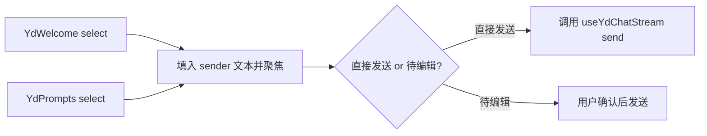

<script setup>
import Demo from '../.vitepress/theme/components/Demo.vue'
import ApiTable from '../.vitepress/theme/components/ApiTable.vue'
import InteractiveRemainingAiDemos from '../.vitepress/theme/components/demos/InteractiveRemainingAiDemos.vue'

const srcBasic = `<script setup>
import { YdPrompts } from '@yudream/components'
import type { YdPromptItem } from '@yudream/components/ai'

const items: YdPromptItem[] = [
  { key: 'weekly', label: '帮我写周报', description: '根据本周提交记录', icon: 'i-ri:file-list-3-line' },
  { key: 'translate', label: '翻译一段文字', icon: 'i-ri:translate-2' },
  { key: 'code-review', label: '审查这段代码', description: '指出潜在问题', icon: 'i-ri:code-s-slash-line' },
]

function onSelect(item: YdPromptItem) {
  // item.value ?? item.label 即建议发送给模型的文本
}
<\/script>

<template>
  <YdPrompts title="你可以试试" :items="items" @select="onSelect" />
</template>`

const props = [
  ['<code>items</code>', '<code>YdPromptItem[]</code>', '—（必填）', '提示词候选列表；数组为空时整个组件不渲染（根节点带 <code>v-if="items.length"</code>）'],
  ['<code>title</code>', '<code>string</code>', "<code>''</code>", '分组标题（<code>h3</code>），空字符串不渲染标题'],
  ['<code>vertical</code>', '<code>boolean</code>', '<code>false</code>', '纵向列表布局（对标 antd-x 的 vertical），默认横向排列'],
  ['<code>wrap</code>', '<code>boolean</code>', '<code>true</code>', '<code>true</code> 时横向放不下自动换行；<code>false</code> 为单行横向滚动'],
]

const item = [
  ['<code>key</code>', '<code>string | number</code>', '候选项唯一 key'],
  ['<code>label</code>', '<code>string</code>', '主文案'],
  ['<code>description</code>', '<code>string?</code>', 'label 下方的辅助说明，超长省略号截断'],
  ['<code>icon</code>', '<code>string?</code>', 'iconify 图标名，缺省不渲染图标'],
  ['<code>disabled</code>', '<code>boolean?</code>', '禁用该项（半透明 + <code>not-allowed</code> 光标，不触发 <code>select</code>）'],
  ['<code>value</code>', '<code>string?</code>', '发送给模型的文本，缺省用 <code>label</code>；组件只发事件，实际发送由业务侧决定'],
]

const emits = [
  ['<code>select</code>', '<code>(item: YdPromptItem)</code>', '点击某个提示词卡片（disabled 项不会触发）'],
]
</script>

# YdPrompts 提示词集

欢迎页 / 对话页的推荐提问卡片组：横向排列的胶囊按钮，每项可带图标、主文案与辅助描述，支持禁用、纵向列表与换行 / 滚动两种溢出策略。常与 `YdWelcome` 搭配使用——`YdWelcome` 接受纯字符串数组做轻量推荐，需要图标、描述、禁用等 richer 能力时用 `YdPrompts`。

组件是纯受控展示：点击只发 `select` 事件，是否把 `item.value ?? item.label` 填入输入框或直接发送由业务侧决定。

源码：`yudream-frontend/packages/components/src/ai/YdPrompts.vue`

## 基础用法

<Demo title="提示词集" description="真实组件；选择提示词只更新本地提示" :source="srcBasic">
  <ClientOnly><InteractiveRemainingAiDemos demo="prompts" /></ClientOnly>
</Demo>

## API

### Props

<ApiTable title="YdPrompts Props" :data="props" />

### YdPromptItem

`items` 数组元素的类型，在组件 `<script setup>` 中声明，并已从 AI 子入口 `src/ai/index.ts` 导出：

```ts
import type { YdPromptItem } from '@yudream/components/ai'
```

<ApiTable title="YdPromptItem 字段" :data="item" :columns="['字段', '类型', '说明']" />

### Emits

<ApiTable title="YdPrompts Emits" :data="emits" :columns="['事件', '签名', '说明']" />

## 与 YdWelcome 的分工

两者都承担「冷启动推荐提问」，选型依据：

| | `YdPrompts` | `YdWelcome.suggestions` |
| --- | --- | --- |
| 数据形态 | `YdPromptItem[]`（对象） | `string[]`（纯文本） |
| 图标 / 描述 / 禁用 | 支持 | 不支持 |
| 布局 | 横向 / 纵向、换行 / 滚动 | 自适应网格（`minmax(240px, 1fr)`） |
| 适用位置 | 输入框上方、侧栏、任意容器 | 居中欢迎区 |

## 典型组合：欢迎页 + 发送



业务侧约定：`item.value ?? item.label` 是建议发送给模型的完整文本——`label` 面向用户展示，`value` 可携带更长的指令模板。

## 注意事项

- 组件自身不处理空态：`items` 为空时整体不渲染，因此可以直接把后端返回的推荐列表透传进来。
- `description` 是 `white-space: nowrap` + 省略号，过长描述会被截断；需要完整展示多行说明时放在 `label` 里自行换行。
- 卡片样式使用主题语义变量与 `rgb(var(--primary-6))` 强调色，深浅模式自动适配，业务侧不要再覆盖品牌色。

> 真实使用参考：`yudream-frontend/apps/component-showcase/src/sections/AiSection.vue`
