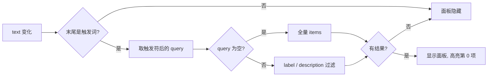

# YdSuggestion 输入建议

聊天输入框的「触发符命令补全面板」：当输入文本末尾出现触发词（默认 `/` 开头的最后一个词）时浮出候选列表，按已输入的过滤词对 `label` / `description` 做不区分大小写的 `includes` 过滤，支持鼠标悬停高亮与完整键盘导航。

组件是**无定位的纯面板**：只负责过滤、高亮与发事件，不监听全局键盘、不做弹出定位；`v-if` 控制显隐，位置（通常悬浮在输入框上方）由业务侧的容器决定。

源码：`yudream-frontend/packages/components/src/ai/YdSuggestion.vue`

## 基础用法

<Demo title="输入建议" description="真实组件；输入 / 后按文本过滤本地候选" :source="srcBasic">
  <ClientOnly><InteractiveRemainingAiDemos demo="suggestion" /></ClientOnly>
</Demo>

## 键盘导航接线

键盘处理通过 `defineExpose` 暴露的 `handleKeydown` 完成，返回值表示事件是否已被面板消费。业务侧在输入框的 `keydown` 中优先调用它：

<Demo title="handleKeydown 接线示例" description="真实建议面板；输入框内可验证本地过滤与选择" :source="srcKeydown">
  <ClientOnly><InteractiveRemainingAiDemos demo="suggestion" /></ClientOnly>
</Demo>

各按键行为（仅面板可见时）：

<ApiTable title="按键行为" :data="keys" :columns="['按键', '行为']" />

## API

### Props

<ApiTable title="YdSuggestion Props" :data="props" />

### YdSuggestionItem

`items` 数组元素的类型，在组件 `<script setup>` 中声明，并已从 AI 子入口 `src/ai/index.ts` 导出（`import type { YdSuggestionItem } from '@yudream/components/ai'`）：

<ApiTable title="YdSuggestionItem 字段" :data="item" :columns="['字段', '类型', '说明']" />

### Emits

<ApiTable title="YdSuggestion Emits" :data="emits" :columns="['事件', '签名', '说明']" />

### Expose

| 成员 | 类型 | 说明 |
| --- | --- | --- |
| `visible` | `Ref<boolean>` | 面板当前是否可见（触发词命中且有过滤结果） |
| `handleKeydown` | `(event: KeyboardEvent) => boolean` | 键盘事件代理，返回 `true` 表示已消费 |

## 触发与过滤流程

面板显隐切换时（`watch(visible)`）自动把高亮重置为第 0 项；鼠标 `mouseenter` 也会同步高亮，与键盘导航共用 `activeIndex`。

## 注意事项

- **组件不回填输入框**。`select` 事件只回传候选项与 `query`，把触发词（`trigger + query`）从输入文本中移除、写入 `item.value ?? item.label` 都由业务侧完成。
- 默认触发正则只识别「行首或空白符之后」的 `/xxx`，因此「帮我/翻译」中的 `/翻译` 能命中（前面是普通汉字时依赖正则中 `(?:^|\s)` 之外的回退分支——实际实现是：默认 `/` 走正则，非 `/` 触发符走 `lastIndexOf` 匹配，行为略有差异，定制触发符时注意验证）。
- 过滤命中 0 条时面板隐藏（`visible` 要求 `filtered.length > 0`），不会显示空态。
- 面板样式为圆角卡片 + 阴影（`box-shadow: 0 6px 24px`），需要业务侧用相对定位容器把它叠在输入框上方。

> 真实使用参考：`yudream-frontend/apps/component-showcase/src/sections/AiSection.vue`
