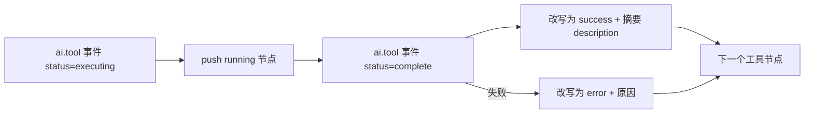

<script setup>
import Demo from '../.vitepress/theme/components/Demo.vue'
import ApiTable from '../.vitepress/theme/components/ApiTable.vue'
import InteractiveRemainingAiDemos from '../.vitepress/theme/components/demos/InteractiveRemainingAiDemos.vue'

const srcBasic = `<script setup>
import { YdThoughtChain } from '@yudream/components'
import type { YdThoughtChainItem } from '@yudream/components'
import { ref } from 'vue'

const items = ref<YdThoughtChainItem[]>([
  { key: 'retrieve', title: '检索知识库', description: '命中 3 篇文档', status: 'success' },
  { key: 'plan', title: '生成执行计划', status: 'running' },
  { key: 'render', title: '渲染结果', status: 'pending' },
])
<\/script>

<template>
  <YdThoughtChain :items="items" />
</template>`

const srcError = `const items = ref<YdThoughtChainItem[]>([
  { key: 'read', title: '读取页面配置', description: 'GET /api/cms/pages/home', status: 'success' },
  { key: 'publish', title: '发布页面', description: '上游服务返回 500，已中止后续步骤', status: 'error' },
  { key: 'notify', title: '通知订阅者', status: 'pending' },
])`

const props = [
  ['<code>items</code>', '<code>YdThoughtChainItem[]</code>', '—（必填）', '步骤列表，按数组顺序自上而下渲染，节点间自动连线'],
  ['<code>collapsible</code>', '<code>boolean</code>', '<code>true</code>', '是否显示可点击的收起头部；收起后只显示头部摘要行'],
  ['<code>defaultExpanded</code>', '<code>boolean</code>', '<code>true</code>', '初始展开状态（注意：仅作为默认值声明，组件内部 <code>expanded</code> 初始为 <code>true</code>，见下方注意事项）'],
  ['<code>title</code>', '<code>string</code>', '<code>\'执行过程\'</code>', '收起头部显示的标题文字，右侧自动拼接 <code>{items.length} 步</code>'],
]

const item = [
  ['<code>key</code>', '<code>string | number</code>', '节点唯一 key，用于 <code>v-for</code> 渲染'],
  ['<code>title</code>', '<code>string</code>', '节点标题'],
  ['<code>description</code>', '<code>string?</code>', '节点描述，支持换行（<code>white-space: pre-wrap</code>）'],
  ['<code>status</code>', '<code>\'pending\' | \'running\' | \'success\' | \'error\'</code>', '节点状态，决定图标与颜色；缺省按 <code>pending</code> 处理'],
  ['<code>icon</code>', '<code>string?</code>', '自定义 iconify 图标名，优先级高于状态图标'],
]

const emits = [
  ['<code>extra</code>（插槽）', '<code>{ item: YdThoughtChainItem, index: number }</code>', '作用域插槽，渲染在每个节点描述下方，可用于追加链接、耗时、重试按钮等自定义内容'],
]

const statusMap = [
  ['<code>pending</code>', '<code>i-ri:record-circle-line</code>', '中性灰（<code>--color-text-3</code>）'],
  ['<code>running</code>', '<code>i-ri:loader-4-line</code>', '主题色（<code>rgb(var(--primary-6))</code>），图标旋转动画'],
  ['<code>success</code>', '<code>i-ri:checkbox-circle-line</code>', '成功绿'],
  ['<code>error</code>', '<code>i-ri:error-warning-line</code>', '危险红'],
]
</script>

# YdThoughtChain 思维链

展示 AI 执行过程的步骤链：每个节点有状态图标（pending / running / success / error）、标题与描述，节点之间自动绘制竖向连线，`running` 状态图标带旋转动画。组件默认带可收起头部（「执行过程 · N 步」），适合折叠在助手消息气泡内展示工具调用与推理步骤。

组件是纯受控展示：`items` 完全由业务侧驱动，流式更新时直接修改数组元素的 `status` / `description` 即可，组件不缓存任何状态（除展开/收起）。

源码：`yudream-frontend/packages/components/src/ai/YdThoughtChain.vue`

## 基础用法

<Demo title="思维链" description="真实组件；可点击标题收起或展开" :source="srcBasic">
  <ClientOnly><InteractiveRemainingAiDemos demo="thought" /></ClientOnly>
</Demo>

## 含失败步骤

`status: 'error'` 的节点显示红色警告图标，后续 `pending` 节点保持灰色，业务侧通常在 error 节点的 `description` 中写明失败原因：

<Demo title="失败节点" description="真实组件的 error 与 pending 状态" :source="srcError">
  <ClientOnly><InteractiveRemainingAiDemos demo="thought-error" /></ClientOnly>
</Demo>

## API

### Props

<ApiTable title="YdThoughtChain Props" :data="props" />

### YdThoughtChainItem

`items` 数组元素的类型，在组件 `<script setup>` 中以 `export interface YdThoughtChainItem` 声明：

<ApiTable title="YdThoughtChainItem 字段" :data="item" :columns="['字段', '类型', '说明']" />

### 插槽

<ApiTable title="插槽" :data="emits" :columns="['名称', '作用域', '说明']" />

```vue
<YdThoughtChain :items="items">
  <template #extra="{ item, index }">
    <span v-if="item.status === 'success'" class="cost">{{ item.costMs }}ms</span>
  </template>
</YdThoughtChain>
```

### 状态图标与颜色

`item.icon` 存在时优先使用，否则按 `status` 映射：

<ApiTable title="status 映射" :data="statusMap" :columns="['status', '图标', '颜色']" />

## 与流式对话配合

典型场景是配合 `useYdChatStream` 的 `ai.tool` 事件维护思维链：工具开始时 push 一个 `running` 节点，工具结束时原地改 `status` 与 `description`。



## 注意事项

- **`defaultExpanded` 目前不生效于初始状态**：组件内部 `const expanded = ref(true)`，即无论传什么初始都展开；`defaultExpanded` 仅作为 prop 默认值声明存在。如需默认收起，需在业务侧包一层控制或改造组件（修改内建组件前需确认）。
- `YdThoughtChainItem` 类型已从 AI 子入口 `yudream-frontend/packages/components/src/ai/index.ts` 导出，可直接 `import type { YdThoughtChainItem } from '@yudream/components/ai'`（与参照页 `yd-chat-session-list` 不同，`YdSessionItem` 未导出）。
- `key` 支持 `string | number`；若使用后端雪花 Long id 作 key，**JSON / TS 中一律使用 string**，禁止 `Number(id)`。
- 组件宽度跟随容器（`border-radius: 10px` 卡片样式），放在气泡内时建议限制 `max-width`。

> 真实使用参考：`yudream-frontend/apps/component-showcase/src/sections/AiSection.vue`
