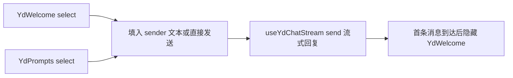

<script setup>
import Demo from '../.vitepress/theme/components/Demo.vue'
import ApiTable from '../.vitepress/theme/components/ApiTable.vue'
import InteractiveRemainingAiDemos from '../.vitepress/theme/components/demos/InteractiveRemainingAiDemos.vue'

const srcBasic = `<script setup>
import { YdWelcome } from '@yudream/components'

const suggestions = [
  '帮我写一篇产品周报',
  '总结这份需求文档的要点',
  '把这段话翻译成英文',
]

function onSelect(text: string) {
  // text 即被点击的推荐提问原文，通常填入输入框或直接发送
}
<\/script>

<template>
  <YdWelcome
    title="下午好，Husky"
    description="我是你的 AI 助手，可以帮你写作、翻译、总结与分析。"
    :suggestions="suggestions"
    icon="i-ri:sparkling-2-fill"
    @select="onSelect"
  />
</template>`

const props = [
  ['<code>title</code>', '<code>string</code>', "<code>'今天想让我帮你做什么？'</code>", '主问候语，28px 大字标题，可按时段与用户名动态拼接'],
  ['<code>description</code>', '<code>string</code>', "<code>''</code>", '副标题描述；空字符串不渲染（最大宽度 560px 居中）'],
  ['<code>suggestions</code>', '<code>string[]</code>', '<code>[]</code>', '推荐提问列表；空数组不渲染推荐网格'],
  ['<code>icon</code>', '<code>string</code>', "<code>'i-ri:sparkling-2-fill'</code>", '顶部品牌标识图标（iconify 名称），渲染在渐变圆角方块中'],
]

const emits = [
  ['<code>select</code>', '<code>(text: string)</code>', '点击某条推荐提问，回传提问原文'],
]
</script>

# YdWelcome 欢迎页

对话应用的冷启动首屏：居中的品牌图标、问候标题、可选副标题与推荐提问网格。推荐项是自适应网格卡片（`repeat(auto-fit, minmax(240px, 1fr))`，容器最大宽 640px），悬停上浮并浮现右上角箭头。

组件纯展示：点击推荐项只发 `select` 事件，填入输入框或直接发送由业务侧决定。需要图标、描述、禁用等更丰富的候选能力时改用 `YdPrompts`。

源码：`yudream-frontend/packages/components/src/ai/YdWelcome.vue`

## 基础用法

<Demo title="欢迎页" description="真实组件；点击推荐问题只更新本地提示" :source="srcBasic">
  <ClientOnly><InteractiveRemainingAiDemos demo="welcome" /></ClientOnly>
</Demo>

## 按时段问候

`title` 是普通字符串 prop，业务侧自行拼接：

```ts
const hour = new Date().getHours()
const greeting = hour < 6 ? '夜深了' : hour < 12 ? '早上好' : hour < 18 ? '下午好' : '晚上好'
const title = `${greeting}，${userStore.userInfo.nickname}`
```

## API

### Props

<ApiTable title="YdWelcome Props" :data="props" />

### Emits

<ApiTable title="YdWelcome Emits" :data="emits" :columns="['事件', '签名', '说明']" />

组件没有插槽——所有内容都由 props 驱动。

## 与 YdPrompts 的组合

典型冷启动流程：欢迎区用 `YdWelcome`，输入框上方再挂一组 `YdPrompts` 提供带图标 / 描述的进阶指令；两者共用同一条「选中 → 发送」管线：



## 注意事项

- `suggestions` 是 `string[]` 而非对象数组，渲染 key 直接使用字符串本身，因此**推荐文案不要重复**。
- 组件自带较大内边距（`padding: 8vh 24px 40px`），是为整屏欢迎区设计的；嵌入小容器时需要外层覆盖间距。
- 图标走项目统一的 `FaIcon`（iconify），深浅模式与主题色自动适配，业务侧无需也无法覆盖品牌色。

> 真实使用参考：`yudream-frontend/apps/component-showcase/src/sections/AiSection.vue`
