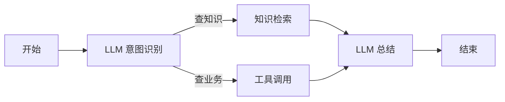
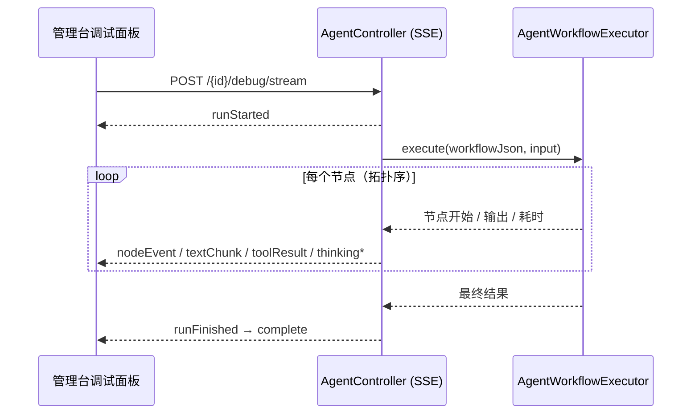

# Agent 平台与工作流引擎

Agent 能力（`agent`）在 [AI 能力](/features/ai) 之上提供**可编排的智能体**：内置 Agent 应用、自研工作流引擎（图定义 → 校验 → 执行）、Python 自定义工具、执行追踪调试，并支持插件以运行时编排方式贡献 Agent。

> 源码：`yudream-application/src/main/java/online/yudream/base/application/platform/agent/`、`yudream-interfaces` 下 `AgentController`（`/api/platform/agents`）

## 双闸门与配置

| 闸门 | 机制 | 说明 |
|---|---|---|
| 项目闸门 | `@ConditionalOnProperty(prefix = "yudream.platform.capabilities.agent", name = "enabled")` | 环境变量 `PLATFORM_AGENT_ENABLED`（默认 `true`）；关闭时 `AgentController` 不注册 |
| 应用闸门 | 运行链路依赖 AI 能力的 `ensureEnabled("ai", ...)` | Agent 执行最终走 AI 网关，受 AI 应用闸门约束 |

| 配置 | 默认 | 说明 |
|---|---|---|
| `yudream.platform.ai.client.sse-timeout` | `30m` | 调试 SSE 流超时（复用 AI 客户端配置） |

## 架构组成

| 组件 | 类 | 职责 |
|---|---|---|
| 应用服务 | `AgentAppService` | Agent CRUD、发布、运行入口、工具管理 |
| 工作流解析 | `AgentWorkflowGraphParser` | 把图定义（节点+边 JSON）解析为执行图；**解析期即拒绝环**（「工作流不能包含环」） |
| 工作流校验 | `AgentWorkflowValidator` | 保存前静态校验：结构合法性与目录（模型 / 知识空间 / 工具）引用匹配 |
| 执行引擎 | `AgentWorkflowExecutor` | 按拓扑序驱动节点执行、传递上下文（`AgentWorkflowContext`） |
| 值解析 | `AgentWorkflowValueResolver` | 节点参数模板渲染与变量回填（引用上游节点输出） |
| 执行追踪 | `AgentExecutionTracer` / `AgentTraceSession` | 记录每一步输入输出与耗时，供调试面板回放 |
| 内置初始化 | `BuiltinAgentInitializerService` | 启动时初始化内置 Agent |

## 内置 Agent

`BuiltinAgentCodes` 定义四个内置应用：

| code | 用途 |
|---|---|
| `builtin-cms-builder` | CMS 页面 AI 构建器（[AI 能力](/features/ai) 的页面生成场景） |
| `builtin-agui-card` | AG-UI 卡片生成 |
| `builtin-wiki-qa` | 知识库问答（对接 [Wiki RAG](/features/wiki)） |
| `builtin-group-chatbot` | 插件托管（`isPluginManaged` 为真），由群聊机器人插件运行时提供编排 |

## 工作流节点类型（11 种）

工作流是**有向无环图**，每种节点一个 handler（`workflow/handler/` 下 11 个实现）：

| 节点 | handler | 用途 |
|---|---|---|
| 开始（start） | `AgentStartNodeHandler` | 入口，声明工作流输入变量 |
| 结束（end) | `AgentEndNodeHandler` | 出口，组装最终输出 |
| LLM | `AgentLlmNodeHandler` | 调用大模型（providerCode + modelCode + 提示词模板） |
| 工具（tool） | `AgentToolNodeHandler` | 调用注册的 AI 工具（含插件注册的） |
| 条件（condition） | `AgentConditionNodeHandler` | 按表达式路由到不同分支 |
| 代码（code） | `AgentCodeNodeHandler` | 执行脚本片段做数据加工 |
| 知识（knowledge） | `AgentKnowledgeNodeHandler` | 检索知识库（对接 Wiki RAG） |
| 引用（citation） | `AgentCitationNodeHandler` | 组装引用来源 |
| 文档（document） | `AgentDocumentNodeHandler` | 读取/生成文档内容 |
| 模板（template） | `AgentTemplateNodeHandler` | 变量模板渲染 |
| 输入（input） | `AgentInputNodeHandler` | 中断等待用户补充输入（人机协同） |



## API 端点

`AgentController` 前缀 `/api/platform/agents`：

| 端点 | 方法 | 权限 | 说明 |
|---|---|---|---|
| `/` | GET | `platform:agent:view` | 分页查询 Agent 应用 |
| `/available` | GET | `platform:agent:view` | 已发布的持久化 + 插件运行时 Agent 清单 |
| `/runtime/{code}` | GET | `platform:agent:view` | 查看插件运行时编排 |
| `/runtime/{code}/import` | POST | `platform:agent:edit` | 把插件运行时 Agent 导入为可编辑的本地覆盖 |
| `/{id}` | GET / PUT / DELETE | view / edit / delete | 详情 / 编辑 / 删除 |
| `/` | POST | `platform:agent:edit` | 新建 Agent 应用 |
| `/{id}/publish` | POST | `platform:agent:publish` | 发布（发布后才出现在 available 清单） |
| `/models` · `/catalog` | GET | `platform:agent:view` | 可用模型 / 编排目录（模型+知识空间） |
| `/{id}/run` | POST | `platform:agent:run` | 同步运行一次工作流 |
| `/{id}/debug/stream` | POST | `platform:agent:edit` | **SSE 流式调试** |
| `/tools` 系列 | GET/POST/PUT/DELETE | `platform:agent:tool:*` | Python 自定义工具 CRUD 与系统工具清单 |

示例：运行一个已发布 Agent（ID 使用字符串形式的 Snowflake ID）：

```json
POST /api/platform/agents/193847291023847936/run
{
  "input": "帮我总结本周的知识库更新",
  "variables": { "spaceSlug": "product-docs" }
}
```

## 调试流（SSE）

`POST /{id}/debug/stream` 返回 `text/event-stream`，事件类型与聊天同族但面向调试：`runStarted`、节点级事件（每个节点的输入/输出/耗时）、`textChunk`（正文增量）、`thinkingStart/Content/End`（推理过程）、`toolResult`（工具调用结果）、`runFinished` / `runError`。发送 `runError` 后正常 `complete`。开发模式调试浮窗（Ctrl/Cmd+Shift+D）有专门的追踪页可视化回放——见 [插件开发者工具](/plugin/dev-tools)。



## Python 自定义工具

除系统工具外，可经 `/tools` 端点登记 **Python 工具**（`AgentToolSaveRequest`），运行期经 Python Runtime 能力执行（`AgentPythonToolContract` 定义入参出参契约）。工具在工作流 tool 节点中按 code 引用。

## 插件接入

- **SPI 端口**：`PluginAiService.runAgent(agentCode, request)` / `runAgentStream(...)`——见 [AI 端口](/plugin/spi/v1/ai)；
- **运行时编排**：插件可声明 Agent 编排，宿主经 `/runtime/{code}` 暴露并可导入为本地覆盖；
- **前端组件**：YuDream 原创 `Yd*` 组件配合 `useYdChatStream` 可直接消费 Agent 流式输出；本页展示的是其在 AI 场景中的一种用法。

---

> 源码引用：`application/platform/agent/{service,workflow,cmd,dto,assembler}/` 全部类；语义细节另见设计档案 `docs/plans/2026-*-agent-workflow-runtime*.md`
