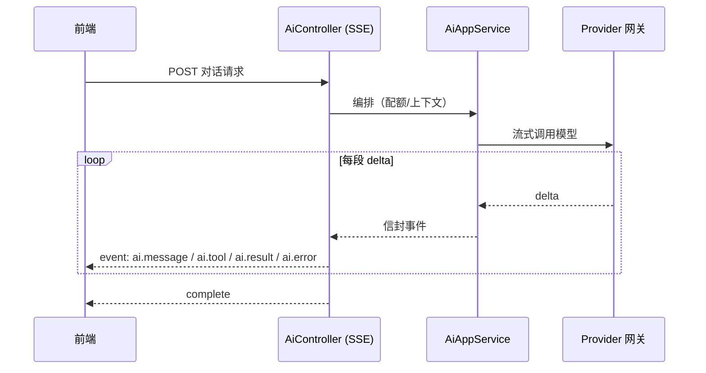

# AI 对话能力

平台 AI 能力（`ai`）把多家大模型 provider 统一接入框架，向上提供对话（SSE 真流式）、原生工具调用与 AG-UI WebSocket 通道，是 Agent、Wiki 问答、聊天、CMS AI 工具组的共同底座。

> 源码：`yudream-application/src/main/java/online/yudream/base/application/platform/ai/`、`yudream-interfaces` 下 `AiController`（`/api/platform/ai`）、`AguiWebSocketHandler`

---

## provider-first 配置模型

AI 配置是**以 provider 为一级实体的列表结构**：

```json
{
  "providers": [
    {
      "code": "openai",
      "name": "OpenAI",
      "baseUrl": "https://api.openai.com/v1",
      "apiKey": "sk-...",
      "proxy": "",
      "defaultModel": "gpt-4o",
      "models": [
        { "code": "gpt-4o", "name": "GPT-4o" },
        { "code": "gpt-4o-mini", "name": "GPT-4o mini" }
      ]
    }
  ]
}
```

- 每个 provider 持有 base URL、API Key、代理、默认模型与**模型清单**；
- 前端与插件调用时传 **`providerCode + modelCode`** 二元组定位模型，而不是全局一个"当前模型"；
- 支持任何 OpenAI 兼容网关（自建中转、DeepSeek、Kimi 等）。

## SSE 真流式

对话走 `AiController` 的 SSE 端点，端到端传播模型 delta：



事件为可扩展信封：`event/action/module/traceId/timestamp/payload`，语义化命名：

| 事件 | 含义 |
|---|---|
| `ai.message` | 文本增量 |
| `ai.tool` | 工具调用过程 |
| `ai.result` | 最终结果 |
| `ai.error` | 错误 |

约定：发送结构化 `ai.error` 后正常 `complete`，不再使用 `completeWithError`——保证前端连接总是干净收尾。

## 原生 tool calling

工具调用使用 **Spring AI 原生 tool calling**：工具以标准方式注册给模型，模型自行决定何时调用、参数由框架解析回填。项目抽象 `AiAgentTool` 由 infra 层适配到 Spring AI——**不要求模型手工产出项目自定义的 `toolCalls` JSON**。

平台内置工具组示例（CMS 画布）：`CmsCanvasAiTool`、`CmsCanvasAtomicAiTools`、`CmsCanvasValidateAiTool`、`CmsChromeAiTool`、`WebFetchAiTool`、`CmsAskUserAiTool`。

## AG-UI WebSocket

除 SSE 外，AI 还提供 AG-UI 协议的 WebSocket 通道（`AguiWebSocketHandler` + `AguiWebSocketConfig`），供前端 AI 组件（如 `useYdChatStream` 的 `agui` 协议模式）使用；WebSocket 采用一问一连接模式。

## 相关配置

| 配置 | 默认 | 说明 |
|---|---|---|
| `PLATFORM_AI_ENABLED` | `true` | 项目闸门 |
| `PLATFORM_AI_CONNECT_TIMEOUT` | `30s` | 连接超时 |
| `PLATFORM_AI_READ_TIMEOUT` | `10m` | 读超时（长回答） |
| `PLATFORM_AI_SSE_TIMEOUT` | `10m` | SSE 流超时 |

---

> 源码引用：`yudream-application/.../platform/ai/AiAppService.java` 与 CMS AI 工具组、`yudream-interfaces/.../platform/ai/controller/AiController.java`、`config/AguiWebSocketConfig.java`
