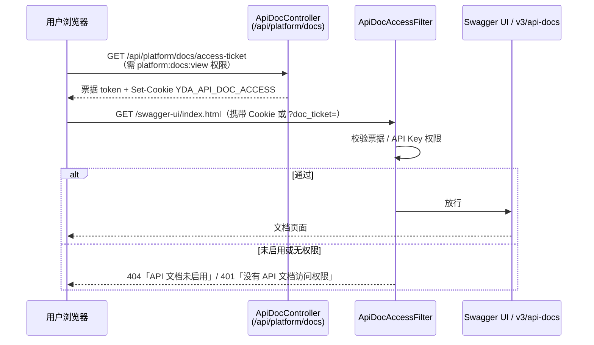

# API 文档（api-docs）

API 文档是平台能力（capability code 为 `api-docs`）之一，基于 **SpringDoc OpenAPI**（`springdoc-openapi-starter-webmvc-ui`）提供 `/v3/api-docs` 与 Swagger UI，并把插件注册的 HTTP 端点自动合并进 OpenAPI 文档。文档入口不是裸奔的：通过访问票据 + 可选 API Key 双通道控制谁能打开。

> 源码：`yudream-interfaces/src/main/java/online/yudream/base/interfaces/platform/docs/`、`yudream-infrastructure/.../platform/docs/service/ApiDocCapabilityProvider.java`、配置 `yudream-bootstrap/src/main/resources/application.yml`

---

## 访问控制模型

Swagger UI 与 OpenAPI JSON 属于敏感信息，系统用一道 Servlet Filter 统一把关：



要点（均可在源码中对应）：

- **票据**：`ApiDocAccessTicketService` 用 `SecureRandom` 生成 32 字节 URL-safe Base64 token，内存 `ConcurrentHashMap` 保存过期时间，**TTL 10 分钟**；发放时顺带清理过期票据。Cookie 名 `YDA_API_DOC_ACCESS`（`httpOnly`、`SameSite=Lax`），也支持查询参数 `?doc_ticket=...`；

票据签发响应同时返回 JSON 与 Cookie（见 `ApiDocController.accessTicket`）：

```json
{
  "code": 200,
  "data": { "ticket": "<token>", "expiresIn": 600 },
  "message": "操作成功"
}
```

`expiresIn` 单位为秒；Cookie 的 `maxAge` 与之同步。票据仅存于内存，后端重启后需重新签发——这是有意的轻量设计，避免为文档访问引入持久化凭证。
- **过滤器**：`ApiDocAccessFilter`（`@Order(HIGHEST_PRECEDENCE + 30)`）拦截路径前缀 `/v3/api-docs`、`/swagger-ui` 与 `/swagger-ui.html`；能力未启用返回 404（隐藏存在性），无权限返回 401；
- **双通道放行**：票据有效即通过；或设置里开启 `apiKeyAccessEnabled` 后，携带 API Key 且具备 `platform:docs:view` 权限的调用方直接访问——便于程序化拉取 OpenAPI JSON。

## 管理端 API

`ApiDocController` 挂载在 `/api/platform/docs`：

| 方法 | 路径 | 权限 | 说明 |
|---|---|---|---|
| GET | `/settings` | `platform:docs:view` | 查看文档配置 |
| PUT | `/settings` | `platform:docs:config` | 更新开关与入口路径 |
| GET | `/access-ticket` | `platform:docs:view` | 签发访问票据并写入 Cookie |

配置实体 `ApiDocSettings`（domain 聚合，经 `ApiDocSettingsRepo` 单例存储）持有：`enabled`、`apiKeyAccessEnabled`、`title`、`description`、`docVersion`、`openApiPath`、`swaggerUiPath`。

## 插件端点自动合并

这是该能力对插件体系最有价值的部分：`OpenApiConfigure` 注册了一个 `OpenApiCustomizer`，从 `PluginAppService.httpEndpoints()` 拉取所有已加载插件的 HTTP 端点，逐个写入 OpenAPI 文档（见 `yudream-interfaces/.../docs/config/OpenApiConfigure.java`）：

- 按 HTTP 方法（GET/POST/PUT/PATCH/DELETE/HEAD/OPTIONS/TRACE）挂到对应 `PathItem`；
- 自动生成操作描述：插件 code、所需权限、响应是否经系统 `Result` 包装；
- 路径中的 `{param}` 占位符自动展开为必填 path 参数（schema 类型 `string`——这与项目「ID 在 URL 中一律 string」的约定一致）;
- 请求体统一声明为宽松的 `application/json` object；路径以 `/events` 结尾或包含 `/events/` 的端点识别为 SSE，响应媒体类型标为 `text/event-stream`;
- 操作按 `插件 - {pluginCode}` 分组打 tag。

因此宿主自身 Controller 的注解式文档与插件动态端点的文档会出现在同一个 Swagger UI 里。

## 能力接入

`ApiDocCapabilityProvider` 遵循平台能力的标准形态（`yudream-infrastructure/.../docs/service/ApiDocCapabilityProvider.java`）：

- 项目闸门：`@ConditionalOnProperty(prefix = "yudream.platform.capabilities.api-docs", name = "enabled")`，对应环境变量 `PLATFORM_API_DOCS_ENABLED`（默认 `true`）；
- 描述符：类型 `DOCUMENTATION`，默认元数据给出 `openApiPath=/v3/api-docs`、`swaggerUiPath=/swagger-ui/index.html`；
- `health()` 反映启用状态与当前入口路径；`enable(config)`/`disable()` 只更新持久化设置，不建立任何外部连接。

应用闸门体现在两处：`ApiDocAppService` 用例前的 `ensureEnabled` 检查，以及 `ApiDocAccessFilter` 对每次文档请求的 `isEnabled` 复核——即使项目闸门放行，运行时仍可随时下线文档。

## SpringDoc 基础配置

`yudream-bootstrap/src/main/resources/application.yml` 中：

```yaml
springdoc:
  cache:
    disabled: true          # 配置变更即时生效
  swagger-ui:
    disable-swagger-default-url: true
    query-config-enabled: true
    url: /v3/api-docs
  api-docs:
    path: /v3/api-docs
```

依赖声明在 `yudream-interfaces/pom.xml`（`org.springdoc:springdoc-openapi-starter-webmvc-ui`）。注意：本能力基于 SpringDoc，项目中**未使用 knife4j**。

## 配置项一览

| 层级 | 配置 | 默认 | 说明 |
|---|---|---|---|
| 环境变量 | `PLATFORM_API_DOCS_ENABLED` | `true` | 项目闸门，决定 provider 是否装配 |
| 持久化设置 | `enabled` | — | 应用闸门，运行时可开关文档 |
| 持久化设置 | `apiKeyAccessEnabled` | — | 允许 API Key 直接访问 `/v3/api-docs` |
| 持久化设置 | `openApiPath` / `swaggerUiPath` | 见 descriptor 默认值 | 文档入口路径 |
| SpringDoc | `springdoc.*`（见下） | — | JSON 缓存关闭、UI 默认地址禁用 |

设置更新经 `PUT /api/platform/docs/settings`（cmd -> 应用层 -> 聚合 `update(...)`），无需重启进程。

## 插件端点文档示例

一个插件端点被合并进 OpenAPI 后大致呈现为：

```yaml
/api/plugins/my-plugin/events:
  get:
    tags: [插件 - my-plugin]
    summary: GET events
    description: |
      插件：my-plugin
      权限：my-plugin:view

      响应会使用系统 Result 包装。
    responses:
      '200':
        description: OK
        content:
          text/event-stream:
            schema: { type: object }   # /events 结尾，识别为 SSE
```

## 与插件权限/挂载约定的关系

- 插件 HTTP 端点统一挂载在 `/api/plugins/{pluginCode}/**`，OpenAPI 文档中的 path 即该完整路径；
- 端点声明的 `permission` 会写入操作描述，便于调用方在 Swagger UI 里自查所需权限；
- SSE 端点（路径含 `/events`）的响应媒体类型标注为 `text/event-stream`，与平台「SSE 端到端真流式」约定呼应。

## 使用方式

1. 管理员确认能力已启用（`PLATFORM_API_DOCS_ENABLED` 与后台能力开关）；
2. 已登录且具备 `platform:docs:view` 权限的用户请求 `GET /api/platform/docs/access-ticket`，浏览器获得 10 分钟有效的访问 Cookie；
3. 直接打开 `{swaggerUiPath}`（默认 `/swagger-ui/index.html`）浏览宿主与插件的全量接口；
4. 需要 API 化拉取时，开启 `apiKeyAccessEnabled` 并以 API Key 调用 `/v3/api-docs`。

---

> 源码引用：`yudream-interfaces/src/main/java/online/yudream/base/interfaces/platform/docs/controller/ApiDocController.java`、同目录 `filter/ApiDocAccessFilter.java`、`service/ApiDocAccessTicketService.java`、`config/OpenApiConfigure.java`、`yudream-infrastructure/src/main/java/online/yudream/base/infra/platform/docs/service/ApiDocCapabilityProvider.java`、`yudream-bootstrap/src/main/resources/application.yml`
