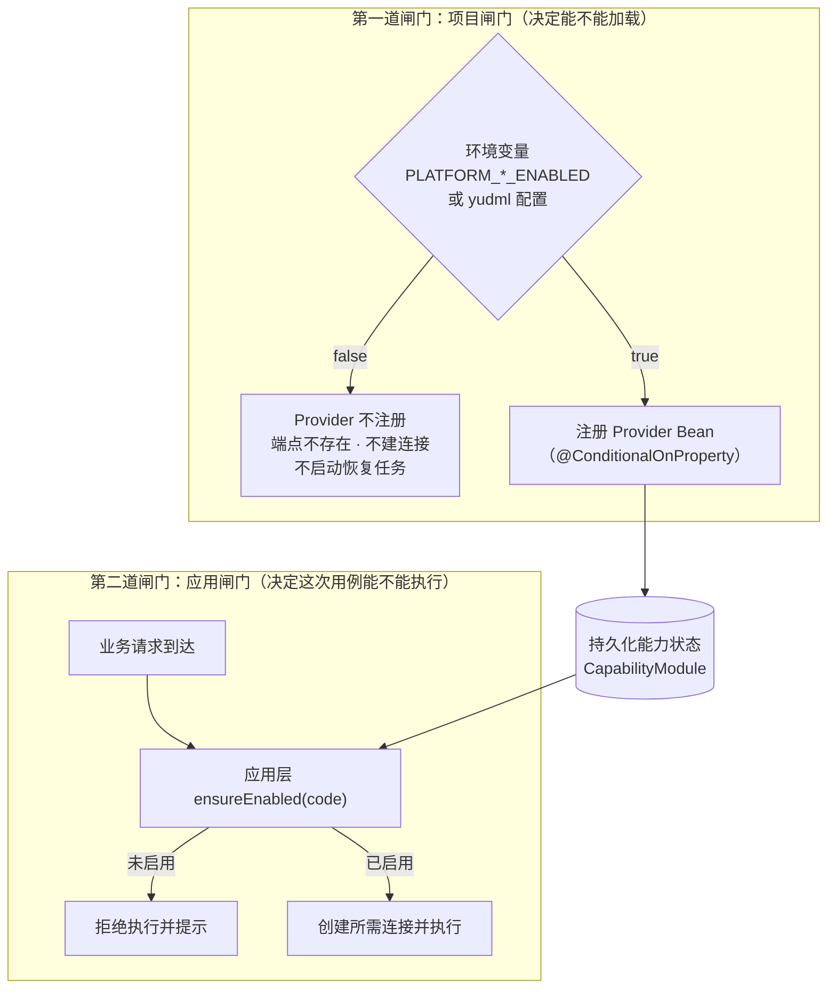
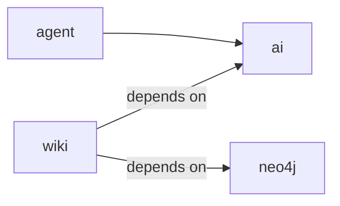

# 能力开关框架（双闸门）

所有平台能力共用一套开关框架：能力以 `CapabilityProvider` 实现类形式存在，宿主按**项目闸门 → 应用闸门**两级管控其生命周期。

> 源码：`yudream-domain/src/main/java/online/yudream/base/domain/platform/capability/`、`yudream-application/.../application/platform/capability/CapabilityAppService.java`、`yudream-interfaces/.../platform/capability/controller/CapabilityController.java`

---

## 核心接口：CapabilityProvider

每个能力在 infra/interfaces 层提供一个 Provider 实现：

```java
public interface CapabilityProvider {
    CapabilityDescriptor descriptor();
    CapabilityHealth health();
    void enable(Map<String, String> config);
    void disable();
    CapabilityTestResult test(String message);
}
```

| 方法 | 语义 | 约束 |
|---|---|---|
| `descriptor()` | 能力元数据（静态） | 不得做任何 IO |
| `health()` | 健康检查 | 只读探测，可安全失败 |
| `enable(config)` | 启用能力 | **不得建立外部连接、声明队列或启动长驻资源**——只允许校验与保存配置 |
| `disable()` | 停用能力 | 必须关闭清理本能力创建的连接与资源 |
| `test(message)` | 连通性测试（如 AI 发一句测试话） | 真实业务动作，允许外部 IO |

关键设计约束：**连接只在两道闸门通过且真实业务/连接/健康检查动作需要时创建**。这样"启用了但没人用"的能力不会占用资源。

## CapabilityDescriptor 字段表

```java
public record CapabilityDescriptor(
        String code, String name, CapabilityType type, String description,
        String icon, int sort,
        List<PluginConfigEntry-like> defaultConfig,
        List<String> dependencies) {}
```

| 字段 | 说明 |
|---|---|
| `code` | 能力唯一标识（如 `ai`、`neo4j`） |
| `name` / `description` / `icon` | 展示信息 |
| `type` | 能力类型枚举 |
| `sort` | 管理页排序 |
| `defaultConfig` | 默认配置键值（管理员启用时的初始表单） |
| `dependencies` | 依赖的其他能力 code 列表 |

相关值对象：`CapabilityHealth`（健康状态）、`CapabilityTestResult`（测试结果）、`CapabilityCode`、`CapabilityStatus`；聚合根为 `CapabilityModule`，仓储接口 `CapabilityModuleRepo`。

---

## 双闸门流程



### 项目闸门

- 通过 Spring 的 `@ConditionalOnProperty`（或等价的环境变量判断，如 `PLATFORM_AI_ENABLED`）控制 Provider Bean 是否装配；
- 未放行的能力：不注册端点、不启动消息恢复、不出现在管理页可启用列表之外。

### 应用闸门

- 能力的启用/停用状态持久化在数据库（聚合 `CapabilityModule`），管理员可在后台动态切换；
- 应用服务在每个用例入口调用 `ensureEnabled(...)` 校验当前状态；
- 因此**改配置不需要重启**即可停用能力；而要让能力彻底不可见则需要同时关掉项目闸门。

## 依赖级联



- **启用方向**：依赖的能力不可用（项目闸门关闭或未启用）→ 拒绝启用依赖方；
- **禁用方向**：禁用 `ai` → 自动级联禁用 `wiki`、`agent` 等所有直接/间接依赖方，避免出现"半死"能力。

## Provider 编写规范

1. 构造函数与 `enable(config)` 中**禁止**建立外部连接、声明 MQ 队列、启动线程池；
2. 需要长驻资源时采用懒初始化：第一次真实业务动作/健康检查时创建，并在 `disable()` 中关闭；
3. `health()` 必须无副作用且快速返回；
4. 新增平台能力需同步：Provider 实现 + `CapabilityCode` 枚举 + 环境变量 + 文档（本目录新增一页）。

---

> 源码引用：
> - 接口与值对象：`yudream-domain/src/main/java/online/yudream/base/domain/platform/capability/{service,valobj}/`
> - 应用编排：`yudream-application/src/main/java/online/yudream/base/application/platform/capability/service/CapabilityAppService.java`
> - 管理 API：`yudream-interfaces` 下 `CapabilityController`（`/api/platform/capabilities`）
> - 环境变量清单：`docker-compose.yml`
