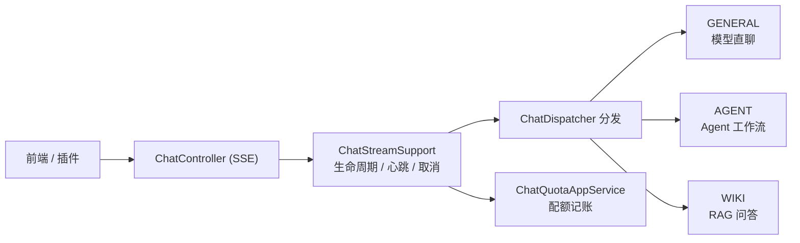
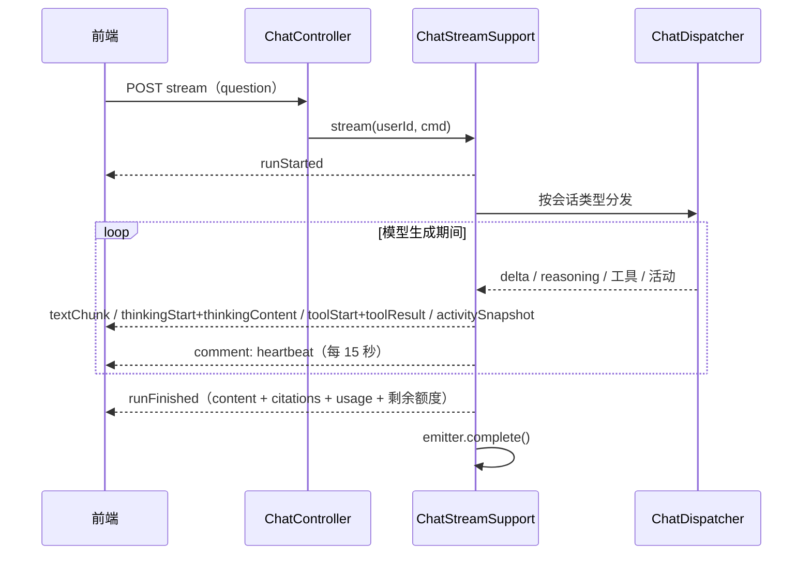

# 聊天能力（AI 助手）

聊天（`chat`）是面向终端用户的**多会话 AI 对话产品**：会话管理、消息持久化、附件上传、每日 token 配额、AG-UI 协议 SSE 流式输出。它复用 [AI 能力](/features/ai) 的模型接入，并按会话意图（通用 / Agent / 知识库）路由到不同执行后端。

> 源码：`yudream-application/src/main/java/online/yudream/base/application/platform/chat/`、`yudream-interfaces` 下 `ChatController`（`/api/platform/chat`）与 `ChatStreamSupport`

## 双闸门

| 闸门 | 机制 | 说明 |
|---|---|---|
| 项目闸门 | `@ConditionalOnProperty(prefix = "yudream.platform.capabilities.ai", name = "enabled")` | 聊天复用 **ai 能力**的项目开关（`PLATFORM_AI_ENABLED`，默认 `true`）；关闭时 `ChatController` 不注册 |
| 应用闸门 | `ChatAppService` 每次问答前检查当日配额 | 配额耗尽（`remaining <= 0`）拒绝新回合，返回结构化错误而非中断连接 |

聊天自身无独立能力开关；停用 AI 能力即整体停用聊天。

## 配置

| 配置 | 环境变量 | 默认 | 说明 |
|---|---|---|---|
| `yudream.platform.chat.sse-timeout` | `PLATFORM_CHAT_SSE_TIMEOUT` | `30m` | SSE 流超时 |
| `yudream.platform.ai.client.*` | `PLATFORM_AI_*` | 见 [AI 能力](/features/ai) | 模型连接与读超时 |

## 分发器族

`ChatDispatcher` 族按会话的 `ChatScopeType`（`GENERAL` / `AGENT` / `WIKI`）把请求路由到不同执行后端：

| 分发器 | 后端 |
|---|---|
| `ChatDispatcher` | 分发入口，按会话绑定选择具体分发器 |
| `GeneralChatDispatcher` | 通用模型直聊（providerCode + modelCode + 原生工具调用） |
| `AgentChatDispatcher` | 会话绑定 Agent，走 [Agent 工作流](/features/agent) |
| `WikiChatDispatcher` | 会话绑定知识库，走 [Wiki RAG 问答](/features/wiki)（`ChatWikiContextResolver` 组装知识库上下文） |

## 会话与消息

会话（`ChatSession`）按 `ChatScopeType` 绑定执行后端：`GENERAL` 直聊、`AGENT` 绑定 `agentCode`、`WIKI` 绑定 `spaceSlug`；支持重命名与置顶。消息（`ChatMessage`）持久化完整历史，含 reasoning、引用、工具事件等结构化字段。

| 端点 | 方法 | 权限 | 说明 |
|---|---|---|---|
| `/api/platform/chat/sessions` | GET | `platform:chat:session:view` | 当前用户会话列表 |
| `/api/platform/chat/sessions` | POST | `platform:chat:session:edit` | 创建会话 |
| `/api/platform/chat/sessions/{id}` | PATCH | `platform:chat:session:edit` | 重命名 / 切换上下文 / 置顶 |
| `/api/platform/chat/sessions/{id}` | DELETE | `platform:chat:session:edit` | 删除会话 |
| `/api/platform/chat/sessions/{id}/messages` | GET | `platform:chat:session:view` | 会话历史消息 |

发送一问一答时，请求体（`ChatSendRequest`）携带 `scopeType`、`providerCode` + `modelCode`、`question`、`contextRefs`（引用上下文）、`attachments` 与 `history`。

## 流式问答（AG-UI over SSE）

| 端点 | 权限 | 说明 |
|---|---|---|
| `POST /api/platform/chat/sessions/{id}/stream` | `platform:chat:use` | 在指定会话中流式问答（消息持久化） |
| `POST /api/platform/chat/stream-once` | `platform:chat:use` | 临时问答，不创建会话、不落库 |

两个端点均返回 `text/event-stream`，由 `ChatStreamSupport` 统一驱动：

- **事件信封**：AG-UI 语义化类型（`runStarted` / `textChunk` / `thinkingStart` / `thinkingContent` / `thinkingEnd` / `toolStart` / `toolResult` / `activitySnapshot` / `runFinished` / `runError`），每条事件携带 `traceId`；
- **心跳保活**：生成期间每 15 秒发送 SSE 注释心跳，防止代理断链；
- **取消传播**：客户端断开（`onCompletion` / `onTimeout` / `onError`）会中断执行任务并停止模型生成；发送失败同样取消任务；
- **干净收尾**：错误以结构化 `runError` 事件报告后正常 `complete`，不使用 `completeWithError`；
- **虚拟线程**：每条流在独立虚拟线程上执行，心跳亦然。

`runFinished` 的 payload 除回答正文、reasoning、引用与 usage 外，还携带 `usedTokens` / `limitTokens` / `remainingTokens`，前端可直接刷新额度显示。

## 附件

`POST /api/platform/chat/attachments`（`multipart/form-data`，权限 `platform:chat:use`）上传图片或文档，返回附件 DTO；发送消息时把附件 ID 放入 `ChatSendRequest.attachments`。上传失败抛出业务异常并给出中文错误信息。

## 配额

配额为**按用户、按自然日的 token 上限**：

- 默认每日上限 `200_000` token（`ChatQuotaAppService.DEFAULT_DAILY_TOKEN_LIMIT`），可经管理端持久化覆盖；
- 每次问答前检查剩余额度，回合结束后按 `usage.totalTokens` 记账；
- 超限拒绝新回合并返回结构化错误事件，不断开已建立的连接。

| 端点 | 方法 | 权限 | 说明 |
|---|---|---|---|
| `/api/platform/chat/quota/me` | GET | `platform:chat:use` | 当前用户当日用量 / 上限 / 余量 |
| `/api/platform/chat/quota/config` | GET | `platform:chat:quota:config` | 查看每日 token 上限配置 |
| `/api/platform/chat/quota/config` | PUT | `platform:chat:quota:config` | 修改每日 token 上限 |

## 前端接入

- 组合式：`useYdChat` + `useYdChatStream`（AG-UI 协议模式），见 [AI 对话组合式（useYdChat / useYdChatStream）](/components/yd-chat-message-list)；
- 组件族：[YdChatSessionList](/components/yd-chat-session-list)、[YdChatMessageList](/components/yd-chat-message-list)、[YdBubble](/components/yd-bubble)、[YdChatReasoning](/components/yd-chat-reasoning)、[YdChatProcess](/components/yd-chat-process)、[YdCitationList](/components/yd-citation-list)、[YdAttachmentList](/components/yd-attachment-list)、[YdChatSender](/components/yd-chat-sender)。

## 插件接入

插件经 SPI 端口 `PluginAiService.chat(...)` 获得同源对话能力（含 Agent 运行），不直接依赖聊天内部服务——见 [AI 端口](/plugin/spi/v1/ai)。

---

> 源码引用：`application/platform/chat/{service,support,cmd,dto,assembler}/`、`interfaces/platform/chat/controller/ChatController.java`、`interfaces/platform/chat/support/ChatStreamSupport.java`
