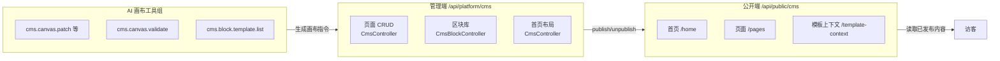
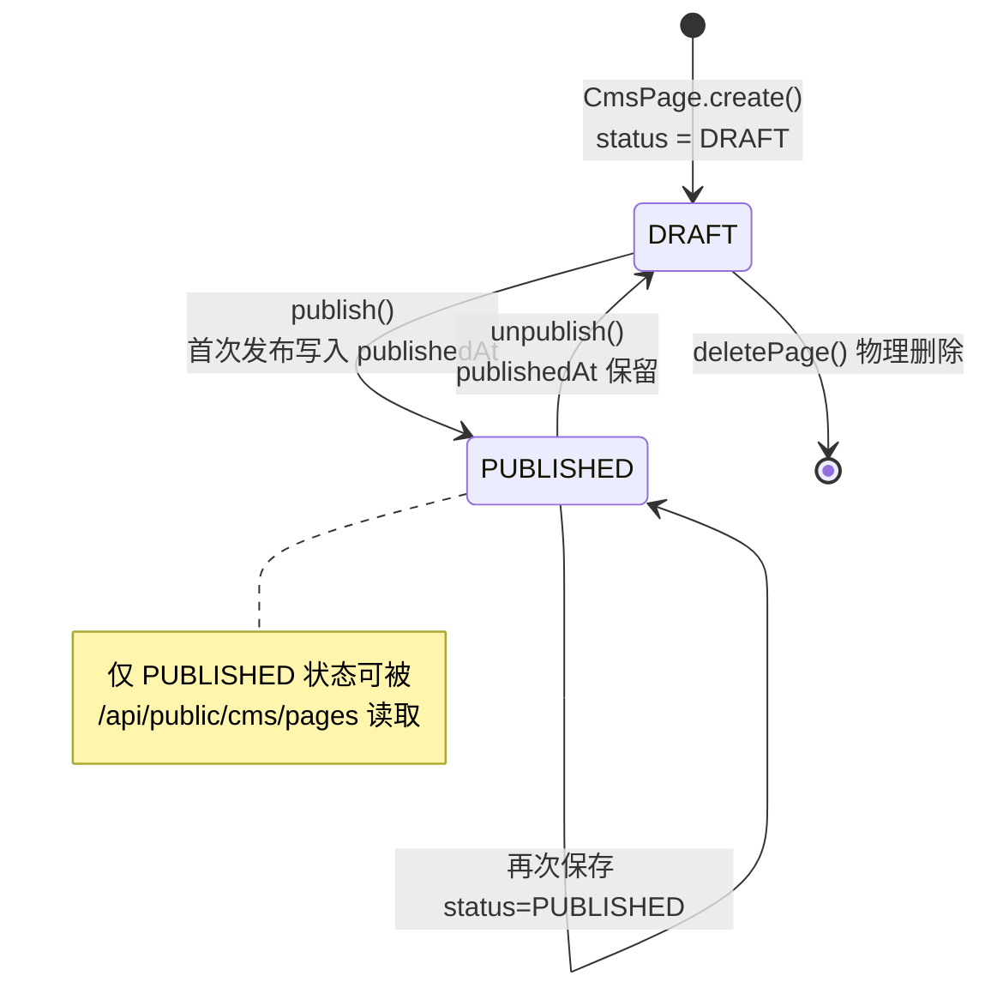

# CMS 内容定制

CMS（能力 code：`cms`）是平台可动态启用的内容定制能力，提供三类内容实体——**页面（CmsPage）**、**区块（CmsBlock）**、**首页布局（HomePageLayout）**——以及供模板渲染消费的**模板上下文（Template Context）**。它与 GrapesJS 可视化构建器、AI 画布工具组配套，构成「编辑 → 校验 → 发布 → 公开渲染」的完整闭环。

## 概述

- 所有 CMS 应用服务入口都会先执行 `ensureEnabled()`：从 `CapabilityModuleRepo` 读取 code 为 `cms` 的能力模块，未启用时抛出 `BizException("内容定制能力未启用")`。模板上下文走 `CapabilityAppService.ensureEnabled("cms", "CMS 内容")`，语义相同。
- 管理端点挂载在 `/api/platform/cms/**`，需要登录与对应权限码；公开渲染端点挂载在 `/api/public/cms/**`，无需登录，但只暴露「已发布」的内容。
- 页面支持三种内容来源：Markdown（`markdownContent`）、可视化构建产物（`htmlContent` / `cssContent` / `jsContent` / `builderProjectJson`），可混用。
- 首页布局是单例聚合（`homePageLayoutRepo.findCurrent()`），保存即覆盖当前布局。



## 核心概念

### 页面 CmsPage

聚合根，代表一个可通过 `/site/{slug}` 访问的内容页面。字段如下（源码：`yudream-domain/src/main/java/online/yudream/base/domain/platform/cms/aggregate/CmsPage.java`）：

| 字段 | 类型 | 说明 |
|---|---|---|
| `id` | Long | 雪花 ID，JSON 中序列化为 string |
| `title` | String | 标题，必填（空时抛 `页面标题不能为空`） |
| `slug` | String | 页面路径，经 `PageSlug` 规范化，全站唯一 |
| `summary` / `excerpt` | String | 摘要 / 摘录 |
| `coverImageUrl` | String | 封面图 URL |
| `categories` / `tags` | List\<String\> | 分类 / 标签，去重去空白，最多 20 个 |
| `markdownContent` | String | Markdown 正文 |
| `htmlContent` / `cssContent` / `jsContent` | String | 可视化构建产物的 HTML / CSS / JS |
| `builderProjectJson` | String | GrapesJS Project JSON，用于恢复编辑 |
| `seoTitle` / `seoDescription` | String | SEO 标题 / 描述 |
| `template` | PageTemplate | 渲染模板，默认 `DEFAULT` |
| `status` | PageStatus | `DRAFT` / `PUBLISHED`，创建即 `DRAFT` |
| `publishedAt` | LocalDateTime | 首次发布时间，取消发布后不清空 |

`PageSlug`（record，`valobj/PageSlug.java`）规则：去空格并转小写，必须匹配 `[a-z0-9][a-z0-9-_/]*`，否则抛 `页面路径只能包含小写字母、数字、中划线、下划线和斜杠`；空值抛 `页面路径不能为空`。

枚举 `PageTemplate`（`enumerate/PageTemplate.java`）：`DEFAULT`、`LANDING`、`DOC`、`BLANK`。

### 区块 CmsBlock

聚合根，GrapesJS 构建器的可复用区块库条目，AI 可通过 `presetCode` 引用。字段（源码：`aggregate/CmsBlock.java`）：

| 字段 | 类型 | 说明 |
|---|---|---|
| `id` | Long | 雪花 ID，JSON 中为 string |
| `code` | String | 区块编码，唯一；保存时 trim 并转小写，空值抛 `区块编码不能为空` |
| `name` | String | 名称，必填 |
| `description` / `category` / `icon` / `previewImageUrl` | String | 描述 / 分类 / 图标 / 预览图 |
| `kind` | CmsBlockKind | `ATOMIC`（原子）/ `PRESET`（预设），默认 `ATOMIC` |
| `htmlContent` / `cssContent` / `jsContent` / `builderProjectJson` | String | 同页面，构建产物四件套 |
| `tags` | List\<String\> | 标签，最多 20 个 |
| `enabled` | Boolean | 是否启用，默认 `true` |
| `builtin` | Boolean | 是否内置区块，新建为 `false` |
| `sort` | Integer | 排序，默认 `0` |

### 首页布局 HomePageLayout

单例聚合，描述自定义首页（源码：`aggregate/HomePageLayout.java`）：

| 字段 | 类型 | 说明 |
|---|---|---|
| `title` / `subtitle` | String | 主标题 / 副标题 |
| `theme` | String | 主题标识，默认 `default` |
| `heroImageUrl` | String | 首屏图 URL |
| `settings` | Map\<String, String\> | 扩展设置键值对 |
| `sections` | List\<HomeSection\> | 区块列表 |
| `published` | Boolean | 是否已发布，默认 `false`；未发布时公开端抛 `首页未发布` |

`HomeSection`（值对象，`valobj/HomeSection.java`）字段：`id`（String）、`type`（`HomeSectionType`：`HERO` / `FEATURE` / `CONTENT` / `CTA`）、`title`、`subtitle`、`mediaUrl`、`actionText`、`actionUrl`、`settings`（Map）、`sort`、`visible`。

### 模板上下文 Template Context

`CmsTemplateContextAppService` 把「CMS 已发布页面 + 知识库（wiki）公开内容」聚合成一份只读上下文，供站点模板渲染消费。结构（`dto/CmsTemplateContextDTO.java`）：

```text
CmsTemplateContextDTO
├── cms.pages.latest        : List<CmsTemplateItemDTO>   最近 CMS 页面
└── knowledge
    ├── spaces              : List<CmsTemplateItemDTO>   公开知识空间
    ├── pages               : List<CmsTemplateItemDTO>   已发布知识页面
    ├── latest              : List<CmsTemplateItemDTO>   按更新时间倒序
    └── featured            : List<CmsTemplateItemDTO>   按 sort 升序精选
```

`CmsTemplateItemDTO` 字段：`id`（String，由 Long 转出）、`sort`、`source`（`cms` / `knowledge` / `knowledge-space`）、`title`、`slug`、`summary`、`excerpt`、`url`（CMS 页面为 `/site/{slug}`，知识页为 `/wiki/{spaceSlug}/{path}`）、`content`、`htmlContent`、`markdownContent`、`spaceSlug`、`path`、`createdAt`、`publishedAt`、`updatedAt`。

默认限量常量（`CmsTemplateContextAppService.java`）：`LATEST_LIMIT = 12`、`MAX_LIST_LIMIT = 50`、`CONTENT_LIMIT = 20000`（正文截断字符数）。wiki 能力未启用时 `knowledge` 返回四个空列表。

## 发布 / 下线闭环

页面状态机只有两个状态。`publish()` 置 `PUBLISHED` 并在首次发布时写入 `publishedAt`；`unpublish()` 回到 `DRAFT`（`publishedAt` 保留）。保存接口若传入 `status = PUBLISHED` 也会走 `publish()` 分支。公开端只认 `PUBLISHED`：



关键行为（`CmsAppService.java`）：

- `savePage(CmsPageSaveCmd)`：`id == null` 走创建（`CmsPage.create(title, slug)`），否则加载已有聚合再 `update(...)`；保存前统一做 slug 规范化与唯一性检查（冲突抛 `页面路径已存在`）。
- `publicPage(slug)`：slug 不存在抛 `页面不存在`；状态非 `PUBLISHED` 抛 `页面未发布`。
- `publicPages(query)`：只查已发布页面，`size` 强制夹在 `[1, 50]`，缺省 12；支持 `keyword` / `category` / `tag` 过滤。
- `publicHome()`：布局不存在抛 `首页未配置`，未发布抛 `首页未发布`。

## SEO 元数据

页面实体携带两个 SEO 字段，随保存接口一并写入、随公开接口返回，由前端渲染层注入 `<title>` 与 `<meta name="description">`：

- `seoTitle`：独立 SEO 标题，为空时前端应回退 `title`。
- `seoDescription`：独立 SEO 描述，为空时前端应回退 `summary` / `excerpt`。

注意后端只做存储与透传，不生成 canonical、OG 标签或站点地图，这些由前端公开站点负责。

## GrapesJS 可视化构建存储

页面与区块共用同一套四字段存储，语义固定：

| 字段 | 语义 | 约束 |
|---|---|---|
| `htmlContent` | 页面/区块的主体 HTML | **禁止包含 `<script>` 标签**（校验工具会报错） |
| `cssContent` | 与 HTML 配套的完整 CSS | 结构性 HTML（`replace-page` / `set-html` / `add-html`）必须提供，且必须覆盖 HTML 中出现的每一个 class，否则抛 `cssContent 未覆盖以下 HTML 类：...` |
| `jsContent` | 页面交互脚本 | **不包含 `script` 标签**；使用 `requestAnimationFrame` / `setInterval` / `addEventListener` / Three.js `setAnimationLoop` 时，必须通过 `window.__YU_CMS_REGISTER_CLEANUP__` 注册清理并配对调用对应取消函数 |
| `builderProjectJson` | GrapesJS Project JSON | 仅用于在构建器中恢复编辑现场，不参与公开渲染 |

交互约定：HTML 中的交互组件通过 `data-yb-action` / `data-yb-tabs` / `data-yb-carousel` / `data-yb-accordion` / `data-yb-modal` / `data-yb-toggle` 标记声明；出现这些标记而 `jsContent` 为空会被校验判为错误。首页整体画布中的固定 Header/Footer 以 `data-yb-chrome="header|footer"` 标记，必须各恰好一个，且只能作为首页整体画布的一部分修改，不能拆分编辑。

样式覆盖检查由 `CmsCanvasStyleCoverage`（`application/platform/ai/service/CmsCanvasStyleCoverage.java`）实现：解析 HTML 全部 class，要求 CSS 中存在同名类选择器；`validate` 时豁免锁定的 Header/Footer 区域与系统框架类（`site-builder-home`、`site-layout-frame`、`site-layout-content`、`site-admin-sidebar`、`layout-header-footer`、`layout-header-copyright`、`layout-admin`）。

## AI 画布工具组

以下工具实现 `AiAgentTool` 接口（`yudream-domain/src/main/java/online/yudream/base/domain/platform/ai/service/AiAgentTool.java`），由 Spring AI 原生 tool calling 调用；它们大多**不在后端执行真实修改**，而是产出结构化指令 payload，由前端 GrapesJS 画布执行。

| 工具名 | 实现类 | 权限码 | 职责 |
|---|---|---|---|
| `cms.canvas.patch` | `CmsCanvasAiTool` | `platform:ai:tool:cms-canvas-patch` | 万能画布修改指令，19 种 action |
| `cms.canvas.selected.text` | `CmsCanvasAtomicAiTools`（Bean） | 同上 | 修改选中元素文案 |
| `cms.canvas.selected.html` | 同上 | 同上 | 替换选中元素内部 HTML |
| `cms.canvas.selected.style` | 同上 | 同上 | 修改选中元素内联样式 |
| `cms.canvas.selected.remove` | 同上 | 同上 | 删除选中元素 |
| `cms.canvas.block.add` | 同上 | 同上 | 向画布末尾追加区块，支持 `presetCode` 引用区块库 |
| `cms.block.template.list` | 同上（`BlockTemplateListTool`） | 同上 | 列出已启用区块模板 |
| `cms.canvas.validate` | `CmsCanvasValidateAiTool` | 同上 | 只读完整性校验 |
| `cms.chrome.style` | `CmsChromeAiTool` | `platform:ai:tool:cms-chrome-style` | Header/Footer 校验与样式 |
| `web.fetch` | `WebFetchAiTool` | `platform:ai:tool:web-fetch` | 抓取公开网页作参考 |
| `cms.ask.user` | `CmsAskUserAiTool` | `platform:ai:tool:cms-ask-user` | 需求不明确时向用户提问 |

### cms.canvas.patch（CmsCanvasAiTool）

入口参数 `action` 缺省为 `replace-page`，`target` 为 `page | home`。不支持的 action 抛 `AI 工具动作不支持`；`target` 传 `header` / `footer` 会被拒绝并提示改用 `cms.chrome.style`。

支持的 action 全集：

- 整页/整段：`replace-page`、`set-html`、`set-css`、`append-css`、`set-js`、`append-js`、`load-project`、`add-html`
- 定向：`remove-selector`
- 选中元素：`replace-selected`、`set-selected-html`、`append-to-selected`、`prepend-to-selected`、`set-selected-text`、`set-attributes`、`set-styles`、`add-class`、`remove-class`、`remove-selected`

主要参数：`htmlContent` / `cssContent` / `jsContent` / `builderProjectJson` / `markdownContent` / `selector` / `textContent` / `attributes` / `styles` / `className` / `title` / `summary` / `message`。其中 `replace-page`、`set-html`、`add-html` 强制走 `CmsCanvasStyleCoverage.requireComplete` 的 CSS 全覆盖检查。

### 原子工具（CmsCanvasAtomicAiTools）

五个 `FixedCanvasTool` Bean 是 `cms.canvas.patch` 的单 action 快捷封装，输入更窄、提示词更聚焦，适合小步修改不替换整页；`cms.canvas.block.add` 额外支持 `presetCode`——传入后从 `CmsBlockRepo` 读取已启用区块的 `htmlContent/cssContent/jsContent` 直接注入，区块不存在或未启用抛 `预设区块不存在或未启用：{code}`。`BlockTemplateListTool` 支持 `category` 与 `kind`（如 `PRESET`）过滤，返回 `code/name/description/category/kind` 列表。

### cms.canvas.validate（CmsCanvasValidateAiTool）

只读校验，入参 `htmlContent` / `cssContent` / `jsContent`，返回 `valid` / `errors` / `warnings` / `stats`（htmlLength、cssLength、jsLength、classCount）。规则：

- HTML 为空 → 错误；有 HTML 无 CSS → 错误
- CSS 花括号不配对、JS 三种括号不配对 → 错误
- HTML 或 jsContent 中出现 `<script` → 错误
- HTML 中存在未被 CSS 覆盖的可编辑 class（最多列 20 个）→ 错误
- 含 `data-yb-*` 交互标记但 JS 为空 → 错误；反之仅警告
- JS 生命周期规则：`requestAnimationFrame` ↔ `cancelAnimationFrame`、`setInterval` ↔ `clearInterval`、`addEventListener` ↔ `removeEventListener`、`setAnimationLoop` ↔ `setAnimationLoop(null)`，且都要注册 `window.__YU_CMS_REGISTER_CLEANUP__`

### cms.chrome.style（CmsChromeAiTool）

`action` 为 `validate | set-styles | append-css`，`target` 为 `header | footer | both`（默认 `both`）。validate 检查：必须提供首页整体 HTML；`data-yb-chrome="header"` 与 `"footer"` 各恰好一个；HTML/CSS 中不允许脚本或 `javascript:` 协议。样式修改动作会把 payload 转成 `target = home` 的首页整体画布指令；`set-styles` + `both` 且未给 `selector` 时报错（改用 `append-css`）；单目标且未给选择器时自动补 `[data-yb-chrome="{target}"]`。

### web.fetch（WebFetchAiTool）

只读工具（`risk() = AgentToolRisk.READ`）。入参 `url`（必填，仅 http/https，否则抛 `web.fetch 仅支持 http/https 地址`）与 `purpose`。使用 JDK `HttpClient`（连接超时 10s、请求超时 20s、跟随重定向、浏览器 UA），非 2xx 抛 `web.fetch 请求失败：HTTP {status}`；返回 `title`（`<title>`）、`description`（`description` / `og:description` meta）、`content`（剥离 script/style 与标签后的纯文本，截断至 6000 字符）。

### cms.ask.user（CmsAskUserAiTool）

入参 `question`（必填，缺省抛 `cms.ask.user 缺少 question 参数`）与 `options`（2–4 个，每项含 `title` 与可选 `desc`，超过 4 个截断，为空抛 `cms.ask.user 至少需要一个选项`）。产出 payload 含 `question`、`options` 和一段 `tokui` DSL（`[callout]` + `[suggestions][suggestion ... clk:pick]`），前端渲染为可点击的建议卡片，用户点击后作为下一轮消息发送。DSL 中的双引号、方括号会被替换转义，避免破坏解析。

## 管理端点 /api/platform/cms

源码：`yudream-interfaces/src/main/java/online/yudream/base/interfaces/platform/cms/controller/CmsController.java`、`CmsBlockController.java`。权限码见各方法 `@PermissionRegister` 注解。

### 页面（CmsController）

| 方法与路径 | 权限码 | 说明 |
|---|---|---|
| GET `/pages` | `platform:cms:view` | 分页列表，查询参数 `keyword` / `category` / `tag` / `page`（默认 1）/ `size`（默认 10） |
| POST `/pages` | `platform:cms:edit` | 新建页面，body 为 `CmsPageSaveRequest` |
| PUT `/pages/{id}` | `platform:cms:edit` | 更新页面，`{id}` 为 Long（URL 中传字符串形式的数字） |
| POST `/pages/{id}/publish` | `platform:cms:publish` | 发布 |
| POST `/pages/{id}/unpublish` | `platform:cms:publish` | 取消发布 |
| DELETE `/pages/{id}` | `platform:cms:delete` | 删除 |
| GET `/home` | `platform:cms:view` | 查看首页布局（无配置时返回默认布局） |
| PUT `/home` | `platform:cms:edit` | 保存首页布局（整单覆盖） |

`CmsPageSaveRequest` 校验：`title`、`slug` 为 `@NotBlank`；其余字段与 `CmsPageSaveCmd` 一致（见「页面 CmsPage」字段表），`template` / `status` 直接收枚举名字符串。

### 区块（CmsBlockController，前缀 `/api/platform/cms/blocks`）

| 方法与路径 | 权限码 | 说明 |
|---|---|---|
| GET `/` | `platform:cms:view` | 分页列表，参数 `keyword` / `category` / `kind` / `page` / `size` |
| GET `/{id}` | `platform:cms:view` | 区块详情 |
| POST `/` | `platform:cms:edit` | 新建，`code`、`name` 为 `@NotBlank` |
| PUT `/{id}` | `platform:cms:edit` | 更新（code 冲突抛 `区块编码已存在`） |
| DELETE `/{id}` | `platform:cms:delete` | 删除 |
| POST `/{id}/enable` | `platform:cms:edit` | 启用 |
| POST `/{id}/disable` | `platform:cms:edit` | 禁用 |
| GET `/categories` | `platform:cms:view` | 已启用区块的分类去重排序列表 |

## 公开渲染端点 /api/public/cms

源码：`yudream-interfaces/src/main/java/online/yudream/base/interfaces/platform/cms/controller/PublicCmsController.java`。无需登录、无权限码，但同样受 `cms` 能力开关约束。

| 方法与路径 | 说明 |
|---|---|
| GET `/home` | 已发布的首页布局；未配置抛 `首页未配置`，未发布抛 `首页未发布` |
| GET `/pages?slug={slug}` | 按 slug 读取已发布页面；不存在抛 `页面不存在`，未发布抛 `页面未发布` |
| GET `/pages/list` | 已发布页面分页，支持 `keyword` / `category` / `tag`，`size` 上限 50、默认 12 |
| GET `/template-context` | 模板上下文；查询参数 `cmsLatestLimit`（默认 12）、`knowledgeSpacesLimit` / `knowledgePagesLimit`（默认 50）、`knowledgeLatestLimit` / `knowledgeFeaturedLimit`（默认 12），单项最大 50，传 0 或负数返回空列表 |

## 注意事项

- **Long ID 一律 string**：`id` 在 JSON、URL 参数、前端模型中全部按字符串处理（响应中后端已将雪花 ID 序列化为 string），前端禁止 `Number(id)`。模板上下文中的 `CmsTemplateItemDTO.id` 本身就是 String。
- 管理端写接口（保存/发布/删除）都在事务内执行；公开端只读。
- `htmlContent` 与 `jsContent` 中永远不要出现 `<script>` 标签；脚本统一放 `jsContent`，由渲染层注入。
- 区块 `code` 与页面 `slug` 都会被规范化（小写、trim），前端展示时应以返回值为准。
- 保存页面时传 `status = PUBLISHED` 等同于发布；想保持草稿请传 `DRAFT` 或省略。
- AI 画布工具（`cms.canvas.*`、`cms.chrome.style`）的产物是指令 payload，真正落画布的是前端 GrapesJS 集成层；后端不做持久化。
- Header/Footer 不能作为独立编辑目标，任何修改必须走 `cms.chrome.style` 并以首页整体画布为 `target = home` 执行。

## 源码引用

- 领域层：`yudream-domain/src/main/java/online/yudream/base/domain/platform/cms/`（`aggregate/CmsPage.java`、`aggregate/CmsBlock.java`、`aggregate/HomePageLayout.java`、`valobj/PageSlug.java`、`valobj/HomeSection.java`、`enumerate/PageStatus.java`、`enumerate/PageTemplate.java`、`enumerate/CmsBlockKind.java`、`enumerate/HomeSectionType.java`）
- 应用层：`yudream-application/src/main/java/online/yudream/base/application/platform/cms/`（`service/CmsAppService.java`、`service/CmsBlockAppService.java`、`service/CmsTemplateContextAppService.java`、`cmd/`、`query/`、`dto/`）
- AI 工具：`yudream-application/src/main/java/online/yudream/base/application/platform/ai/service/`（`CmsCanvasAiTool.java`、`CmsCanvasAtomicAiTools.java`、`CmsCanvasValidateAiTool.java`、`CmsChromeAiTool.java`、`WebFetchAiTool.java`、`CmsAskUserAiTool.java`、`CmsCanvasStyleCoverage.java`）
- 接口层：`yudream-interfaces/src/main/java/online/yudream/base/interfaces/platform/cms/`（`controller/CmsController.java`、`controller/CmsBlockController.java`、`controller/PublicCmsController.java`、`request/`、`res/`、`assembler/CmsWebAssembler.java`）
