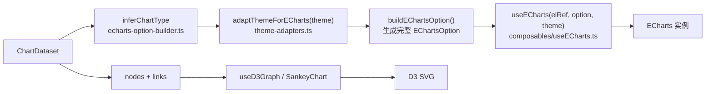

# 数据可视化（dataviz）

`@yudream/dataviz` 是前端 monorepo 中的共享可视化包，基于 **ECharts**（常规图表）与 **D3**（关系图、桑基图）封装了一套主题统一、开箱即用的图表组件与组合式函数。它只依赖 `vue` 与 `@vueuse/core`（peerDependencies）以及 `echarts`、`d3`（dependencies），不含任何业务逻辑，可被宿主前端与插件前端共同复用。

> 源码：`yudream-frontend/packages/dataviz/src/`，包定义见 `yudream-frontend/packages/dataviz/package.json`

---

## 包结构

```
packages/dataviz/src/
├── index.ts              # 统一出口：类型 / 组合式函数 / 组件 / 工具
├── types.ts              # ChartDataset、ChartNode、ChartLink、ChartTheme 等核心类型
├── components/           # BaseChart、LineChart、BarChart、PieChart、SankeyChart、GraphChart、StatTile
├── composables/          # useECharts、useD3Graph、useChartTheme
└── utils/                # echarts-option-builder、theme-adapters、transformers、d3-layouts
```

## 核心数据模型

一切图表都从统一的 `ChartDataset` 出发（`src/types.ts`）：

```ts
interface ChartDataset {
  id?: string
  label?: string
  chartType?: ChartType        // 'line' | 'bar' | 'pie' | 'graph' | 'sankey' | ...
  dimensions?: string[]        // 维度列名
  source?: Array<Record<string, unknown> | unknown[]>   // 数据行
  series?: ChartSeries[]
  dataZoom?: unknown[]
  nodes?: ChartNode[]          // 关系图节点
  links?: ChartLink[]          // 关系图边
}
```

设计要点：

- **一份 dataset 描述所有图**：普通图表走 `dimensions + source`（ECharts dataset 结构），关系类图表走 `nodes + links`；
- `chartType` 可显式指定，也可省略——由 `buildEChartsOption` 自动推断；
- 任意原始数据可用 `normalizeDataset(raw)` 规范化：数组自动推导 `dimensions`（取第一行的 key），单对象包装成一行，`nodes/links` 结构识别为关系图。

## 图表组件

组件全部在 `src/components/` 下，经 `components/index.ts` 统一导出：

| 组件 | 渲染引擎 | 说明 |
|---|---|---|
| `BaseChart` | ECharts | 通用底座，接收 `dataset`/`theme`/`height` |
| `LineChart` / `BarChart` / `PieChart` | ECharts | 薄封装：强制覆写 `dataset.chartType` 后交给 `BaseChart` |
| `GraphChart` | D3 | 力导向关系图，节点可拖拽 |
| `SankeyChart` | D3 | 桑基图，自动按入度/出度分层 |
| `StatTile` | 纯 CSS | 指标卡片，支持涨跌 `trend` 百分比 |

典型用法：

```vue
<script setup lang="ts">
import { LineChart } from '@yudream/dataviz'
</script>

<template>
  <LineChart
    :dataset="{
      dimensions: ['month', 'uv'],
      source: [
        { month: '1月', uv: 1200 },
        { month: '2月', uv: 1580 },
      ],
    }"
    theme="light"
    :height="300"
  />
</template>
```

## 配置构建流水线

`BaseChart` 并不直接写 ECharts 配置，而是经过一条「dataset → 推断类型 → 注入主题 → ECharts option」的流水线：



关键行为都可在源码中对应：

- 类型推断（`utils/echarts-option-builder.ts` 的 `inferChartType`）：有 `chartType` 用显式值；有 `nodes/links` 归为 pie 兜底；维度 ≤2 判 pie，否则 line；
- 主题注入：坐标轴、tooltip、legend、标题的文字色与网格色全部来自主题配置，业务侧不需要也无法单独指定配色；
- `dataZoom` 存在时自动压缩 grid 底部留白，避免缩放条遮挡内容。

## 主题系统

主题由 `resolveTheme(theme)`（`utils/theme-adapters.ts`）解析，`theme` 可以是 `'light' | 'dark'` 字符串或部分 `ChartThemeConfig` 覆盖对象。内置两套色板（`useChartTheme` / `theme-adapters.ts` 中定义一致）：

| 模式 | 背景 | 主文本 | 网格 | 色板首色 |
|---|---|---|---|---|
| light | `#ffffff` | `#1f2937` | `#e5e7eb` | `#3b82f6` |
| dark | `#111827` | `#f9fafb` | `#374151` | `#60a5fa` |

覆盖规则是「浅合并」：自定义配置只覆盖给出的字段，未给出的回落到默认色板；`color` 与语义化别名 `colors` 互相兜底。解析结果再经 `adaptThemeForECharts` / `adaptThemeForD3` 分别裁剪成两个引擎需要的形状。

这与项目「不在业务页面自行指定主色、由主题体系统一控制」的规范一致：图表配色跟随 `light/dark` 模式切换，业务代码只传模式或中性覆盖项。

## ECharts 生命周期（useECharts）

`composables/useECharts.ts` 负责实例管理，要点：

- `watchEffect` 监听容器挂载后 `echarts.init`；options 深度 watch 后 `setOption(..., true)` 全量替换；
- `useResizeObserver` + `requestAnimationFrame` 合并 resize，避免高频抖动；
- `onUnmounted` 时取消动画帧并 `dispose()` 实例，防止泄漏。

## 关系图渲染（useD3Graph）

`composables/useD3Graph.ts` 用 D3 力导向布局渲染 SVG：

- 数据提取兼容两种形态：直接 `nodes/links`，或 `source[0]` 中内嵌 `{ nodes, links }` 的行结构（`extractGraphData`）；
- 节点半径按 `value` 开方映射（`Math.sqrt(value) * 2 + 5`），力模型在 `utils/d3-layouts.ts` 的 `forceSimulation` 中统一定义（`forceLink` 距离 100、`forceManyBody` 强度 -300、中心居中、碰撞半径同样随 value 缩放）;
- 内置拖拽交互（drag 时固定 `fx/fy`），resize 时整体重绘，卸载时停掉仿真并移除 SVG。

`SankeyChart` 则自行实现分层：按入度/出度做拓扑排队，再交给 `d3.sankey` 布局（见 `components/SankeyChart.vue`）。

## 组件 API 摘要

图表组件共享同一组 props（见各 `components/*.vue` 的 `defineProps`）：

| Prop | 类型 | 默认 | 说明 |
|---|---|---|---|
| `dataset` | `ChartDataset` | 必填 | 图表数据集 |
| `theme` | `'light' \| 'dark' \| ChartThemeConfig` | `'light'` | 主题模式或覆盖配置 |
| `height` | `number \| string` | `BaseChart` 为 300，关系类为 400 | 容器高度 |

`StatTile` 单独接收 `title`、`value`、`trend?`（百分比数字，正数显示绿色上涨、负数下跌，自动带符号）。

组合式函数签名：

- `useECharts(elRef, options, theme?)` → `{ instance(), resize }`；
- `useD3Graph(elRef, dataset, theme?)` → `{ render }`；
- `useChartTheme(mode)` → 完整 `ChartThemeConfig`。

工具函数（`utils/index.ts` 再导出）：`buildEChartsOption(dataset, theme)`、`normalizeDataset(raw)`、`resolveTheme(theme)`、`adaptThemeForECharts(theme)`、`adaptThemeForD3(theme)`、`forceSimulation(nodes, links, width, height)`。

## 数据规范化示例

`normalizeDataset` 对常见原始形态的适配（`utils/transformers.ts`）：

```ts
// 对象数组：dimensions 自动取第一行的 key
normalizeDataset([{ month: '1月', uv: 1200 }])
// => { dimensions: ['month', 'uv'], source: [...] }

// 二维数组：生成 dim0/dim1... 维度名
normalizeDataset([['1月', 1200]])

// 关系数据：识别 nodes + links
normalizeDataset({ nodes: [...], links: [...] })

// 其他对象：包装成单行 source
normalizeDataset({ total: 42 })
```

后端统计接口返回的任意结构，经这一层转换即可直接喂给图表组件，业务侧无需手工拼 ECharts option。

## 关系图与指标卡示例

```vue
<GraphChart
  :dataset="{
    nodes: [
      { id: 'a', name: '服务 A', value: 40 },
      { id: 'b', name: '服务 B', value: 20 },
    ],
    links: [{ source: 'a', target: 'b', value: 3 }],
  }"
/>

<StatTile title="今日提交" :value="128" :trend="12.5" theme="dark" />
```

关系图节点半径与碰撞体积都随 `value` 缩放，适合表达「权重」语义；桑基图数据同样使用 `nodes + links` 形态（也兼容放在 `series[0]` 中）。

## 在宿主与插件中使用

- 宿主前端经 workspace 别名直接引用包源码（`exports: "./src/index.ts"`），无需构建产物；
- 插件前端若需复用，应遵循官方插件前端的既有打包方式，把依赖打进插件自身的产物，而不是假设宿主全局可用。

---

> 源码引用：`yudream-frontend/packages/dataviz/src/index.ts`、`types.ts`、`components/BaseChart.vue`、`components/SankeyChart.vue`、`composables/useECharts.ts`、`composables/useD3Graph.ts`、`utils/echarts-option-builder.ts`、`utils/theme-adapters.ts`、`utils/transformers.ts`、`utils/d3-layouts.ts`
