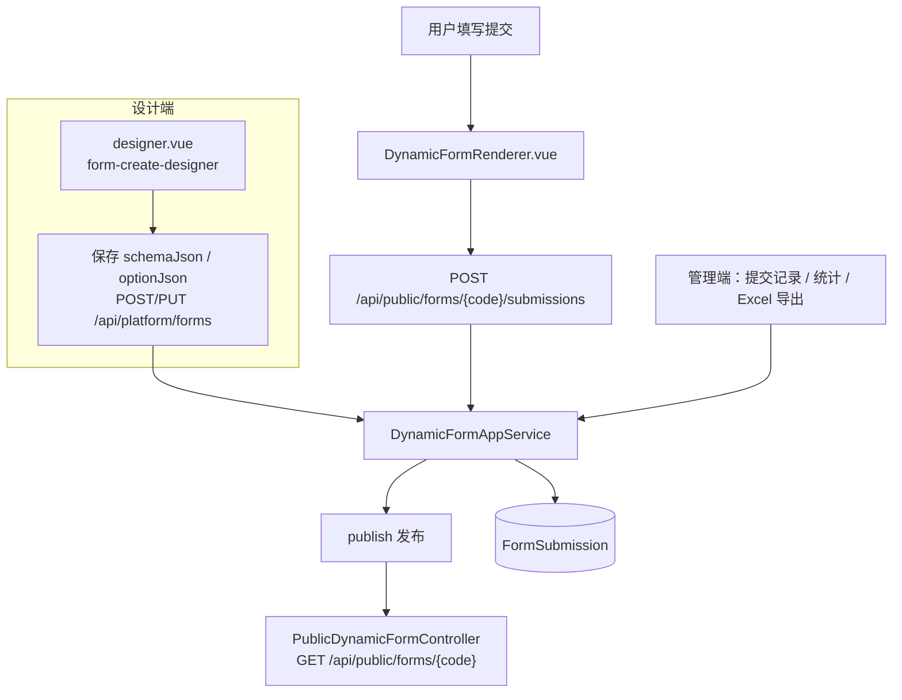
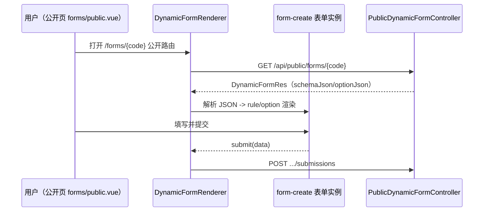

# 动态表单（Dynamic Form）

动态表单是平台能力（capability code 为 `form`）之一：管理员在可视化设计器中拖拽设计表单，发布后生成公开填单链接，匿名或登录用户提交数据，后台查看提交记录、导出 Excel 并做字段统计。表单定义以 JSON Schema 形式存储，前端用 `form-create` 动态渲染。

> 源码：`yudream-domain/src/main/java/online/yudream/base/domain/platform/form/`、`yudream-application/.../platform/form/`、`yudream-interfaces/.../platform/form/`、前端 `yudream-frontend/apps/core-arco-design-vue/src/views/platform/form/`

---

## 整体流程



## 领域模型

聚合根 `DynamicForm`（`yudream-domain/.../form/aggregate/DynamicForm.java`）持有：

| 字段 | 说明 |
|---|---|
| `name` / `code` | 名称与唯一编码（经值对象 `FormCode` 校验） |
| `schemaJson` | 表单结构 JSON（必填，发布前置校验） |
| `optionJson` | 表单渲染选项 JSON |
| `allowAnonymous` | 是否允许匿名提交（默认 `true`） |
| `status` | `DRAFT` / `PUBLISHED` / `DISABLED`（`DynamicFormStatus`） |

状态机收敛在聚合内：`create` 初始为 `DRAFT`；`publish()` 要求 `schemaJson` 非空并记录 `publishedAt`；`unpublish()` 回到 `DRAFT`；`disable()` 置为 `DISABLED`。提交记录是独立聚合 `FormSubmission`，保存 `data`（JSON）、`submitterId`、`submitterIp`、`submittedAt`。

## 后端分层

遵循项目 DDD 分层规则：

- **interfaces**：`DynamicFormController`（管理端 `/api/platform/forms`）与 `PublicDynamicFormController`（公开端 `/api/public/forms`）；`request -> cmd`、`DTO -> res` 的映射在 `DynamicFormWebAssembler`；
- **application**：`DynamicFormAppService` 编排仓储与文件服务，每次用例前执行 `ensureEnabled()` 应用闸门检查（capability code `"form"`）；
- **domain**：聚合、`FormCode` 值对象、`DynamicFormRepo` / `FormSubmissionRepo` 仓储接口；
- **infrastructure**：`DynamicFormRepoImpl` 等 mapper 实现与 `DynamicFormCapabilityProvider` 项目闸门 provider。

### 管理端 API

`DynamicFormController`（权限码通过 `@PermissionRegister` 注册）：

| 方法 | 路径 | 权限 | 说明 |
|---|---|---|---|
| GET | `/api/platform/forms` | `platform:form:view` | 分页列表 |
| GET | `/api/platform/forms/{id}` | `platform:form:view` | 详情 |
| POST / PUT | `/api/platform/forms`、`/{id}` | `platform:form:edit` | 新建/编辑 |
| POST | `/{id}/publish`、`/{id}/unpublish` | `platform:form:publish` | 发布/下线 |
| DELETE | `/{id}` | `platform:form:delete` | 删除 |
| GET | `/{id}/submissions` | `platform:form:submission:view` | 提交分页 |
| GET | `/{id}/submissions/export` | `platform:form:submission:export` | Excel 导出 |
| GET | `/{id}/statistics` | `platform:form:statistics:view` | 字段统计 |

Excel 导出走既有支撑设施：应用层组装 `FormSubmissionExportDTO`，接口层由 `FormSubmissionExcelAssembler` 生成表头与行数据，`ExcelHttpSupport.writeDynamic(...)` 写响应流。

### 公开端 API

`PublicDynamicFormController` 无需登录即可访问：

- `GET /api/public/forms/{code}` — 按 `code` 取已发布表单（应用层校验发布状态）；
- `POST /api/public/forms/{code}/submissions` — 提交表单数据；若请求方已登录（`StpUtil.isLogin()`）自动关联 `submitterId`，否则匿名，客户端 IP 取 `X-Forwarded-For` 首段兜底 `remoteAddr`；
- `POST /api/public/forms/{code}/files` — 表单附件上传，走 `FileAppService` 公开上传通道，返回 `FileObjectRes`。

统计接口（`statistics`）在应用层限制最多扫描 5000 条提交（`STAT_SUBMISSION_LIMIT`），输出总量、今日、近 7 天以及逐字段的填写数/空白数/Top 值；导出上限为 10000 条（`EXPORT_SUBMISSION_LIMIT`）。导出可打包附件为 ZIP，Excel 保留原始文件名；上传不再使用 60 秒超时，大小上限可在能力配置中调整。

## 前端实现

前端位于 `yudream-frontend/apps/core-arco-design-vue/src/views/platform/form/`，API 封装在 `src/api/modules/platform-form.ts`。技术选型：

- 设计器：`form-create-designer-arco-design`（见 `apps/core-arco-design-vue/package.json`），产出的规则 JSON 存入 `schemaJson`；
- 渲染器：`@form-create/arco-design` + 自研 `DynamicFormRenderer.vue`。



`DynamicFormRenderer.vue` 的关键处理：

- `rules = normalizeRules(JSON.parse(schemaJson))`——递归遍历规则树，对上传类字段（`type` 为 `upload`/`fcupload`）注入自定义上传逻辑 `customRequest`，统一改走 `apiForm.uploadPublicFile(form.code, formData)`（即公开上传端点），回显时把相对地址转成后端资源 URL（`toBackendAssetUrl`）；
- 只读模式（查看已提交数据）下给所有可禁用的控件注入 `disabled: true`，布局强制 `vertical`，隐藏内置的提交/重置按钮，由组件自己的 `FaButton` 触发 `submit`；
- 校验失败 emit `invalid`，成功 emit `submit(data)`，提交态与成功提示由父页面控制。

管理端页面：`views/platform/form/index.vue`（列表）、`designer.vue`（设计器）、`components/FormSubmissionPanel.vue`（提交记录与详情查看）。公开填写页为 `src/views/forms/public.vue`，路由与守卫见 `src/router/routes.ts`、`src/router/guards.ts`。

## 表单定义示例

`schemaJson` 是 form-create 的规则数组，`optionJson` 是渲染选项。一个最简定义：

```json
// schemaJson
[
  { "type": "input", "field": "name", "title": "姓名", "validate": [{ "required": true }] },
  { "type": "select", "field": "channel", "title": "来源渠道",
    "options": [{ "label": "线上", "value": "online" }, { "label": "线下", "value": "offline" }] },
  { "type": "upload", "field": "attachment", "title": "附件" }
]
```

```json
// optionJson
{ "form": { "labelWidth": "100px" } }
```

提交后 `FormSubmission.data` 即按字段名保存 `{ name, channel, attachment }`；统计接口对每个字段输出 `FormFieldStat`（`field`、`filled`、`empty`、`topValues: FormValueCount[]`），管理端可直接据此绘制分布图。

## 前端 TS 模型

`src/api/modules/platform-form.ts` 中的核心模型（注意所有 ID 字段均为 `string`）：

```ts
export interface DynamicForm {
  id: string                 // Snowflake ID，JSON/TS 中一律 string
  name: string
  code: string
  schemaJson: string
  optionJson?: string
  allowAnonymous: boolean
  status: 'DRAFT' | 'PUBLISHED' | 'DISABLED'
}

export interface FormSubmission {
  id: string
  formId: string             // 同为 string
  data: Record<string, unknown>
  submitterId?: string
}
```

## 双闸门

与其他平台能力一致，表单能力受两道闸门约束：

1. **项目闸门**：`DynamicFormCapabilityProvider` 标注 `@ConditionalOnProperty(prefix = "yudream.platform.capabilities.form", name = "enabled")`（对应环境变量 `PLATFORM_FORM_ENABLED`，默认 `true`，见 `yudream-bootstrap/src/main/resources/application.yml`）；闸门关闭则 provider 不加载，相关菜单与端点不注册。
2. **应用闸门**：`DynamicFormAppService` 每个用例入口调用 `ensureEnabled()` 检查持久化的能力开关状态，未启用直接拒绝业务操作。

## ID 使用约定

表单及提交记录的主键为 Java `Long`（Snowflake ID）。按项目硬性约定，这些 ID 在 JSON 响应、TS 模型（如 `platform-form.ts` 中 `DynamicForm.id: string`、`FormSubmission.submitterId?: string`）与 URL 参数中一律使用 `string`，禁止 `Number(id)` 转换，避免 JS 精度丢失。

---

> 源码引用：`yudream-interfaces/src/main/java/online/yudream/base/interfaces/platform/form/controller/DynamicFormController.java` 与同目录 `PublicDynamicFormController.java`、`yudream-application/src/main/java/online/yudream/base/application/platform/form/service/DynamicFormAppService.java`、`yudream-domain/src/main/java/online/yudream/base/domain/platform/form/aggregate/DynamicForm.java`、`yudream-infrastructure/src/main/java/online/yudream/base/infra/platform/form/service/DynamicFormCapabilityProvider.java`、`yudream-frontend/apps/core-arco-design-vue/src/views/platform/form/components/DynamicFormRenderer.vue`、`yudream-frontend/apps/core-arco-design-vue/src/api/modules/platform-form.ts`
