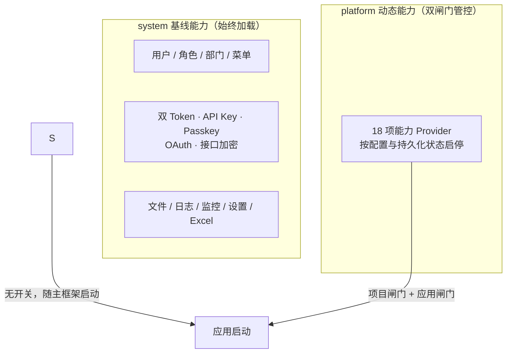

# 平台能力总览

YuDream Admin 把**非必需的重型能力**全部设计为"平台能力"（platform）：SSE、消息队列、图数据库、AI、CMS……它们不参与框架启动的关键路径，而是通过统一的**能力开关框架**按需加载。

与之相对，用户/角色/菜单/安全等**基线能力**属于 `system`，始终可用、不走动态开关。

## 能力清单（18 项）

| 能力 code | 项目闸门环境变量 | 说明 | 文档 |
|---|---|---|---|
| `api-docs` | `PLATFORM_API_DOCS_ENABLED` | SpringDoc 接口文档生成 | [API 文档](/features/api-doc) |
| `sse` | `PLATFORM_SSE_ENABLED` | SSE 服务端推送通道 | — |
| `websocket` | `PLATFORM_WEBSOCKET_ENABLED` | WebSocket 实时通信（含 AG-UI） | — |
| `rabbitmq` | `PLATFORM_RABBITMQ_ENABLED` | RabbitMQ 消息队列 | — |
| `neo4j` | `PLATFORM_NEO4J_ENABLED` | 图数据库（Wiki 图谱等依赖它） | [Neo4j 图数据库](/features/wiki) |
| `ai` | `PLATFORM_AI_ENABLED` | 多 provider 大模型接入 + 原生 tool calling | [AI 对话](/features/ai) |
| `agent` | `PLATFORM_AGENT_ENABLED` | Agent 编排与工作流引擎 | [Agent 平台](/features/agent) |
| `cms` | `PLATFORM_CMS_ENABLED` | GrapesJS 可视化建站 | [CMS](/features/cms) |
| `wiki` | `PLATFORM_WIKI_ENABLED` | 知识库 + RAG + 图谱增强 | [知识库 Wiki](/features/wiki) |
| `form` | `PLATFORM_FORM_ENABLED` | 动态表单与公开填报 | [动态表单](/features/dynamic-form) |
| `document-template` | `PLATFORM_DOCUMENT_TEMPLATE_ENABLED` | Word 模板文档生成 | [Word 文档生成](/features/word-document) |
| `integration` | `PLATFORM_INTEGRATION_ENABLED` | HTTP 连接器 + Python 脚本运行时 | [集成运行时](/features/integration) |
| `dataviz` | `PLATFORM_DATAVIZ_ENABLED` | 图表定义与数据服务 | [数据可视化](/features/dataviz) |
| `milky` | `PLATFORM_MILKY_ENABLED` | QQ 消息平台：Milky 与官方 OpenAPI v2 共用出站端口 | [QQ 机器人接入](/features/milky) |
| `message-render` | `PLATFORM_MESSAGE_RENDER_ENABLED` | HTML/Markdown → 图片渲染（render-server） | [消息渲染](/features/render) |
| `file-preview` | `PLATFORM_FILE_PREVIEW_ENABLED` | kkFileView 文件预览（Office / PSD / 压缩包等） | [文件预览](/features/file-preview) |
| `inbound-mail` | `PLATFORM_INBOUND_MAIL_ENABLED` | IMAPS 入站邮箱，管理端查看邮件详情，插件按发件域与验证码核验 | [入站邮箱](/features/inbound-mail) |
| `plugin-market-source` | `PLATFORM_PLUGIN_MARKET_SOURCE_ENABLED` | 本机插件市场源（LOCAL）；远程源订阅不依赖本能力 | [自托管市场源](/plugin/market-source) |

## system vs platform 边界

判定规则：

- **缺了系统就跑不起来或涉及身份安全的** → `system`；
- **可以没有、且不同部署形态需求差异大的** → `platform`。

## 双闸门机制简介

每个平台能力的运行必须同时过两道闸门：

1. **项目闸门**：配置决定是否允许加载 provider——环境变量 `PLATFORM_*_ENABLED` 或 `yudream.platform.capabilities.<code>.enabled`；未放行时 provider 不注册、端点不存在、不建任何外部连接。
2. **应用闸门**：每次用例执行前，应用层调用 `ensureEnabled(...)` 校验该能力的**持久化状态**为已启用——管理员可以在后台"平台管理"里动态停用某个能力，无需重启。

机制细节见 [能力开关框架](/features/capability-framework)。

## 能力间依赖

能力在 `CapabilityDescriptor.dependencies` 中声明依赖（如 `wiki` 依赖 `ai` 与 `neo4j`）：

- 依赖不可用时拒绝启用该能力；
- 禁用一个被依赖的能力会**级联禁用**所有依赖方。

---

> 源码引用：`yudream-domain/src/main/java/online/yudream/base/domain/platform/capability/`、`yudream-infrastructure/src/main/java/online/yudream/base/infra/platform/` 下各 Provider、`docker-compose.yml`（环境变量清单）
