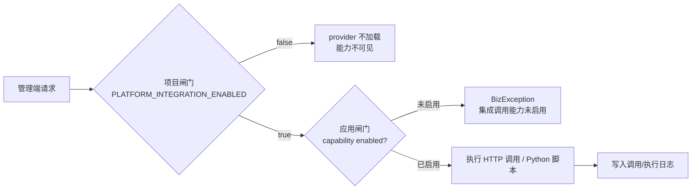
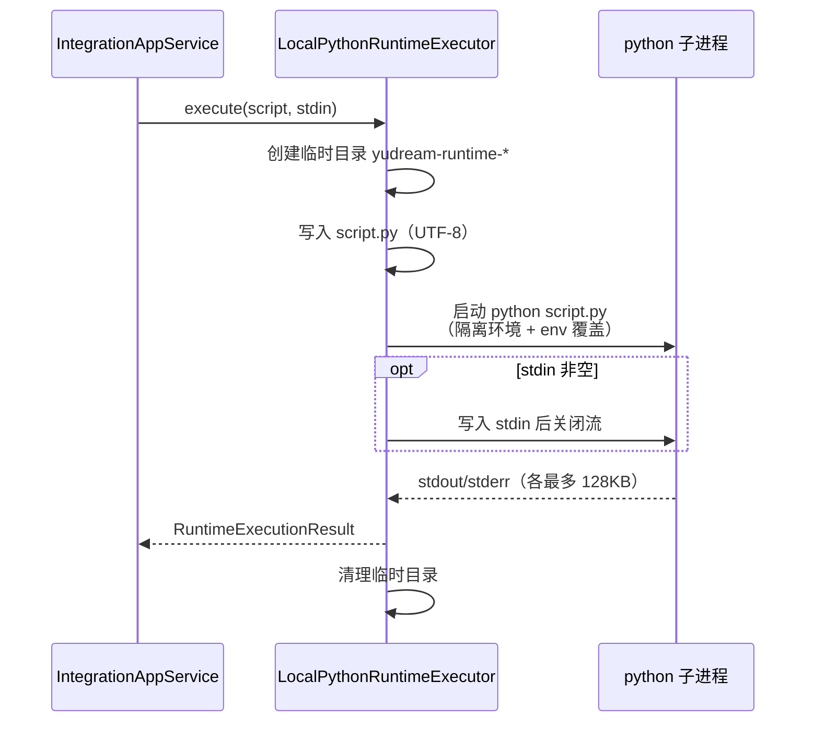

# HTTP 集成与 Python Runtime（integration）

集成调用能力（能力 code：`integration`）提供两类"外联"功能：

- **HTTP 连接器**：把对第三方 HTTP 接口的调用沉淀为可复用、可启停、可审计的连接器配置；
- **Python 运行脚本**：在宿主机本地执行管理员维护的 Python 脚本，并记录每次执行的 stdout/stderr/退出码。

它是 platform 动态能力，运行必须同时通过两道闸门（详见 [平台能力](/guide/platform-capabilities)）：

1. **项目闸门**：`yudream.platform.capabilities.integration.enabled`（环境变量 `PLATFORM_INTEGRATION_ENABLED`，默认 `true`）决定 `IntegrationCapabilityProvider` 是否被 Spring 加载；
2. **应用闸门**：应用层每个用例前调用 `ensureIntegrationEnabled()` 检查持久化启用状态，未启用一律抛 `集成调用能力未启用`。



## IntegrationCapabilityProvider

源码：`yudream-infrastructure/src/main/java/online/yudream/base/infra/platform/integration/service/IntegrationCapabilityProvider.java`

实现 `CapabilityProvider`，类上标注 `@ConditionalOnProperty(prefix = "yudream.platform.capabilities.integration", name = "enabled", havingValue = "true")`。

### CapabilityDescriptor

`descriptor()` 返回的描述符字段：

| 字段 | 值 |
|---|---|
| code | `integration` |
| displayName | `集成调用` |
| type | `CapabilityType.INTEGRATION` |
| description | `提供 HTTP 调用和 Python 运行脚本能力` |
| icon | `i-ri:terminal-box-line` |
| order | `70` |
| defaultConfig | `pythonCommand = python` |

### 生命周期方法

| 方法 | 行为 |
|---|---|
| `enable(Map<String, String> config)` | 读取 `config["pythonCommand"]`（缺省 `python`）下发给 `LocalPythonRuntimeExecutor.configurePythonCommand(...)`，然后置启用标记。**不启动任何进程、不校验 Python 是否存在**（provider 只是工具包装）。 |
| `disable()` | 清除启用标记，并将 Python 命令重置为默认 `python`。 |
| `health()` | 启用时返回 `CapabilityHealth.enabled`，附加 `runtime=python` 与当前 `pythonCommand`；未启用返回 disabled。 |
| `test(String message)` | 未启用直接失败；已启用则调用 `LocalPythonRuntimeExecutor.checkPythonCommand()`（实际执行 `python --version`），成功时返回版本输出，失败时返回错误原因。 |

## HTTP 连接器

### 领域模型 HttpConnector

源码：`yudream-domain/src/main/java/online/yudream/base/domain/platform/integration/aggregate/HttpConnector.java`

| 字段 | 类型 | 说明 |
|---|---|---|
| name | String | 连接器名称（必填，空白抛 `连接器名称不能为空`） |
| code | String | 连接器编码（必填，**创建后不可修改**） |
| url | String | 请求地址（必填） |
| method | HttpMethodType | 请求方法，缺省 `GET` |
| headers | Map\<String, String\> | 默认请求头 |
| queryParams | Map\<String, String\> | 默认查询参数 |
| bodyTemplate | String | 请求体模板（invoke 未传 body 时使用） |
| timeoutMillis | int | 单次请求超时毫秒，`<=0` 归一为 `10000` |
| retryTimes | int | 失败重试次数（不含首次），负值归一为 `0` |
| status | ConnectorStatus | `ACTIVE` / `DISABLED`，缺省 `ACTIVE` |

枚举 `HttpMethodType`：`GET`、`POST`、`PUT`、`PATCH`、`DELETE`。

### 调用语义

- 调用时把**连接器默认 headers/queryParams 与本次请求覆盖值合并**（覆盖优先）；body 未传则用 `bodyTemplate`。
- 连接器处于 `DISABLED` 时拒绝调用：`HTTP 连接器已停用`。
- 每次调用（无论成败）都写入 `HttpInvocationLog`，请求头中 key 含 `token`/`secret`/`key`/`password`/`authorization`（不区分大小写）的值在日志里会被替换为 `******`。

### JdkHttpInvocationGateway

源码：`yudream-infrastructure/src/main/java/online/yudream/base/infra/platform/integration/service/JdkHttpInvocationGateway.java`

基于 JDK 原生 `java.net.http.HttpClient` 的 `HttpInvocationGateway` 实现：

- URL 拼接：`queryParams` 逐个 URL 编码后按 `?`/`&` 追加到连接器 `url` 之后；
- 请求体：`GET`/`DELETE` 不带 body，其余方法以 UTF-8 字符串为 body；
- 重试：总尝试次数 = `retryTimes + 1`，全部失败才返回 `ExecutionStatus.FAILED` 与最后一次异常信息；
- 每次调用新建 `HttpClient.newHttpClient()`，请求级超时取连接器 `timeoutMillis`；
- 返回值 `HttpInvocationResult(statusCode, body, durationMillis, status, errorMessage)`——注意即使 HTTP 返回 4xx/5xx，只要请求本身成功发出，`status` 仍是 `SUCCESS`，响应码在 `statusCode` 字段中体现。

### HTTP 连接器接口

Controller：`yudream-interfaces/src/main/java/online/yudream/base/interfaces/platform/integration/controller/IntegrationController.java`，统一前缀 `/api/platform/integration`。

| 方法 | 路径 | 权限 code | 说明 |
|---|---|---|---|
| GET | `/http-connectors` | `platform:integration:view` | 分页查询连接器（`keyword`/`page`/`size`） |
| POST | `/http-connectors` | `platform:integration:edit` | 新增连接器 |
| PUT | `/http-connectors/{id}` | `platform:integration:edit` | 编辑连接器（`code` 不可改） |
| DELETE | `/http-connectors/{id}` | `platform:integration:edit` | 禁用连接器 |
| POST | `/http-connectors/{id}/enable` | `platform:integration:edit` | 启用连接器 |
| POST | `/http-connectors/{id}/invoke` | `platform:integration:invoke` | 执行调用，返回本次调用日志 |
| GET | `/http-logs` | `platform:integration:log:view` | 分页查询调用日志 |

> 路径变量 `{id}` 与请求/响应中的所有 `Long` 主键（`id`、`connectorId`、`scriptId` 等）在 JSON 与 URL 中一律按 **string** 处理，前端禁止 `Number(id)`，避免雪花 ID 精度丢失。

`HttpConnectorSaveRequest` 字段：`name`（@NotBlank）、`code`（@NotBlank）、`url`（@NotBlank）、`method`、`headers`、`queryParams`、`bodyTemplate`、`timeoutMillis`（默认 10000）、`retryTimes`、`status`。

`HttpInvokeRequest` 字段：`headers`、`queryParams`、`body`（均可选，用于覆盖连接器默认值）。

`HttpInvocationLogRes` 字段：`id`、`connectorId`、`connectorCode`、`url`、`method`、`requestHeaders`（已脱敏）、`requestBody`、`responseStatus`、`responseBody`、`durationMillis`、`status`、`errorMessage`、`invokedAt`。

新增连接器示例：

```bash
curl -X POST http://localhost:8080/api/platform/integration/http-connectors \
  -H 'Content-Type: application/json' \
  -d '{
    "name": "天气查询",
    "code": "weather",
    "url": "https://api.example.com/weather",
    "method": "GET",
    "queryParams": {"appid": "your-appid"},
    "timeoutMillis": 10000,
    "retryTimes": 1
  }'
```

执行调用示例：

```bash
curl -X POST http://localhost:8080/api/platform/integration/http-connectors/1948157831234560000/invoke \
  -H 'Content-Type: application/json' \
  -d '{"queryParams": {"city": "北京"}}'
```

## Python 运行脚本

### 领域模型 RuntimeScript

源码：`yudream-domain/src/main/java/online/yudream/base/domain/platform/integration/aggregate/RuntimeScript.java`

| 字段 | 类型 | 说明 |
|---|---|---|
| name | String | 脚本名称（必填） |
| code | String | 脚本编码（必填，**创建后不可修改**） |
| language | RuntimeLanguage | 运行语言，目前仅 `PYTHON`，缺省 `PYTHON` |
| scriptContent | String | 脚本内容（必填） |
| timeoutMillis | int | 执行超时毫秒，`<=0` 归一为 `10000` |
| env | Map\<String, String\> | 附加环境变量 |
| status | ConnectorStatus | `ACTIVE` / `DISABLED` |

### LocalPythonRuntimeExecutor

源码：`yudream-infrastructure/src/main/java/online/yudream/base/infra/platform/integration/service/LocalPythonRuntimeExecutor.java`

`RuntimeExecutor` 的本地实现，核心行为：



- **命令可配置**：`pythonCommand` 默认 `python`，由能力 enable 配置中的 `pythonCommand` 覆盖；支持带引号的复合命令（如 `"C:\\Python311\\python.exe" -u`），按空白拆分、双引号成对保护。
- **非 PYTHON 直接失败**：`execute` 检查 `language != PYTHON` 时返回 `暂不支持该运行时`。
- **超时**：超过脚本 `timeoutMillis` 后 `destroyForcibly()` 强杀，状态为 `TIMEOUT`（`脚本执行超时`）；`checkPythonCommand()`（执行 `--version`）单独使用 5 秒超时。
- **输出截断**：stdout/stderr 各自最多读取 `128 * 1024` 字节，超出部分丢弃并在尾部追加 `\n...输出已截断...`。
- **环境隔离（安全边界）**：子进程环境被清空后仅保留 `PATH` 与 `SystemRoot`，强制注入 `PYTHONNOUSERSITE=1`、`PYTHONDONTWRITEBYTECODE=1`，最后叠加脚本配置的 `env`。也就是说**脚本默认看不到宿主进程的其他环境变量**（API key、数据库口令等），需要时必须在脚本配置里显式声明。
- **工作目录**：每次执行在系统临时目录下创建 `yudream-runtime-` 前缀目录写入 `script.py` 并以其为工作目录，执行结束（含异常）后递归删除。
- 退出码非 0 视为 `FAILED`，`errorMessage` 取 stderr 全文。

### Python 脚本接口

| 方法 | 路径 | 权限 code | 说明 |
|---|---|---|---|
| GET | `/runtime-scripts` | `platform:integration:view` | 分页查询脚本 |
| POST | `/runtime-scripts` | `platform:integration:edit` | 新增脚本 |
| PUT | `/runtime-scripts/{id}` | `platform:integration:edit` | 编辑脚本（`code` 不可改） |
| DELETE | `/runtime-scripts/{id}` | `platform:integration:edit` | 禁用脚本 |
| POST | `/runtime-scripts/{id}/enable` | `platform:integration:edit` | 启用脚本 |
| POST | `/runtime-scripts/{id}/execute` | `platform:integration:execute` | 执行脚本，返回本次执行日志 |
| GET | `/runtime-logs` | `platform:integration:log:view` | 分页查询执行日志 |

`RuntimeScriptSaveRequest` 字段：`name`（@NotBlank）、`code`（@NotBlank）、`language`、`scriptContent`（@NotBlank）、`timeoutMillis`（默认 10000）、`env`、`status`。

`RuntimeExecuteRequest` 仅一个字段 `stdin`（可选），执行时写入子进程标准输入。

`RuntimeExecutionLogRes` 字段：`id`、`scriptId`、`scriptCode`、`language`、`stdin`、`stdout`、`stderr`、`exitCode`、`durationMillis`、`status`（`SUCCESS`/`FAILED`/`TIMEOUT`）、`errorMessage`、`executedAt`。

脚本停用后拒绝执行：`运行脚本已停用`；每次执行（无论成败）都会写入 `RuntimeExecutionLog`。

新增并执行脚本示例：

```bash
# 新增
curl -X POST http://localhost:8080/api/platform/integration/runtime-scripts \
  -H 'Content-Type: application/json' \
  -d '{
    "name": "问候脚本",
    "code": "hello",
    "language": "PYTHON",
    "scriptContent": "import sys\nname = sys.stdin.read().strip() or \"world\"\nprint(f\"hello, {name}\")",
    "timeoutMillis": 10000
  }'

# 执行
curl -X POST http://localhost:8080/api/platform/integration/runtime-scripts/1948157831234560001/execute \
  -H 'Content-Type: application/json' \
  -d '{"stdin": "yudream"}'
```

返回的 `RuntimeExecutionLogRes.stdout` 为 `hello, yudream`。

## 注意事项

- **能力未启用即全拒**：`integration` 能力在能力管理中未启用时，以上全部端点都会抛 `集成调用能力未启用`，且 `test` 之前不会启动任何 Python 进程。
- **禁用语义**：DELETE 接口实际是"禁用"（软删除），数据保留并可在日志中继续追溯。
- **无网络出口限制**：`JdkHttpInvocationGateway` 不做 URL 白名单/SSRF 防护，连接器可以指向任意内网地址，请仅向可信管理员开放 `platform:integration:edit` / `platform:integration:invoke` 权限。
- **脚本权限即宿主机权限**：Python 脚本以宿主进程同一操作系统用户运行，能读写该用户可达的一切资源，环境隔离只挡住环境变量，挡不住文件/网络访问。务必严控 `platform:integration:edit` / `platform:integration:execute` 权限。
- **Windows 路径**：`pythonCommand` 中的反斜杠路径建议用双引号包裹（拆分逻辑会去除引号）。
- 日志中的 `id`、`connectorId`、`scriptId` 等 Long 字段在 JSON 中序列化为 string，前端一律按字符串处理。

## 源码索引

- `yudream-infrastructure/src/main/java/online/yudream/base/infra/platform/integration/service/IntegrationCapabilityProvider.java`
- `yudream-infrastructure/src/main/java/online/yudream/base/infra/platform/integration/service/JdkHttpInvocationGateway.java`
- `yudream-infrastructure/src/main/java/online/yudream/base/infra/platform/integration/service/LocalPythonRuntimeExecutor.java`
- `yudream-domain/src/main/java/online/yudream/base/domain/platform/integration/aggregate/HttpConnector.java`
- `yudream-domain/src/main/java/online/yudream/base/domain/platform/integration/aggregate/RuntimeScript.java`
- `yudream-application/src/main/java/online/yudream/base/application/platform/integration/service/IntegrationAppService.java`
- `yudream-interfaces/src/main/java/online/yudream/base/interfaces/platform/integration/controller/IntegrationController.java`
