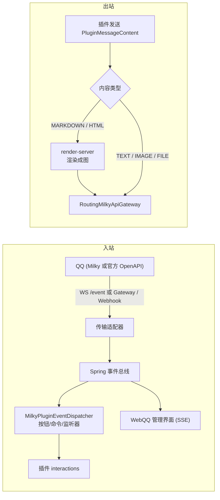

# QQ 机器人接入（Milky 与官方 OpenAPI）

Milky 能力（能力码 `milky`，类型 `MESSAGING`）通过**统一出站端口**接入 QQ 机器人：一条连接可选 **Milky 协议**或**腾讯官方 QQ 机器人 OpenAPI v2**。上层发送、命令、沙盒、WebQQ 与插件消息端口共用同一套实现；协议差异只在传输适配器消化。协议层细节见 [Milky 协议详解](/protocol/milky)。

> 源码：`yudream-infrastructure/src/main/java/online/yudream/base/infra/platform/milky/`、`.../milky/official/`、`yudream-application/.../platform/milky/`、`yudream-interfaces/.../platform/milky/controller/`

## 能力描述符与闸门

```java
// MilkyCapabilityProvider
new CapabilityDescriptor("milky", "QQ 消息平台", CapabilityType.MESSAGING,
    "Milky 与官方 QQ 机器人连接、WebQQ 与插件消息通道", "i-ri:chat-3-line", 75, Map.of(), List.of())
```

- **项目闸门**：`PLATFORM_MILKY_ENABLED`（默认 `true`），决定 provider 是否装配、端点是否注册；
- **应用闸门**：每次用例前 `ensureEnabled("milky", "QQ 消息平台")` 校验持久化开关；
- 连接凭据经 `AesGcmMilkyCredentialCipher` AES-GCM 加密落库：Milky 使用 Access Token，官方机器人使用 AppSecret；统一使用 `YUDREAM_CREDENTIAL_KEY`（Base64 解码后恰为 32 字节）。旧 `YUDREAM_MILKY_CREDENTIAL_KEY` 仅用于读取历史密文；后续保存会使用统一主密钥重加密。

## 连接管理

`MilkyConnectionController`（`/api/platform/milky/connections`）：

| 端点 | 说明 |
|---|---|
| `GET /` | 分页查询（keyword 过滤），ID 一律 string |
| `POST /` | 创建连接 |
| `PUT /{id}` | 更新连接 |
| `POST /{id}/enable` | 启用：启动事件 WebSocket 与发送通道 |
| `POST /{id}/disable` | 停用：断开事件流并清理运行时资源 |
| `POST /{id}/test` | 连通性测试 |

- 每个连接对应一个协议客户端实例（`MilkyConnectionRuntime` 按 `protocol` 分流：Milky WebSocket `/event` 或官方 Gateway；`MilkyRuntimeShutdownRequested` 触发停用清理）；
- 连接启用后才参与消息收发；存在多个启用连接时，插件发送必须显式指定 `connectionId`，否则因配置歧义被拒绝。
- 官方连接填写 AppID / AppSecret；Webhook 回调地址为 `/api/public/qqbot/{connectionId}/webhook`（无需登录，走 Ed25519 签名校验）。官方身份是 openid，与 Milky 的 QQ 号不是同一套 ID。

## 沙盒聊天

`MilkyChatController`（`/api/platform/milky/connections/{connectionId}/chat`，提供 `conversations` / `history` 等端点）+ `QqSandboxController` 提供**开发沙盒**：不接入真实 QQ，在管理界面里模拟 `message_receive` 等事件注入完整分发管线，用于调试插件的命令/按钮/监听逻辑，支持指令模拟器、端点测试器与用例保存/回放（见 [插件开发者工具](/plugin/dev-tools)）。

## 消息收发与富文本降级



- 入站事件经宿主事件总线（`MilkyEventPublished`）同时驱动**插件分发**与**WebQQ 管理界面实时展示**；
- 出站 MARKDOWN/HTML 内容在消息渲染能力（`PLATFORM_MESSAGE_RENDER_ENABLED`）开启时先渲染为图片再发送，即**富文本降级**；`PluginMessageResult.rendered` / `degraded` 标记是否发生；
- 需要调用未封装的对端方法时走 `PluginMessagingRawService.invoke(connectionId, method, payload)`：Milky 用方法名（如 `get_friend_list`）；官方连接可用共享方法名（自动映射）或特异化入口 `GET /v2/groups/{openid}/info`、`POST /v2/groups/{openid}/files` 这类 OpenAPI 路径。管理端原生工作台已列出官方 sitemap 全部 REST。调用同步记录到开发者工具沙盒时间线。

## 相关配置

| 配置 | 说明 |
|---|---|
| `PLATFORM_MILKY_ENABLED` | 项目闸门（默认 `true`） |
| `YUDREAM_CREDENTIAL_KEY` | 连接凭据加密主密钥（Base64 编码、解码后恰为 32 字节） |

::: warning ID 类型
`connectionId`、`channelId`、`userId`、`messageId` 等在 JSON / TS / URL 中一律是 `string`，禁止 `Number(id)`。
:::
