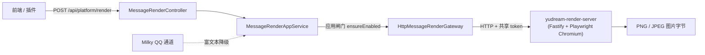

# 消息渲染能力

平台消息渲染能力（`message-render`）通过一个独立的 Headless Chromium 服务，把 HTML、Markdown 或外部 URL 渲染为图片。它主要服务于聊天消息场景：当目标通道（如 Milky 接入的 QQ）不支持富文本时，先把 Markdown/HTML 转成图片再发送。

> 源码：`yudream-render-server/src/`（独立 Fastify 服务）、`yudream-infrastructure/src/main/java/online/yudream/base/infra/platform/render/service/`、`yudream-application/.../platform/render/service/MessageRenderAppService.java`、`yudream-interfaces/.../platform/render/controller/MessageRenderController.java`

---

## 整体架构

渲染服务是一个**独立进程**（`yudream-render-server`），宿主 Java 后端经 HTTP 网关调用，两者只在内网边界通信：



- 服务端点（`yudream-render-server/src/server.ts`）：`GET /health`、`POST /v1/render/html`、`POST /v1/render/markdown`、`POST /v1/render/url`；
- 渲染服务返回 `{ contentType, data, width, height }`，其中 `data` 是 **Base64 字符串，仅存在于内部服务边界**；Java 网关解码后向调用方返回真实图片字节（见 `HttpMessageRenderGateway#decodeResponse`）；
- Milky / 官方消息通道在发送 MARKDOWN/HTML 内容时复用同一网关，把内容渲染为图片后经出站适配器上传发送（见 [QQ 协议详解](/protocol/milky)）。

## 双闸门启用

与其他平台能力一致，消息渲染必须同时通过两道闸门：

1. **项目闸门**（配置级）：`yudream.platform.capabilities.message-render.enabled=true` 时 `MessageRenderCapabilityProvider` 才会注册；未注册则不产生端点与健康检查。
2. **应用闸门**（用例级）：`MessageRenderAppService` 在每次 `render` / `healthy` 前调用 `capabilityAppService.ensureEnabled("message-render", "消息渲染")` 校验持久化开关。

宿主侧连接配置由 `MessageRenderProperties`（前缀 `yudream.platform.render`）承载：

| 配置 | 默认 | 说明 |
|---|---|---|
| `baseUrl` | `http://localhost:3000` | 渲染服务地址 |
| `token` | 空 | 内部共享令牌（Docker 部署对应 `MESSAGE_RENDER_TOKEN`） |
| `timeout` | `45s` | HTTP 调用超时（需覆盖 url-html 的 30s 默认抓取） |
| `maxResponseSize` | `16MB` | 响应体积上限 |

Docker Compose 部署时在 `.env` 中设置：

```env
MESSAGE_RENDER_TOKEN=<internal-shared-token>
MESSAGE_RENDER_BASE_URL=http://render-server:3000
PLATFORM_MESSAGE_RENDER_ENABLED=true
```

渲染服务本身内网部署、不对外发布端口，部署方式见 `docs/platform/message-render-server.md` 与 `yd-docs` 之外的仓库根 `docker/` 配置。

## 渲染服务内部

三个源文件构成全部实现逻辑（`yudream-render-server/src/`）：

- `browser-pool.ts`：Playwright Chromium 浏览器池，并发上限 `RENDER_MAX_CONCURRENT`（默认 2）、队列上限 `RENDER_MAX_QUEUE`（默认 32）；队列满抛 `RenderQueueFullError` 映射为 HTTP 429；
- `security.ts`：输入校验与 SSRF 防护；
- `render-service.ts`：文档组装、页面加载与截图。

### 安全约束

Headless 安全模型是"浏览器隔离 + 网络封锁 + 私网地址拒绝"：

- 浏览器上下文一律 `javaScriptEnabled: false`，每次渲染使用全新 context；
- HTML / Markdown 渲染时 `page.route("**/*", route => route.abort())`——脚本、内联事件、CSS import、外链子资源全部被拦截；
- URL 渲染只放行**一次**校验通过的导航请求，重定向与所有子资源均被 abort；
- `assertSafeExternalUrl` 强制绝对 http(s) URL，拒绝 userinfo、`localhost`，并在 DNS 解析前后双重检查 IPv4 私有段（`10/8`、`127/8`、`192.168/16` 等）、IPv6 回环与 ULA 地址，阻断 SSRF；
- Docker 运行为只读文件系统、无 capabilities、受限 tmpfs 与 CPU/内存限额。

### 输入限制

限制定义在 `src/config.ts` 的 `limits`，超限返回 400：

| 参数 | 范围 / 默认 |
|---|---|
| `html` / `markdown` 体积 | ≤ 2 MB |
| `css` 体积 | ≤ 50 KB |
| `width` | 320–1920（默认 900） |
| `maxHeight` | 200–10000（默认 4000）。布局视口仍限制在 1080px，超过该高度时用 CDP `captureBeyondViewport` 或 PNG 分块拼接 |
| `timeoutMs` | 1000–30000（默认 10000） |
| `deviceScaleFactor` | 1–2 |
| `format` | 仅 `png` / `jpeg` |

错误映射（`server.ts`）：输入错误 → 400，队列满 → 429，超时 → 504，其余 → 500。

## 宿主 HTTP API

`MessageRenderController` 暴露 `POST /api/platform/render`，请求体即 `MessageRenderRequest`：

| 字段 | 类型 | 说明 |
|---|---|---|
| `sourceType` | `SourceType` 枚举 | `HTML` / `MARKDOWN` / `URL`，决定转发到 `/v1/render/{sourceType}` |
| `content` | `String`（必填） | 待渲染内容或目标 URL |
| `width` | `Integer` | 视口宽度 |
| `maxHeight` | `Integer` | 截图最大高度 |
| `transparent` | `Boolean` | PNG 透明背景 |
| `format` | `String` | `png` 或 `jpeg` |
| `options` | `Map<String,Object>` | 其余透传选项 |

Markdown 渲染由服务端 `markdown-it`（禁用内联 HTML）转成 HTML 后套用内置中文主题样式（`themes/default.css` 同源的紧凑 CSS），支持表格语法。

## 插件使用（SPI）

插件不能直连渲染服务，只能通过 SPI 端口 `framework().render()`（`PluginRenderService`）：

```java
public interface PluginRenderService {
    CompletionStage<PluginRenderedImage> html(String html);
    default CompletionStage<PluginRenderedImage> html(String html, String selector) { ... }
    CompletionStage<PluginRenderedImage> markdown(String markdown);
    CompletionStage<PluginRenderedImage> url(String url);
}
```

`PluginRenderedImage` 为不可变 record（`contentType`、防御性克隆的 `byte[] content`、`width`、`height`）。宿主实现在 `PluginRenderFrameworkService`，同样受双闸门约束——能力被禁用时插件调用失败。

```java
// 插件内把 Markdown 渲染为图片并随消息发送
PluginRenderedImage image = context.framework().render()
        .markdown("# 本周战报\n- 活动参与 42 人")
        .toCompletableFuture().join();
```

## 使用示例

```bash
curl -X POST http://<host>/api/platform/render \
  -H 'Content-Type: application/json' \
  -d '{
    "sourceType": "MARKDOWN",
    "content": "# 排行榜\n| 名次 | 玩家 |\n|---|---|\n| 1 | Steve |",
    "width": 720,
    "format": "png"
  }'
```

成功响应返回图片元数据与下载信息；`GET /health` 由能力健康检查用于展示渲染服务可达性。

## 与其他能力的关系

- **QQ 消息通道**：富文本降级渲染的消费者（见 [QQ 协议详解](/protocol/milky)）；
- **能力框架**：作为 `MESSAGING` 类型能力参与统一的启用/禁用、健康检查与依赖级联（见 features/capability-framework.md）。

---

> 源码引用：
> - `yudream-render-server/src/server.ts`、`src/render-service.ts`、`src/security.ts`、`src/browser-pool.ts`、`src/config.ts`
> - `yudream-infrastructure/src/main/java/online/yudream/base/infra/platform/render/service/HttpMessageRenderGateway.java`、`MessageRenderCapabilityProvider.java`、`MessageRenderProperties.java`
> - `yudream-application/src/main/java/online/yudream/base/application/platform/render/service/MessageRenderAppService.java`
> - `yudream-interfaces/src/main/java/online/yudream/base/interfaces/platform/render/controller/MessageRenderController.java`
> - `yudream-plugins/yudream-plugin-spi/src/main/java/online/yudream/base/plugin/spi/system/render/PluginRenderService.java`
> - 部署文档：根仓 `docs/platform/message-render-server.md`
