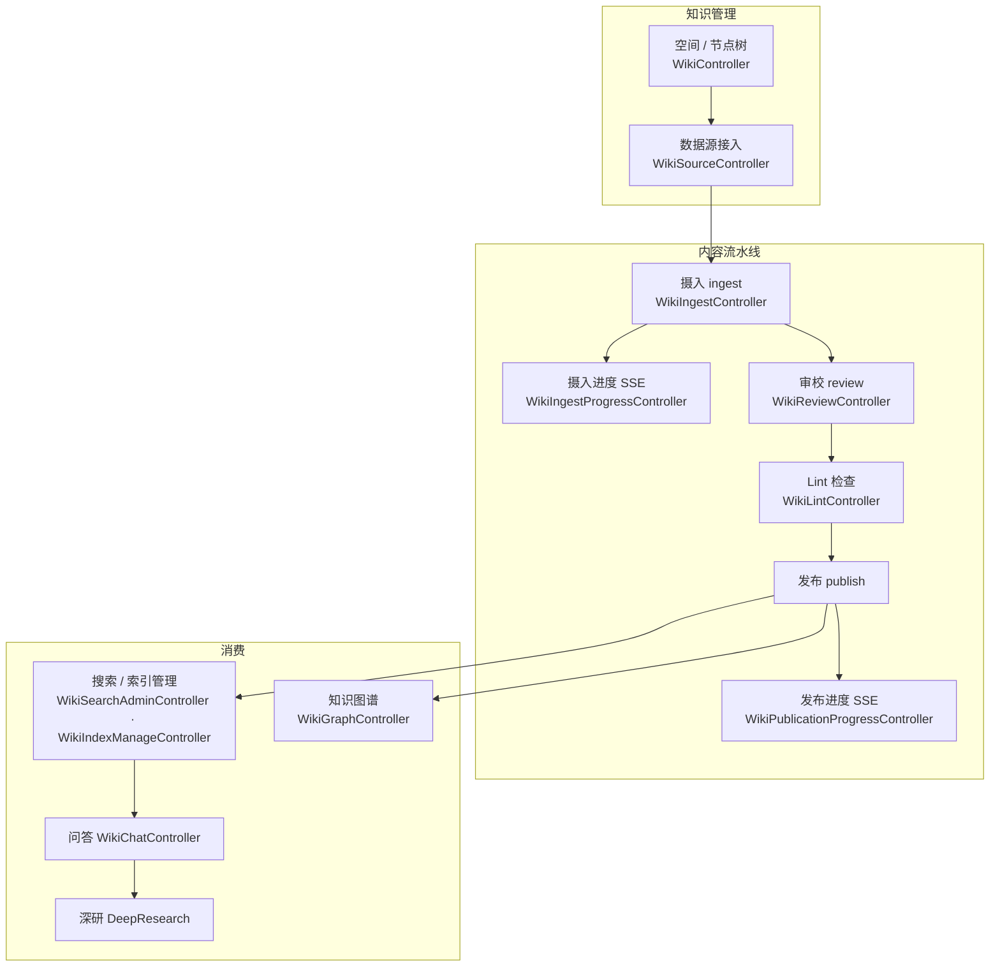
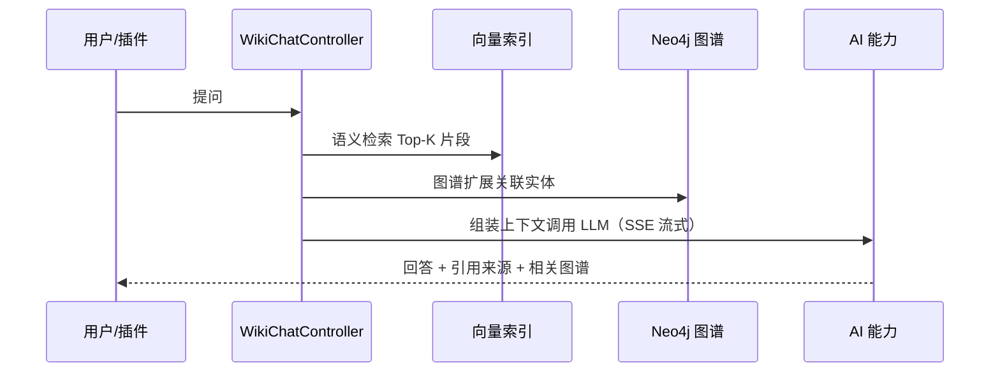

# 知识库 Wiki（RAG）

Wiki 能力（`wiki`）提供完整的知识库 + RAG 检索增强：空间/节点管理、多源数据摄入、发布流水线、向量与关键词搜索、Neo4j 知识图谱、问答与深度研究。它依赖 `ai`（嵌入与生成）与 `neo4j`（图谱）。每个知识库必须选择一个启用的逻辑图表；图表复用部署配置的单一物理 Neo4j，写入按图表编码和知识库空间双重隔离。

> 源码：`yudream-application/src/main/java/online/yudream/base/application/platform/wiki/`（17 个服务）、`yudream-interfaces/src/main/java/online/yudream/base/interfaces/platform/wiki/`

---

## 功能地图

## Controller 家族

| Controller | 前缀 | 职责 |
|---|---|---|
| `WikiController` | `/api/platform/wiki` | 空间、节点树、节点内容 CRUD |
| `WikiSourceController` | 同上 | 数据源（上传文档、外部源）接入 |
| `WikiIngestController` | 同上 | 触发摄入（解析→切片→嵌入→索引） |
| `WikiIngestProgressController` | 同上 | 摄入进度 SSE 流 |
| `WikiPublicationProgressController` | 同上 | 发布进度 SSE 流 |
| `WikiSearchAdminController` | 同上 | 搜索管理（重建索引等） |
| `WikiIndexManageController` | 同上 | 向量索引管理 |
| `WikiReviewController` | 同上 | 内容审校工作流 |
| `WikiLintController` | 同上 | Markdown Lint 规则检查 |
| `WikiGraphController` | 同上 | Neo4j 知识图谱构建与查询 |
| `WikiChatController` | 同上 | RAG 问答会话 |
| `WikiDeepResearchController` | 同上 | 多轮深研任务 |
| `WikiMigrationController` | 同上 | 存储迁移工具 |

## 对外访问通道

| 通道 | 前缀 | 鉴权 | 用途 |
|---|---|---|---|
| 公开站点 | `/api/public/wiki` | 免登录（仅已发布空间） | 面向访客的知识库站点渲染；文档页移动端为悬浮按钮 + 左侧目录抽屉 |
| 开放 API | `/api/open/wiki` | **API Key** | 第三方系统检索知识库；由 `ApiKeyAuthenticationContext` 完成鉴权，密钥管理见 [API Key](/security/api-key) |

## RAG 问答链路

回答中携带**引用来源**与**相关图谱节点**，前端由 Yd 组件族渲染（`YdCitationList` / `YdChatProcess` / `YdChatGraphView`，见组件文档）。

---

> 源码引用：`yudream-application/.../platform/wiki/` 全部服务；设计档案 `docs/plans/*platform-wiki-rag*`
